* https://app.pluralsight.com/course-player?clipId=a0abcd55-183c-406c-8620-c65adc0b6718

# plan overview
1. Kubernetes Installation and Configuration Fundamentals (3h 4m)
2. Managing the Kubernetes API Server and Pods (3h 44m)
3. Managing Kubernetes Controllers and Deployments (2h 48m)
4. Configuring and Managing Kubernetes Storage and Scheduling (2h 50m) 
5. Configuring and Managing Kubernetes Networking, Services, and Ingress (2h 6m) 
6. Maintaining, Monitoring and Troubleshooting Kubernetes (2h 14m)
7. Configuring and Managing Kubernetes Security (2h 16m)
* take a look at the LFCS, as I should be able to manage this once I finish reading `How Linux Works, 3rd Edition, What Every Superuser Should Know by Brian Ward`
  * https://training.linuxfoundation.org/wp-content/uploads/2019/04/LFCS-Practice-Questions-v1.0.pdf
  * https://github.com/willher/LFCS-Practice-Exam

# Kubernetes installation and configuration fundamentals

## Course Overview

## Exploring the Kubernetes Architecture

### What Is Kubernetes? Kubernetes Benefits and Operating Principles

* what is kubernetes?
  * container orchestrator
  * workload placement: deploy container based app to hardware
  * provides an infrastructure abstraction
    * LBs, hardware allocation, etc
  * maintains desired state
* benefits of kubernetes
  * speed of deployment
    * absorb change quickly
  * ability to recover quickly
    * achieves desired state repeatedly
  * hide infrastructure complexity in the cluster
    * storage, network place, etc

#### kubernetes principles
* desired state/declarative config
  * write code to describe deployment, kubernetes brings it online
* controllers/control loop
  * monitors and maintains desired state
  * if failure, then the controller will bring the service up.
* kubernetes API/API server
  * collection of objects that we can use to build and define systems
  * API server is central comm hub for cluster
  * controller uses the API server to acheive desired state

### Introducing the Kubernetes API - Objects and API Server

* API objects
  * collection of primitives to represent your system's state
    * ex: pod, nodes
  * enables config of state
    * declaratively: describe the state that should be acheived
    * imperatively: (manually) executed a bunch of commands to achieve a state
* API server
  * REST API over HTTP using JSON
  * only way that we interact with our cluster
  * only way kubernetes interacts with your cluster
  * desired state is serialized and persisted into the cluster data store

### Understanding API Objects - Pods
* single or collection of containers that we deploy as a single unit.  The 
* unit of scheduling work.
* defined in the manifest.
* ephemeral: no pod is ever redeployed.
* atomicity: the pod is there or it's not.
  * multicontainer pods: if one container dies, then the entire pod becomes unavailable.

* k8s Controllers are responsible (via the API server) to maintain communication with a Pod to maintain the desired state by:
  * observing state of pod: up/down
  * health of pod: application is good/bad via Probes
    * Probes: within manifest, you define Probe checks.

### Understanding API Objects - Controllers
* keeps the system in a desired state.
* Controllers are exposed via Workload resource API objects via the API Server.
  * create and manage Pods for you
* Controllers monitor and respond to the state of health.

#### Controller type: ReplicaSet controller
* define a number of replicas that should be running at all times.
* you generally don't create `ReplicaSets` directly, but create `Deployments`.

### controller type: Deployment controller
* admin defines a deployment.
* Deployment manages the rollout of the ReplicaSet.
  * commonly used when deploying container versions
  * can roll back

#### Understanding API Objects - Services
* provide a persistent access point to applications that we deploy in Pods
  * as things change, and controllers deploy new Pods, the Services provide a single point of access.
  * persists IP and DNS name for the service
  * networking abstraction for Pod access
* Services are dynamically updated based on Pod lifecycle
  * updates routing information, firewall config, etc.
* Services can be scaled by adding/removing pods
* provides load balancing

#### Understanding API Objects - Storage
* store data persistently
* Persistent Volume: pod independant storage that's defined at the Cluster level
  * when a Pod wants access to a storage, defines a persistent volume claim
  * decouples pod from storage

### Kubernetes Cluster Components Overview and Control Plane
* control plane node: implements major control functions of a cluster (used to be called "Master Node")
  * coordinates:
    * cluster operations
    * monitoring
    * pod scheduling
    * access point for cluster amdin
* Node/worker node
  * responsible for starting pods and containers
  * implement networking
  * contributes to compute capacity
  * Cluster is made up of many nodes (depending on configuration)
  * can be virtual or physical machines

#### control plane node
* `API Server`: primary access point for cluster admin, comm hub, it's stateless.
  * `kubectl` interacts with the API Server to configure.
  * central to the control of cluster, config changes are communicated via this component.
  * Simple interface.
  * REST API: GET, PUSH, POST
  * persists state of cluster to `etcd`
* Cluster store `etcd`: persists the state of the cluster objects
  * persists states
  * API Object maintainance
  * Stores state as key-value pairs
* `Scheduler`: tells k8s which nodes to start pods on based on the pod's desired state
  * watches API server for unscheduled pods
  * schedules pods on nodes
  * evaluates resources needed for pods
  * respects any contraints described for pods
* `Controller Manager`: implementing lifecycle functions of the Controllers, that control and monitor the state of the objects such as pods.  This is what commands Controllers to maintain the desired state.
  * controller loop execution
  * implement lifecycle functions and desired states
  * watch and update the API server of the state of the cluster
  * Made up of specific Controllers with specific roles, such as `ReplicaSet`

### Nodes
* a node is where the app pods run
* starts a pod and ensures the containers in pods are up and running
* implement networking
* can have many nodes in cluster based on scalability requirements
* nodes are either physical machines or VMs

#### node components
* each of these components run on all the nodes (including control plane node)

* `kubelet`: responsible for starting/stopping pods on nodes.
  * communicates directly with `API Server` to monitor for changes in the environment... sending info and rcving commands relevant to the `kubelet`'s role (to start pods).
  * monitors API server for changes
  * responsible for pod lifecycle (starting and stopping pods [and containers])
  * reports to API server on Node and Pod state
  * Pod health probe execution
* `kube-proxy`: responsible for pod networking and implementing out services abstraction ont he node itself.
  * communicates directly with `API Server` to monitor for changes in the environment... sending info and rcving commands relevant to the `kube-proxy`'s role (to change network topology).
  * `iptables`
  * implements services abstraction
  * routing traffic to Pods
  * load balancing
* `container runtime`: the actual runtime env, responsible for pulling container image from container registry and providing execution environment for container image and pod abstraction
  * downloads images and runs containers.
  * wrapped within Container Runtime Interface (CRI)
    * can swap out container runtime.
  * `containerd`: default runtime used by kubernetes, it is CRI compliant.
    * in `v1.20`, Docker was depreciated as the default container runtime.  It will be removed in `v1.22`, but you can still use containers built for Docker.


### Cluster Add-on Pods
* pods that provide special services to the cluster itself.
  * DNS:
    * provide DNS services within cluster via coreDNS server
    * IPs for the services and the search suffix is placed into the network config for any pods within the cluster via the cluster API server
    * commonly used for service discovery
  * Ingress controllers (optional)
    * advanced HTTP and layer 7 load balancers that handle content routing requests
  * Dashboard (optional)
    * for web based admin of k8s cluster
  * network overlays


### Pod Operations
* a cluster is established
  * this means it has a control plane node and two worker nodes
  * using `kubectl` we submit commands to configure a cluster, to the control plane node, that define
    * we want 3 replicas of the pod (submitted to API server, and stored to `etcd`)
    * controller manager will spin up the three requested replicas in replica set, which is submitted to the scheduler.
    * the scheduler then tells API server that the pods need to be spun up on nodes it selects, and the config decisions are written to `etcd`
      * which nodes did the pod replicas get scheduled on?
      * depedant on resources requested in the pods, and the resources available in the nodes in the cluster.
      * the `kubelet`s on the nodes will check in with the API server to see if there is any work queued for execution.
        * once the queued work is received, the pod will be spun up.
  * The controller manager receives information from the nodes regarding the state of pods running on each node.
    * if a node drops, the node is no longer reporting state.
      * controller manager will signal to the scheduler to locate a node to schedule the replica of the pod on.
        * by default the control plane node is NOT to be used for pod replica targets, only on worker node.

### Service Operations
* network or access point to applicaitons running within cluster
* review at cluster level
* pods are created within cluster for web app
* expose access with a Service, running HTTP on tcp 80
  * users can access on port 80
  * fixed and persistent service endpoint, which will be a DNS name or ip address
    * requests will be load balanced across replica set of pods
* services abstract access to pods' services
  * "self-healing" of underlying pods within a replica set occurs by the replica set controller

### Kubernetes Networking Fundamentals
* every pod deployed gets assigned a unique IP addr.
* pods on a node can communicate with all pods on all nodes in a cluster without NAT.
* agents on a node (kubelet, etc) can communicate with all pods on that node.

#### k8s network design

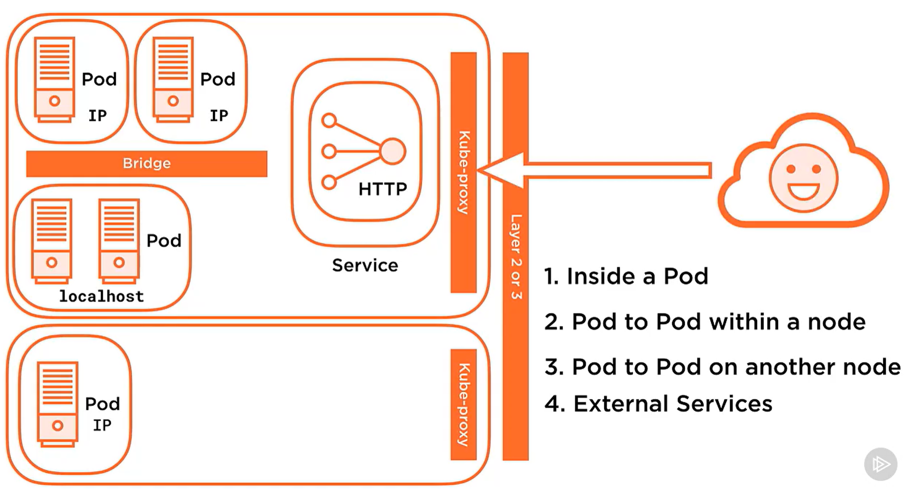

* multi container pod within cluster (within a node)
  * the containers within this pod communicate via namespaces within localhost
* additional pods deployed to the cluster (within a node)
  * these pods will inter-communicate via a software defined network bridge, using the real IPs of the pods themslves.
* pod on one node need to reach out to a pod on a second node
  * occurs between the real IPs of the pods themselves, so layer 2 and/or 3 connectivity must exist between the nodes
  * overlay network
    * if you don't control the underlying network infrastructure (inter-node), then you can deploy an overlay network to provide the overlay of layer 2/3 connectivity inter-node.
* external services
  * `kube-proxy` exposes the service within a cluster to external clients
    * the `service` then interacts with the pods.


## Installing and Configuring Kubernetes

### Installation Considerations
* where are you going to install?
  * cloud
    * two major use cases
      * IaaS: VMs as nodes
        * OS and k8s cluster must be managed.
      * PaaS: managed service
        * lose flexibility in versioning.
  * on prem
    * base metal or VMs
  * which one to choose?
    * skill set?c
    * cloud footprint already?
* cluster networking
  * overlay network versus metal r+s
* scalability
  * nodes, etc
* HA and DR
  * single control plane node?

### Installation Methods
* desktop installation
  * dev environments
    * docker-desktop
    * lens
* `kubeadm`
  * bootstraps cluster quickly
* cloud IaaS/PaaS

### Installation Requirements
* system requirements
  * need linux (ubuntu/RHEL)
  * 2 CPUs, 2GB RAM
  * swap is disabled on *nix
* container runtime
  * CRI compatbiel
    * containerd <-- we'll use this
    * docker
    * CRI-O
* networking
  * connectivity between all nodes
  * nodes need unique hostnames
  * nodes need unique MAC addresses

### Understanding Cluster Networking Ports
* setting up security perimters
  * control plane node provides services to the cluster
  * working nodes need access to the API server
* API server: tcp 6443, used by all cluster items (and admin via `kubectl`)
* `etcd`: tcp 2379-2380, used by API server and any etcd replicas
* Scheduler: tcp 10251, used by itself only (localhost)
* Controller Manager: tcp 10252, used by itself only (localhost)
* `kubelet`: tcp 10250, control plane services
  * worker nodes also run kubelets, tcp 10250, control plane needs access to worker node's kubelets
  * NodePort service: tcp 30000-32767, used by components that need access to the services published on the NodePorts
    * NodePort service: exposes `services` via ports on each node in cluster, and port ranges are allocated from the tcp port range.


### Getting Kubernetes
* github.com/kubernetes/kubernetes
* *nix repos

### Building Your Own Cluster
* steps
  * install and configure packages
  * create the cluster
  * configure pod networking
  * join nodes to cluster
* required packages on all nodes (worker or control plane)
  * container runtime: `containerd`
  * `kubelet`
  * `kubeadm`: create cluster, joins nodes
  * `kubectl`: configure pod network, etc.
* 

### Installing Kubernetes on VMs
* refer to wsl2.md in this repo for some work I did in that area, however I need to move on now... so I'm going to use vmware player and build four VMs.
* you should grab vmware workstation pro download and then extract `vmnetcfg.exe` from the installer and place it in `C:\Program Files (x86)\VMware\VMware Player`
  * configure the vswitch to be on network `172.16.94.0/24`
* "ubuntucontrol" = 172.16.94.10,"ubuntuworkernode1" = 172.16.94.11,"ubuntuworkernode2" = 172.16.94.12,"ubuntuworkernode3" = 172.16.94.13
  * Onboard as NAT networking type
  * update local Windows host at `C:\windows\system32\drivers\etc\hosts` for all nodes' IPs
* after ubuntu 22.02 install, configure as follows:
  * set each to a static IP within the vmware player established vswitch subnet by creating a netplan config at `/etc/netplan/99_config.yaml`, `sudo netplan try --state /etc/netplan/`, then `sudo netplan apply`
    ```
    #it's a yaml, so indents matter
    network:
      version: 2
      renderer: networkd
      ethernets:
        ens33:
          addresses:
            - 172.16.94.10/24
          routes:
            - to: default
              via: 172.16.94.2
          nameservers:
              search: [localdomain]
              addresses: [172.16.94.2]
    ```

### Lab Environment Overview

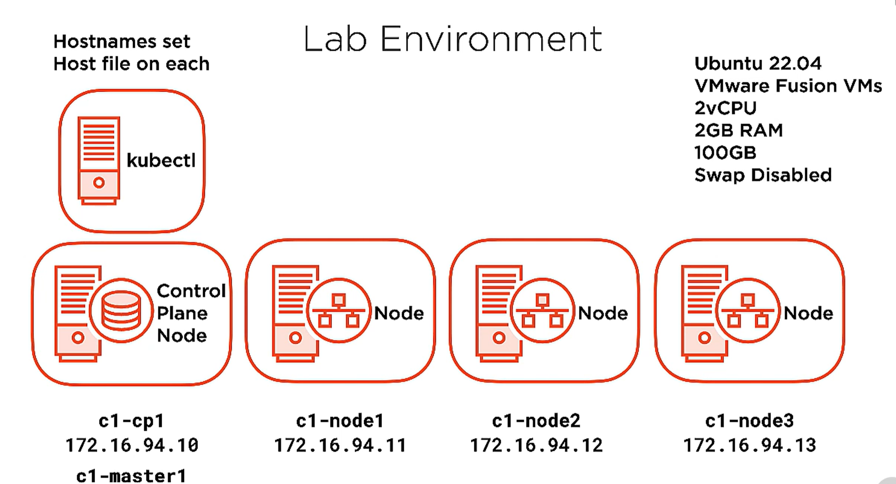

* one control plane node, and three worker nodes
  * `kubectl` on control plane node
  * ubuntu version 22.04
  * remember to disable swap
  * add `/etc/hosts` entries for each node


### Demo: Installing and Configuring containerd

* goals:
  * install the following
    * containerd
    * kubelet
    * kubeadm
    * kubectl
  * review how `systemd` manages these
   
* interface with the control plane VM, decrease swappiness, then install containerd
```
#disable swap
sudo sed -i '/\/swap/ s/^/#/' /etc/fstab
sudo swapoff -a
sudo cat /proc/swaps

#containerd prereqs
cat <<EOF | sudo tee /etc/modules-load.d/containerd.conf
overlay
br_netfilter
EOF
# affect at runtime
sudo modprobe overlay
sudo modprobe br_netfilter

#k8s prereqs
cat <<EOF | sudo tee /etc/sysctl.d/00-kubernetes-cri.conf
net.bridge.bridge-nf-call-iptables = 1
net.ipv4.ip_forward = 1
net.bridge.bridge-nf-call-ip6tables = 1
EOF
# affect at runtime
sudo sysctl --system


sudo apt update -y

#install and configure containerd
sudo apt install -y containerd
sudo mkdir -p /etc/containerd
sudo containerd config default | sudo tee /etc/containerd/config.toml
#set the cgroup driver to systemd in /etc/containerd/config.toml
$below `[plugins."io.containerd.grpc.v1.cri".containerd.runtimes.runc.options]` find and change the following value:
SystemdCgroup = true
sudo systemctl restart containerd
```

### Demo: Installing and Configuring Kubernetes Packages

1. install kubernetes packages

```
# install kubernetes
# https://kubernetes.io/docs/setup/production-environment/tools/kubeadm/install-kubeadm/
curl -s https://packages.cloud.google.com/apt/doc/apt-key.gpg | sudo apt-key add -
sudo bash -c 'cat <<EOF > /etc/apt/sources.list.d/kubernetes.list
deb https://apt.kubernetes.io kubernetes-xenial main
EOF'

sudo apt update
#list versions
apt-cache policy kubelet | head -n 20

#pin to a specific version during install
VERSION=1.20.1-00
sudo apt install -y kubelet=$VERSION kubeadm=$VERSION kubectl=$VERSION

#disable upgrading of these packages by apt so that you can control what versions you're using:
sudo apt-mark hold kubelet kubeadm kubectl containerd
```

2. review kubelet systemd unit status, note that it will fail to start because there's no cluster config (see next section)
```
sudo systemctl status kubelet.service
● kubelet.service - kubelet: The Kubernetes Node Agent
     Loaded: loaded (/lib/systemd/system/kubelet.service; enabled; vendor preset: enabled)
    Drop-In: /etc/systemd/system/kubelet.service.d
             └─10-kubeadm.conf
     Active: activating (auto-restart) (Result: exit-code) since Thu 2023-03-30 10:10:22 UTC; 1s ago
       Docs: https://kubernetes.io/docs/home/
    Process: 4049 ExecStart=/usr/bin/kubelet $KUBELET_KUBECONFIG_ARGS $KUBELET_CONFIG_ARGS $KUBELET_KUBEADM_ARGS $KUBELET_EXTRA_ARGS (code=exited, status=255/EXCEPTION)
   Main PID: 4049 (code=exited, status=255/EXCEPTION)
        CPU: 100ms

Mar 30 10:10:22 ubuntucontrol systemd[1]: kubelet.service: Main process exited, code=exited, status=255/EXCEPTION
Mar 30 10:10:22 ubuntucontrol systemd[1]: kubelet.service: Failed with result 'exit-code'.
```

3. review containerd systemd unit status
```
sudo systemctl status containerd.service
```

4. set both `kubelet` and `containerd` to start upon system boot
```
sudo systemctl enable kubelet.service containerd.service
```

### Bootstrapping a Cluster with kubeadm (on the control plane node)
* create a cluster by invoking `kubeadm init`.  This performs the following:
1. validation occurs
  * RAM
  * compatible container runtime check and that it's running
2. creates a CA (certs are used for encryption and authentication)
3. generates `kubeconfig` files
4. generates static pob manifests
5. wait for the control plane pods to start
6. taints the control plane node
  * this will cause the control plane node to never schedule user pods on the control plane node
7. generates a bootstrap taken
8. starts add-on components: DNS and kube-proxy

### Understanding the Certificate Authority's Role in Your Cluster
* kubeadm init creates a self signed CA
* you can tell kubeadm to integrate into an external PKI
* CA is used: /etc/kubernetes/pki
  * to secure cluster comms throughout cluster
    * used for API Server comms
  * to authenticate users and cluster components (nodes, etc)
* The CA certs are distributed to each node

### kubeadm Created kubeconfig Files and Static Pod Manifests

#### kubeconfig files
* a `kubeconfig` file defines how to connect to the cluster
  * includes:
    * client certs
    * CA certs
    * cluster API server network location
* `kubeadm` creates various `kubeconfig` files that are used by the control plane node and worker nodes within `/etc/kubernetes`
  * `admin.conf` (kubernetes-admin): is the admin account/superuser
  * `kubelet.conf`: used to help kubelet to locate the API server and provide auth cert
  * `controller-manager.conf`: used to help controller manager to locate the API server and provide auth cert
  * `scheduler.conf`: : used to help scheduler to locate the API server and provide auth cert

#### static pod manifests
* manifest describes a config of a pod
* generated by `kubeadm init`
  * produces files in `/etc/kubernetes/manifests`
* core control plan components:
  * etcd
  * api server
  * controller manager
  * scheduler
* `kubelet` watches the directory `/etc/kubernetes/manifests` for changes to the config

### Pod Networking Fundamentals

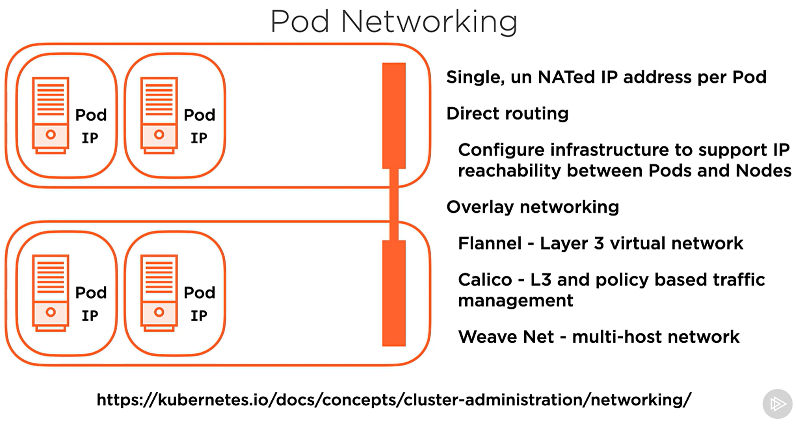

* overlay network options
  * Flannel: layer 3 virtual network
  * Calico: layer 3 and policy based traffic management
  * Weave Net: multi host network

### Creating a Cluster Control Plane Node and Adding a Node

#### create a cluster control plane node, admin user, and overlay network
* download yaml manifest that describes the pod overlay network
```
wget https://docs.projectcalico.org/manifests/calico.yaml
```
* create a cluster config file
```
kubeadm config print init-defaults | tee ClusterConfigurations.yaml
```
* init the cluster
```
sudo kubeadm init --config=Clusterconfiguration.yaml --cri-socket /run/containerd/containerd.sock
```
  * once this command has exited, all control plane pods will be up and running
  * this command will also output:
    * commands to have workernodes join the cluster
    * how to execute kubeadm to create an admin user

##### creating a cluster admin user
```
mkdir -p $HOME/.kube
sudo cp -i /etc/kubernetes/admin.conf $HOME/.kube/config
sudo chown $(id -u):$(id -d) $HOME/.kube/config
```
* inside of this kubeconfig file will contain network info on API server as well as certs used for authentication

##### deploy the pod network
```
kubectl apply -f calico.yaml
# this will push the overlay network related pods into the cluster
```

#### adding a node to a cluster
1. install packages
2. `kubeadm join`
  * takes additional parameters: bootstrap token, CA cert hash, and the location of the API server
3. downloads cluster info
4. node submits a CSR to the API server (used for kubelet to auth to API server)
5. CA signs the CSR automatically
  * `kubeadm join` downloads the cert and stores in `/var/lib/kubelet/pki`
6. creates `/etc/kubernetes/kubelet.conf`
  * contains client auth cert
  * contains API server info 
* invocation is: (note that `kubeadm init` you ran earlier produces this command)
```
kubeadm join APISERVER:6443 --token [token] --discovery-token-ca-cert-hash sha256:[hash]
```

### Demo: Creating a Cluster Control Plane Node
1. create the cluster

```
# https://docs.tigera.io/calico/latest/getting-started/kubernetes/self-managed-onprem/onpremises#install-calico-with-kubernetes-api-datastore-50-nodes-or-less
wget https://raw.githubusercontent.com/projectcalico/calico/v3.25.0/manifests/calico.yaml

#if you need to do this later: https://stackoverflow.com/a/60185268/843000
#if needed, findCALICO_IPV4POOL_CIDR and modify this range to something outside of the ranges used by any infrastructure (in our case there is an overlap)
vim calico.yaml

#create a kubeconfig file
kubeadm config print init-defaults | tee ClusterConfiguration.yaml
vim ClusterConfiguration.yaml
#modify localAPIEndpoint/advertiseAddress to the control plane node's address (172.16.94.10)
#modify nodeRegistration/criSocket to the containerd socket (/run/containerd/containerd.sock)
#modify kubernetesVersion to match the current version  (v1.20.1)
#set the cgroupDriver to systemd (matching containerd)
cat <<EOF | cat >> ClusterConfiguration.yaml
---
apiVersion: kubelet.config.k8s.io/v1beta1
kind: KubeletConfigutation
cgroupDriver: systemd
EOF

#build the cluster!
sudo kubeadm init --config=ClusterConfiguration.yaml --cri-socket /run/containerd/containerd.sock

[init] Using Kubernetes version: v1.20.1
[preflight] Running pre-flight checks
[preflight] Pulling images required for setting up a Kubernetes cluster
[preflight] This might take a minute or two, depending on the speed of your internet connection
[preflight] You can also perform this action in beforehand using 'kubeadm config images pull'
[certs] Using certificateDir folder "/etc/kubernetes/pki"
[certs] Generating "ca" certificate and key
[certs] Generating "apiserver" certificate and key
[certs] apiserver serving cert is signed for DNS names [kubernetes kubernetes.default kubernetes.default.svc kubernetes.default.svc.cluster.local ubuntucontrol] and IPs [10.96.0.1 172.16.94.10]
[certs] Generating "apiserver-kubelet-client" certificate and key
[certs] Generating "front-proxy-ca" certificate and key
[certs] Generating "front-proxy-client" certificate and key
[certs] Generating "etcd/ca" certificate and key
[certs] Generating "etcd/server" certificate and key
[certs] etcd/server serving cert is signed for DNS names [localhost ubuntucontrol] and IPs [172.16.94.10 127.0.0.1 ::1]
[certs] Generating "etcd/peer" certificate and key
[certs] etcd/peer serving cert is signed for DNS names [localhost ubuntucontrol] and IPs [172.16.94.10 127.0.0.1 ::1]
[certs] Generating "etcd/healthcheck-client" certificate and key
[certs] Generating "apiserver-etcd-client" certificate and key
[certs] Generating "sa" key and public key
[kubeconfig] Using kubeconfig folder "/etc/kubernetes"
[kubeconfig] Writing "admin.conf" kubeconfig file
[kubeconfig] Writing "kubelet.conf" kubeconfig file
[kubeconfig] Writing "controller-manager.conf" kubeconfig file
[kubeconfig] Writing "scheduler.conf" kubeconfig file
[kubelet-start] Writing kubelet environment file with flags to file "/var/lib/kubelet/kubeadm-flags.env"
[kubelet-start] Writing kubelet configuration to file "/var/lib/kubelet/config.yaml"
[kubelet-start] Starting the kubelet
[control-plane] Using manifest folder "/etc/kubernetes/manifests"
[control-plane] Creating static Pod manifest for "kube-apiserver"
[control-plane] Creating static Pod manifest for "kube-controller-manager"
[control-plane] Creating static Pod manifest for "kube-scheduler"
[etcd] Creating static Pod manifest for local etcd in "/etc/kubernetes/manifests"
[wait-control-plane] Waiting for the kubelet to boot up the control plane as static Pods from directory "/etc/kubernetes/manifests". This can take up to 4m0s
[apiclient] All control plane components are healthy after 14.502704 seconds
[upload-config] Storing the configuration used in ConfigMap "kubeadm-config" in the "kube-system" Namespace
[kubelet] Creating a ConfigMap "kubelet-config-1.20" in namespace kube-system with the configuration for the kubelets in the cluster
[upload-certs] Skipping phase. Please see --upload-certs
[mark-control-plane] Marking the node ubuntucontrol as control-plane by adding the labels "node-role.kubernetes.io/master=''" and "node-role.kubernetes.io/control-plane='' (deprecated)"
[mark-control-plane] Marking the node ubuntucontrol as control-plane by adding the taints [node-role.kubernetes.io/master:NoSchedule]
[bootstrap-token] Using token: abcdef.0123456789abcdef
[bootstrap-token] Configuring bootstrap tokens, cluster-info ConfigMap, RBAC Roles
[bootstrap-token] configured RBAC rules to allow Node Bootstrap tokens to get nodes
[bootstrap-token] configured RBAC rules to allow Node Bootstrap tokens to post CSRs in order for nodes to get long term certificate credentials
[bootstrap-token] configured RBAC rules to allow the csrapprover controller automatically approve CSRs from a Node Bootstrap Token
[bootstrap-token] configured RBAC rules to allow certificate rotation for all node client certificates in the cluster
[bootstrap-token] Creating the "cluster-info" ConfigMap in the "kube-public" namespace
[kubelet-finalize] Updating "/etc/kubernetes/kubelet.conf" to point to a rotatable kubelet client certificate and key
[addons] Applied essential addon: CoreDNS
[addons] Applied essential addon: kube-proxy

Your Kubernetes control-plane has initialized successfully!

To start using your cluster, you need to run the following as a regular user:

  mkdir -p $HOME/.kube
  sudo cp -i /etc/kubernetes/admin.conf $HOME/.kube/config
  sudo chown $(id -u):$(id -g) $HOME/.kube/config

Alternatively, if you are the root user, you can run:

  export KUBECONFIG=/etc/kubernetes/admin.conf

You should now deploy a pod network to the cluster.
Run "kubectl apply -f [podnetwork].yaml" with one of the options listed at:
  https://kubernetes.io/docs/concepts/cluster-administration/addons/

Then you can join any number of worker nodes by running the following on each as root:

kubeadm join 172.16.94.10:6443 --token abcdef.0123456789abcdef \
    --discovery-token-ca-cert-hash sha256:3822f8596a80bbde636e3c60a2e96bb70c2314163d7d2c5180a314399ebe4769
```

2. create admin credentials and add completion
```
mkdir -p $HOME/.kube
sudo cp -i /etc/kubernetes/admin.conf $HOME/.kube/config
sudo chown $(id -u):$(id -g) $HOME/.kube/config
kubectl completion bash | sudo tee /etc/bash_completion.d/kubectl > /dev/null #not working right now, it's okay
```

3. create a pod network
```
kubectl apply -f calico.yaml
#note that this **WILL** fail, due to the fact that the k8s apiVersion supported in the latest calico release doesn't support k8s v1.20, but v1.21, or v1.25 (I'm reading both/either may be the case)
  # https://github.com/projectcalico/calico/issues/6132#issuecomment-1134776125
  # https://github.com/kubernetes-sigs/metrics-server/issues/1104
#regardless, we will TRY to get this moving by adjusting the value from `apiVersion: policy/v1` to `apiVersion: policy/v1beta1` in ./calico.yaml... annddd... success:
att@ubuntucontrol:~$ kubectl apply -f calico.yaml
poddisruptionbudget.policy/calico-kube-controllers created
serviceaccount/calico-kube-controllers unchanged
serviceaccount/calico-node unchanged
configmap/calico-config unchanged
customresourcedefinition.apiextensions.k8s.io/bgpconfigurations.crd.projectcalico.org configured
customresourcedefinition.apiextensions.k8s.io/bgppeers.crd.projectcalico.org configured
customresourcedefinition.apiextensions.k8s.io/blockaffinities.crd.projectcalico.org configured
customresourcedefinition.apiextensions.k8s.io/caliconodestatuses.crd.projectcalico.org configured
customresourcedefinition.apiextensions.k8s.io/clusterinformations.crd.projectcalico.org configured
customresourcedefinition.apiextensions.k8s.io/felixconfigurations.crd.projectcalico.org configured
customresourcedefinition.apiextensions.k8s.io/globalnetworkpolicies.crd.projectcalico.org configured
customresourcedefinition.apiextensions.k8s.io/globalnetworksets.crd.projectcalico.org configured
customresourcedefinition.apiextensions.k8s.io/hostendpoints.crd.projectcalico.org configured
customresourcedefinition.apiextensions.k8s.io/ipamblocks.crd.projectcalico.org configured
customresourcedefinition.apiextensions.k8s.io/ipamconfigs.crd.projectcalico.org configured
customresourcedefinition.apiextensions.k8s.io/ipamhandles.crd.projectcalico.org configured
customresourcedefinition.apiextensions.k8s.io/ippools.crd.projectcalico.org configured
customresourcedefinition.apiextensions.k8s.io/ipreservations.crd.projectcalico.org configured
customresourcedefinition.apiextensions.k8s.io/kubecontrollersconfigurations.crd.projectcalico.org configured
customresourcedefinition.apiextensions.k8s.io/networkpolicies.crd.projectcalico.org configured
customresourcedefinition.apiextensions.k8s.io/networksets.crd.projectcalico.org configured
clusterrole.rbac.authorization.k8s.io/calico-kube-controllers unchanged
clusterrole.rbac.authorization.k8s.io/calico-node unchanged
clusterrolebinding.rbac.authorization.k8s.io/calico-kube-controllers unchanged
clusterrolebinding.rbac.authorization.k8s.io/calico-node unchanged
daemonset.apps/calico-node configured
deployment.apps/calico-kube-controllers unchanged
```

4. review all pods and nodes that were created to support the deployed services (SDN/overlay network, control plane services)
```
$ kubectl get pods --all-namespaces
NAMESPACE     NAME                                       READY   STATUS    RESTARTS   AGE
kube-system   calico-kube-controllers-5bb7768754-92rf9   1/1     Running   0          12m #this is calico related
kube-system   calico-node-qw5pf                          0/1     Running   0          12m #this is calico related
kube-system   coredns-74ff55c5b-qbg9s                    1/1     Running   0          54m #this is control plane add on (dns)
kube-system   coredns-74ff55c5b-xbtsh                    1/1     Running   0          54m #this is control plane add on (dns)
kube-system   etcd-ubuntucontrol                         1/1     Running   0          54m #this is control plane (etcd)
kube-system   kube-apiserver-ubuntucontrol               1/1     Running   0          54m #this is control plane (api server)
kube-system   kube-controller-manager-ubuntucontrol      1/1     Running   0          54m #this is control plane (controller manager)
kube-system   kube-proxy-sqbm5                           1/1     Running   0          54m #this is related to local node functionality (kubeproxy, remember this implements service networking ON THIS NODE)
kube-system   kube-scheduler-ubuntucontrol               1/1     Running   0          54m #this is control plane (scheduler)

$ kubectl get nodes
NAME            STATUS   ROLES                  AGE   VERSION
ubuntucontrol   Ready    control-plane,master   64m   v1.20.1
```

5. review systemd units
* remember kubelet.service systemd unit was erroring earlier because there wasn't a cluster... it should be fine now
```
$ sudo systemctl status kubelet.service
● kubelet.service - kubelet: The Kubernetes Node Agent
     Loaded: loaded (/lib/systemd/system/kubelet.service; enabled; vendor preset: enabled)
    Drop-In: /etc/systemd/system/kubelet.service.d
             └─10-kubeadm.conf
     Active: active (running) since Thu 2023-03-30 13:55:56 UTC; 1h 6min ago
       Docs: https://kubernetes.io/docs/home/
   Main PID: 4093 (kubelet)
      Tasks: 14 (limit: 4531)
     Memory: 40.8M
        CPU: 1min 50.619s
     CGroup: /system.slice/kubelet.service
             └─4093 /usr/bin/kubelet --bootstrap-kubeconfig=/etc/kubernetes/bootstrap-kubelet.conf --kubeconfig=/etc/kubernetes/kubelet.conf --config=/var/lib/kubelet/config.yaml --container-runtime=remote --container-runtime-endpoint=/run/containerd/containerd.sock
```

6. review the static pod manifests
* static pod manifests describe what's needed to have the pod start up on the node
```
$ ls /etc/kubernetes/manifests/
etcd.yaml  kube-apiserver.yaml  kube-controller-manager.yaml  kube-scheduler.yaml
$ sudo more /etc/kubernetes/manifests/etcd.yaml
$ sudo more /etc/kubernetes/manifests/kube-apiserver.yaml
$ sudo cat /etc/kubernetes/manifests/kube-apiserver.yaml | egrep cert
```

7. review kubeconfig files for all pods on this node
* remember kubeconfig files contain cluster info (api server connection info, cluster authentication information) for the node
```
$ ls /etc/kubernetes
```

### Demo: Adding a Node to Your Cluster
1. build out the baseline config for the workernode1 VM
```
#disable swap
sudo sed -i '/ swap / s/^/#/' /etc/fstab
sudo swapoff -a

#containerd prereqs
cat <<EOF | sudo tee /etc/modules-load.d/containerd.conf
overlay
br_netfilter
EOF
# affect at runtime
sudo modprobe overlay
sudo modprobe br_netfilter

#k8s prereqs
cat <<EOF | sudo tee /etc/sysctl.d/00-kubernetes-cri.conf
net.bridge.bridge-nf-call-iptables = 1
net.ipv4.ip_forward = 1
net.bridge.bridge-nf-call-ip6tables = 1
EOF
# affect at runtime
sudo sysctl --system

sudo apt update -y

#install and configure containerd
echo 'Acquire::Retries "10";' > /etc/apt/apt.conf.d/80-retries
sudo apt install -y containerd
sudo mkdir -p /etc/containerd
sudo containerd config default | sudo tee /etc/containerd/config.toml
#set the cgroup driver to systemd in /etc/containerd/config.toml
$below `[plugins."io.containerd.grpc.v1.cri".containerd.runtimes.runc.options]` find and change the following value:
SystemdCgroup = true
sudo systemctl restart containerd
```

2. install kubernetes packages

```
# install kubernetes
# https://kubernetes.io/docs/setup/production-environment/tools/kubeadm/install-kubeadm/
curl -s https://packages.cloud.google.com/apt/doc/apt-key.gpg | sudo apt-key add -
sudo bash -c 'cat <<EOF > /etc/apt/sources.list.d/kubernetes.list
deb https://apt.kubernetes.io kubernetes-xenial main
EOF'

sudo apt update

#pin to a specific version during install
VERSION=1.20.1-00
sudo apt install -y kubelet=$VERSION kubeadm=$VERSION kubectl=$VERSION

#disable upgrading of these packages by apt so that you can control what versions you're using:
sudo apt-mark hold kubelet kubeadm kubectl containerd

#validate containerd is running
sudo systemctl status containerd.service
#enable at boot
sudo systemctl enable kubelet.service containerd.service
```

3. Get the cluster auth token and cert hash from the control plane node so that the worker node can join the cluster
* you need the bootstrap token and the CA cert hash
```
#go back to control node
#review bootstrap tokens (if one exists, it's fine... one the node joins the cluster, it will automatically rcv a new token when the old token expires)
kubeadm token list
#create a new token for fun
kubeadm token create
lqn8hs.yrgmidj9vrzozkxl

#get the cert hash
openssl x509 -pubkey -in /etc/kubernetes/pki/ca.crt | openssl rsa -pubin -outform der 2>/dev/null | openssl dgst -sha256 -hex | sed 's/^.*\s//'
3822f8596a80bbde636e3c60a2e96bb70c2314163d7d2c5180a314399ebe4769

#or just freggin do one of these little guys:
$ kubeadm token create --print-join-command
kubeadm join 172.16.94.10:6443 --token lk42bq.p2599stsnx88zdi8 --discovery-token-ca-cert-hash sha256:3822f8596a80bbde636e3c60a2e96bb70c2314163d7d2c5180a314399ebe4769
```

4. join the worker node to the cluster:
* join, which will immediately trigger 
```
#on the worker node
sudo kubeadm join 172.16.94.10:6443 --token lk42bq.p2599stsnx88zdi8 --discovery-token-ca-cert-hash sha256:3822f8596a80bbde636e3c60a2e96bb70c2314163d7d2c5180a314399ebe4769
```
* on control plane node, take a look at the nodes and note the status of workernode.  The pods that are necessary for worker node functionality and communication will immediately be deployed the new node (kubeproxy, calico, etc)
```
ubuntucontrol:~$ kubectl get nodes
NAME                STATUS     ROLES                  AGE    VERSION
ubuntucontrol       Ready      control-plane,master   154m   v1.20.1
ubuntuworkernode1   NotReady   <none>                 22s    v1.20.1

#observe the deployment progress
ubuntucontrol:~$ kubectl get pods --all-namespaces --watch

# then check to verify worker node is "Ready"
ubuntucontrol:~$ kubectl get nodes
NAME                STATUS   ROLES                  AGE     VERSION
ubuntucontrol       Ready    control-plane,master   158m    v1.20.1
ubuntuworkernode1   Ready    <none>                 4m34s   v1.20.**1**
```

5. repeat for worker nodes 2 and 3.
* i had a bad time due to probably my ZTNA client messing around with my internet connectivity, so I was seeing 
```
ubuntucontrol:~$ kubectl get pods --all-namespaces --watch
NAMESPACE     NAME                                       READY   STATUS                  RESTARTS   AGE
kube-system   calico-kube-controllers-5bb7768754-92rf9   1/1     Running                 0          140m
kube-system   calico-node-5x8wq                          0/1     Running                 0          29m
kube-system   calico-node-mbdvm                          0/1     Running                 0          16m
kube-system   calico-node-qw5pf                          0/1     Running                 0          140m
kube-system   calico-node-zn6w6                          0/1     Init:ImagePullBackOff   0          12m
kube-system   coredns-74ff55c5b-qbg9s                    1/1     Running                 0          3h2m
kube-system   coredns-74ff55c5b-xbtsh                    1/1     Running                 0          3h2m
kube-system   etcd-ubuntucontrol                         1/1     Running                 0          3h2m
kube-system   kube-apiserver-ubuntucontrol               1/1     Running                 0          3h2m
kube-system   kube-controller-manager-ubuntucontrol      1/1     Running                 0          3h2m
kube-system   kube-proxy-2fkn2                           1/1     Running                 0          16m
kube-system   kube-proxy-gnhpm                           1/1     Running                 0          12m
kube-system   kube-proxy-sqbm5                           1/1     Running                 0          3h2m
kube-system   kube-proxy-tkjg8                           1/1     Running                 0          29m
kube-system   kube-scheduler-ubuntucontrol               1/1     Running                 0          3h2m
```
* this error is discussed well here: https://www.tutorialworks.com/kubernetes-imagepullbackoff/
  * again, I'm convinced it's the ZTNA client causing the VM on my machine to fail
* here's some tshooting
```
kubectl get pod --all-namespaces
kubectl get daemonset --all-namespaces
kubectl describe daemonset calico-node -n kube-system
#interesting things here:
containers/*/image: docker.io/calico/node:v3.25.0

#determine the failing node
kubectl get nodes

#on the target node take a look at the kubelet service unit's output
journalctl -b -f -u kubelet.service

Mar 30 17:11:23 ubuntuworkernode3 kubelet[24358]: E0330 17:11:23.358875   24358 pod_workers.go:191] Error syncing pod ad4a80eb-f93d-4f24-af67-bc46dd1d183c ("calico-node-zn6w6_kube-system(ad4a80eb-f93d-4f24-af67-bc46dd1d183c)"), skipping: failed to "StartContainer" for "upgrade-ipam" with ImagePullBackOff: "Back-off pulling image \"docker.io/calico/cni:v3.25.0\""
Mar 30 17:11:24 ubuntuworkernode3 kubelet[24358]: E0330 17:11:24.738627   24358 kubelet.go:2160] Container runtime network not ready: NetworkReady=false reason:NetworkPluginNotReady message:Network plugin returns error: cni plugin not initialized

# let's smack kubelet around on the failing node
sudo systemctl restart kubelet.service && journalctl -b -f -u kubelet.service
#this worked...
# note to self of probable causes: DNS, network/IP connectivity, "things not coming up in the correct order"
```

### Managed Cloud Deployment Scenarios: AKS, EKS, and GKE
* AWS: Elastic Kubernetes Service (EKS)
* Google Kubernetes Engine (GKE)
* Azure Kubernetes Service (AKS)

### Demo: Creating a Cluster in the Cloud with Azure Kubernetes Service

1. install azure cli tools and auth
```
Invoke-WebRequest -Uri https://aka.ms/installazurecliwindows -OutFile .\AzureCLI.msi
Start-Process msiexec.exe -Wait -ArgumentList '/I AzureCLI.msi /quiet'
rm .\AzureCLI.msi
az login --use-device-code
#you might need to move $env:userprofile/.azure to $env:userprofile/_orig.azure
```

2. build resource group for AKS resources
```
az group create --name "kubernetes-cloud" --location centralus
```

3. list aks versions
```
az aks get-versions --location centralus -o table
```

4. create a cluster
```
az aks create --resource-group "kubernetes-cloud" --generate-ssh-keys --name cscluster --node-count 3
```
* if you need kubectl, you can run `az aks install-cli`
  
5. get creds from AKS cluster and add them to `~/.kube/config`
```
az aks get-credentials --resource-group "kubernetes-cloud" --name cscluster
```

6. list contexts from `~/.kube/config` and change context
```
kubectl config get-contexts
kubectl config use-context cscluster
```

7. delete the AKS cluster
```
az aks delete --resource-group "kubernetes-cloud" --name cscluster --yes --no-wait
```

## Working with Your Kubernetes Cluster

* introducing and using kubernetes
* a closer look at `kubectl`
* demo: using `kubectl`: nodes, pods, api reosurces, bash auto completion
* app and pod deployment (and working with yaml manifests)
* demo: imperative deployments (and workign with resources in your cluster)
* demo: exposing and accessing services in your cluster
* demo: declaritive deploymentsa and acessing and mofiying existing resources in your cluster

### using `kubectl`
* primary CLI tool for controlling workloads (how to communicate with the API server)
  * used for operations (CRUD, etc) (perform an "action", aka verbs)
  * affect resources (affected object, aka nouns)
  * returns output (gets metadata)

#### operations:
* `apply`/`create`: create resources and sending deployments
* `run`: start a pod from an image (a pod not managed by a controller)
* `explain`: documentation for resources (shows api objects)
* `delete`: delete resources
* `get`: list resources
* `describe`: detailed resource info (good for tshooting)
* `exec`: execute a command on a container inside a pod (similar to `docker exec`)
* `logs`: view logs to stdout from a container running inside a pod

#### resources:
* `nodes` (`no`)
* `pods` (`po`)
* `services` (`svc`)
* and more

#### output:
* modidying output
* specify formats:
  * `wide`: output additional info
  * `yaml`: outputs YAML
  * `json`: outputs JSON
  * `dry-run`: prints an object without sending it to the API Server.  Good for creating resources.

### a closer look at `kubectl`
* https://kubernetes.io/docs/reference/kubectl/cheatsheet/
* `kubectl get pods [pod1] --output=yaml`
* `kubectl create deployment nginx --image=nginx`

### demo: using kubectl with nodes, pods, and api resources, configure bash auto-completion
1. get clsuter info
```
kubectl cluster-info
```

2. get the nodes
```
kubectl get nodes
kubectl get nodes -o wide
kubectl get nodes -o yaml
```

3. get the pods
```
kubectl get pods
kubectl get pods -A

$ kubectl get pods -A -o wide
NAMESPACE     NAME                                       READY   STATUS    RESTARTS   AGE     IP               NODE                NOMINATED NODE   READINESS GATES
kube-system   calico-kube-controllers-5bb7768754-92rf9   1/1     Running   0          4h59m   192.168.246.65   ubuntucontrol       <none>           <none>
kube-system   calico-node-5x8wq                          0/1     Running   0          3h7m    172.16.94.11     ubuntuworkernode1   <none>           <none>
kube-system   calico-node-mbdvm                          0/1     Running   0          175m    172.16.94.12     ubuntuworkernode2   <none>           <none>
kube-system   calico-node-qw5pf                          0/1     Running   0          4h59m   172.16.94.10     ubuntucontrol       <none>           <none>
kube-system   calico-node-zn6w6                          0/1     Running   0          171m    172.16.94.13     ubuntuworkernode3   <none>           <none>
kube-system   coredns-74ff55c5b-qbg9s                    1/1     Running   0          5h41m   192.168.246.67   ubuntucontrol       <none>           <none>
kube-system   coredns-74ff55c5b-xbtsh                    1/1     Running   0          5h41m   192.168.246.66   ubuntucontrol       <none>           <none>
kube-system   etcd-ubuntucontrol                         1/1     Running   0          5h41m   172.16.94.10     ubuntucontrol       <none>           <none>
kube-system   kube-apiserver-ubuntucontrol               1/1     Running   0          5h41m   172.16.94.10     ubuntucontrol       <none>           <none>
kube-system   kube-controller-manager-ubuntucontrol      1/1     Running   0          5h41m   172.16.94.10     ubuntucontrol       <none>           <none>
kube-system   kube-proxy-2fkn2                           1/1     Running   0          175m    172.16.94.12     ubuntuworkernode2   <none>           <none>
kube-system   kube-proxy-gnhpm                           1/1     Running   0          171m    172.16.94.13     ubuntuworkernode3   <none>           <none>
kube-system   kube-proxy-sqbm5                           1/1     Running   0          5h41m   172.16.94.10     ubuntucontrol       <none>           <none>
kube-system   kube-proxy-tkjg8                           1/1     Running   0          3h7m    172.16.94.11     ubuntuworkernode1   <none>           <none>
kube-system   kube-scheduler-ubuntucontrol               1/1     Running   0          5h41m   172.16.94.10     ubuntucontrol       <none>           <none>
```
* note that each node has kube-proxy and for comms with the "real IP" versus the calico SDN IPs.

4. get all info
```
$ kubectl get all -A
NAMESPACE     NAME                                           READY   STATUS    RESTARTS   AGE
kube-system   pod/calico-kube-controllers-5bb7768754-92rf9   1/1     Running   0          5h8m
kube-system   pod/calico-node-5x8wq                          0/1     Running   0          3h16m
kube-system   pod/calico-node-mbdvm                          0/1     Running   0          3h4m
kube-system   pod/calico-node-qw5pf                          0/1     Running   0          5h8m
kube-system   pod/calico-node-zn6w6                          0/1     Running   0          179m
kube-system   pod/coredns-74ff55c5b-qbg9s                    1/1     Running   0          5h50m
kube-system   pod/coredns-74ff55c5b-xbtsh                    1/1     Running   0          5h50m
kube-system   pod/etcd-ubuntucontrol                         1/1     Running   0          5h50m
kube-system   pod/kube-apiserver-ubuntucontrol               1/1     Running   0          5h50m
kube-system   pod/kube-controller-manager-ubuntucontrol      1/1     Running   0          5h50m
kube-system   pod/kube-proxy-2fkn2                           1/1     Running   0          3h4m
kube-system   pod/kube-proxy-gnhpm                           1/1     Running   0          179m
kube-system   pod/kube-proxy-sqbm5                           1/1     Running   0          5h50m
kube-system   pod/kube-proxy-tkjg8                           1/1     Running   0          3h16m
kube-system   pod/kube-scheduler-ubuntucontrol               1/1     Running   0          5h50m

NAMESPACE     NAME                 TYPE        CLUSTER-IP   EXTERNAL-IP   PORT(S)                  AGE
default       service/kubernetes   ClusterIP   10.96.0.1    <none>        443/TCP                  5h50m
kube-system   service/kube-dns     ClusterIP   10.96.0.10   <none>        53/UDP,53/TCP,9153/TCP   5h50m

NAMESPACE     NAME                         DESIRED   CURRENT   READY   UP-TO-DATE   AVAILABLE   NODE SELECTOR            AGE
kube-system   daemonset.apps/calico-node   4         4         0       4            0           kubernetes.io/os=linux   5h8m
kube-system   daemonset.apps/kube-proxy    4         4         4       4            4           kubernetes.io/os=linux   5h50m

NAMESPACE     NAME                                      READY   UP-TO-DATE   AVAILABLE   AGE
kube-system   deployment.apps/calico-kube-controllers   1/1     1            1           5h8m
kube-system   deployment.apps/coredns                   2/2     2            2           5h50m

NAMESPACE     NAME                                                 DESIRED   CURRENT   READY   AGE
kube-system   replicaset.apps/calico-kube-controllers-5bb7768754   1         1         1       5h8m
kube-system   replicaset.apps/coredns-74ff55c5b                    2         2         2       5h50m
```

5. get all api objects that are available in k8s
```
$ kubectl api-resources
NAME                              SHORTNAMES   APIVERSION                             NAMESPACED   KIND
bindings                                       v1                                     true         Binding
componentstatuses                 cs           v1                                     false        ComponentStatus
configmaps                        cm           v1                                     true         ConfigMap
endpoints                         ep           v1                                     true         Endpoints
events                            ev           v1                                     true         Event
limitranges                       limits       v1                                     true         LimitRange
namespaces                        ns           v1                                     false        Namespace
nodes                             no           v1                                     false        Node
persistentvolumeclaims            pvc          v1                                     true         PersistentVolumeClaim
persistentvolumes                 pv           v1                                     false        PersistentVolume
pods                              po           v1                                     true         Pod
podtemplates                                   v1                                     true         PodTemplate
replicationcontrollers            rc           v1                                     true         ReplicationController
resourcequotas                    quota        v1                                     true         ResourceQuota
secrets                                        v1                                     true         Secret
serviceaccounts                   sa           v1                                     true         ServiceAccount
services                          svc          v1                                     true         Service
mutatingwebhookconfigurations                  admissionregistration.k8s.io/v1        false        MutatingWebhookConfiguration
validatingwebhookconfigurations                admissionregistration.k8s.io/v1        false        ValidatingWebhookConfiguration
customresourcedefinitions         crd,crds     apiextensions.k8s.io/v1                false        CustomResourceDefinition
apiservices                                    apiregistration.k8s.io/v1              false        APIService
controllerrevisions                            apps/v1                                true         ControllerRevision
daemonsets                        ds           apps/v1                                true         DaemonSet
deployments                       deploy       apps/v1                                true         Deployment
replicasets                       rs           apps/v1                                true         ReplicaSet
statefulsets                      sts          apps/v1                                true         StatefulSet
tokenreviews                                   authentication.k8s.io/v1               false        TokenReview
localsubjectaccessreviews                      authorization.k8s.io/v1                true         LocalSubjectAccessReview
selfsubjectaccessreviews                       authorization.k8s.io/v1                false        SelfSubjectAccessReview
selfsubjectrulesreviews                        authorization.k8s.io/v1                false        SelfSubjectRulesReview
subjectaccessreviews                           authorization.k8s.io/v1                false        SubjectAccessReview
horizontalpodautoscalers          hpa          autoscaling/v1                         true         HorizontalPodAutoscaler
cronjobs                          cj           batch/v1beta1                          true         CronJob
jobs                                           batch/v1                               true         Job
certificatesigningrequests        csr          certificates.k8s.io/v1                 false        CertificateSigningRequest
leases                                         coordination.k8s.io/v1                 true         Lease
bgpconfigurations                              crd.projectcalico.org/v1               false        BGPConfiguration
bgppeers                                       crd.projectcalico.org/v1               false        BGPPeer
blockaffinities                                crd.projectcalico.org/v1               false        BlockAffinity
caliconodestatuses                             crd.projectcalico.org/v1               false        CalicoNodeStatus
clusterinformations                            crd.projectcalico.org/v1               false        ClusterInformation
felixconfigurations                            crd.projectcalico.org/v1               false        FelixConfiguration
globalnetworkpolicies                          crd.projectcalico.org/v1               false        GlobalNetworkPolicy
globalnetworksets                              crd.projectcalico.org/v1               false        GlobalNetworkSet
hostendpoints                                  crd.projectcalico.org/v1               false        HostEndpoint
ipamblocks                                     crd.projectcalico.org/v1               false        IPAMBlock
ipamconfigs                                    crd.projectcalico.org/v1               false        IPAMConfig
ipamhandles                                    crd.projectcalico.org/v1               false        IPAMHandle
ippools                                        crd.projectcalico.org/v1               false        IPPool
ipreservations                                 crd.projectcalico.org/v1               false        IPReservation
kubecontrollersconfigurations                  crd.projectcalico.org/v1               false        KubeControllersConfiguration
networkpolicies                                crd.projectcalico.org/v1               true         NetworkPolicy
networksets                                    crd.projectcalico.org/v1               true         NetworkSet
endpointslices                                 discovery.k8s.io/v1beta1               true         EndpointSlice
events                            ev           events.k8s.io/v1                       true         Event
ingresses                         ing          extensions/v1beta1                     true         Ingress
flowschemas                                    flowcontrol.apiserver.k8s.io/v1beta1   false        FlowSchema
prioritylevelconfigurations                    flowcontrol.apiserver.k8s.io/v1beta1   false        PriorityLevelConfiguration
ingressclasses                                 networking.k8s.io/v1                   false        IngressClass
ingresses                         ing          networking.k8s.io/v1                   true         Ingress
networkpolicies                   netpol       networking.k8s.io/v1                   true         NetworkPolicy
runtimeclasses                                 node.k8s.io/v1                         false        RuntimeClass
poddisruptionbudgets              pdb          policy/v1beta1                         true         PodDisruptionBudget
podsecuritypolicies               psp          policy/v1beta1                         false        PodSecurityPolicy
clusterrolebindings                            rbac.authorization.k8s.io/v1           false        ClusterRoleBinding
clusterroles                                   rbac.authorization.k8s.io/v1           false        ClusterRole
rolebindings                                   rbac.authorization.k8s.io/v1           true         RoleBinding
roles                                          rbac.authorization.k8s.io/v1           true         Role
priorityclasses                   pc           scheduling.k8s.io/v1                   false        PriorityClass
csidrivers                                     storage.k8s.io/v1                      false        CSIDriver
csinodes                                       storage.k8s.io/v1                      false        CSINode
storageclasses                    sc           storage.k8s.io/v1                      false        StorageClass
volumeattachments                              storage.k8s.io/v1                      false        VolumeAttachment
```
* "NAMESPACED" is if the resource can be within a namespace

6. learn more about resources (useful while building yamls)
```
kubectl explain pod
kubectl explain pod.spec
kubectl explain pod.spec.containers
kubectl explain pod --recursive
```

7. describe will give you a lot of info on resources
```
$ kubectl describe nodes ubuntucontrol
Name:               ubuntucontrol
Roles:              control-plane,master
Labels:             beta.kubernetes.io/arch=amd64
                    beta.kubernetes.io/os=linux
                    kubernetes.io/arch=amd64
                    kubernetes.io/hostname=ubuntucontrol
                    kubernetes.io/os=linux
                    node-role.kubernetes.io/control-plane=
                    node-role.kubernetes.io/master=
Annotations:        kubeadm.alpha.kubernetes.io/cri-socket: /run/containerd/containerd.sock
                    node.alpha.kubernetes.io/ttl: 0
                    projectcalico.org/IPv4Address: 172.16.94.10/24
                    projectcalico.org/IPv4IPIPTunnelAddr: 192.168.246.64
                    volumes.kubernetes.io/controller-managed-attach-detach: true
CreationTimestamp:  Thu, 30 Mar 2023 13:55:53 +0000
Taints:             node-role.kubernetes.io/master:NoSchedule
Unschedulable:      false
Lease:
  HolderIdentity:  ubuntucontrol
  AcquireTime:     <unset>
  RenewTime:       Thu, 30 Mar 2023 19:52:19 +0000
Conditions:
  Type                 Status  LastHeartbeatTime                 LastTransitionTime                Reason                       Message
  ----                 ------  -----------------                 ------------------                ------                       -------
  NetworkUnavailable   False   Thu, 30 Mar 2023 14:38:38 +0000   Thu, 30 Mar 2023 14:38:38 +0000   CalicoIsUp                   Calico is running on this node
  MemoryPressure       False   Thu, 30 Mar 2023 19:50:18 +0000   Thu, 30 Mar 2023 13:55:49 +0000   KubeletHasSufficientMemory   kubelet has sufficient memory available
  DiskPressure         False   Thu, 30 Mar 2023 19:50:18 +0000   Thu, 30 Mar 2023 13:55:49 +0000   KubeletHasNoDiskPressure     kubelet has no disk pressure
  PIDPressure          False   Thu, 30 Mar 2023 19:50:18 +0000   Thu, 30 Mar 2023 13:55:49 +0000   KubeletHasSufficientPID      kubelet has sufficient PID available
  Ready                True    Thu, 30 Mar 2023 19:50:18 +0000   Thu, 30 Mar 2023 14:38:25 +0000   KubeletReady                 kubelet is posting ready status. AppArmor enabled
Addresses:
  InternalIP:  172.16.94.10
  Hostname:    ubuntucontrol
Capacity:
  cpu:                2
  ephemeral-storage:  19430032Ki
  hugepages-1Gi:      0
  hugepages-2Mi:      0
  memory:             3983176Ki
  pods:               110
Allocatable:
  cpu:                2
  ephemeral-storage:  17906717462
  hugepages-1Gi:      0
  hugepages-2Mi:      0
  memory:             3880776Ki
  pods:               110
System Info:
  Machine ID:                 f3ac3a329eba47d4886ec66d88244590
  System UUID:                26cb4d56-9c4a-3cd7-42e5-4f513cc7df13
  Boot ID:                    8cf1045f-a9fe-48e2-8b5e-5190450d339d
  Kernel Version:             5.15.0-69-generic
  OS Image:                   Ubuntu 22.04.2 LTS
  Operating System:           linux
  Architecture:               amd64
  Container Runtime Version:  containerd://1.6.12
  Kubelet Version:            v1.20.1
  Kube-Proxy Version:         v1.20.1
Non-terminated Pods:          (9 in total)
  Namespace                   Name                                        CPU Requests  CPU Limits  Memory Requests  Memory Limits  AGE
  ---------                   ----                                        ------------  ----------  ---------------  -------------  ---
  kube-system                 calico-kube-controllers-5bb7768754-92rf9    0 (0%)        0 (0%)      0 (0%)           0 (0%)         5h14m
  kube-system                 calico-node-qw5pf                           250m (12%)    0 (0%)      0 (0%)           0 (0%)         5h14m
  kube-system                 coredns-74ff55c5b-qbg9s                     100m (5%)     0 (0%)      70Mi (1%)        170Mi (4%)     5h56m
  kube-system                 coredns-74ff55c5b-xbtsh                     100m (5%)     0 (0%)      70Mi (1%)        170Mi (4%)     5h56m
  kube-system                 etcd-ubuntucontrol                          100m (5%)     0 (0%)      100Mi (2%)       0 (0%)         5h56m
  kube-system                 kube-apiserver-ubuntucontrol                250m (12%)    0 (0%)      0 (0%)           0 (0%)         5h56m
  kube-system                 kube-controller-manager-ubuntucontrol       200m (10%)    0 (0%)      0 (0%)           0 (0%)         5h56m
  kube-system                 kube-proxy-sqbm5                            0 (0%)        0 (0%)      0 (0%)           0 (0%)         5h56m
  kube-system                 kube-scheduler-ubuntucontrol                100m (5%)     0 (0%)      0 (0%)           0 (0%)         5h56m
Allocated resources:
  (Total limits may be over 100 percent, i.e., overcommitted.)
  Resource           Requests     Limits
  --------           --------     ------
  cpu                1100m (55%)  0 (0%)
  memory             240Mi (6%)   340Mi (8%)
  ephemeral-storage  100Mi (0%)   0 (0%)
  hugepages-1Gi      0 (0%)       0 (0%)
  hugepages-2Mi      0 (0%)       0 (0%)
Events:              <none>
```

8. help, which contains examples
```
kubectl -h
kubectl get -h
kubectl create -h
```

9. bash completion

```
sudo apt -y install bash-completion
echo "source <(kubectl completion bash)" >> ~/.bashrc
source ~/.bashrc
```

### application deployment in k8s
* imperative configuration: generally considered single-stream configuration method
```
# creates a pod nginx with image nginx
kubectl create deployment nginx --image=nginx

#creates a pod for nginx
kubectl run nginz --image=nginx
```
* declaratively: define desired state in code
  * manifest: these contain descriptions of nodes
    * can be yaml or json
```
#deployment.yaml will contain yaml that defines the resources that should be spun up on the cluster
kubectl apply -f deployment.yaml
```

#### basic manifest: deployment
1. create a minimum/basic manifest yaml
* remember to use the `kubectl explain` and `dry-run` to work on building manifests
```
apiVersion: apps/v1
kind: Deployment
metadata:
  name: hello-world
spec:
  replicas: 1
  selector:
    matchLabels:
      app: hello-world
template:
  metadata:
    labels:
      app: hello-world
  spec:
    containers:
    - image: gcr.io/google-samples/hello-app:1.0
      name: hello-app
```
  * api resource versions allow for stability any time the manifest is executed, given that API versions are maintained historically.
  * `apps` is used for deployments
  * `kind`: defines
  * `spec/selector` labels match template label metadata

2. deploy this example to the cluster
```
kubectl apply -f deployment.yaml
```

#### generate manifests with `dry-run`
* you can use `--dry-run=client -o yaml` to produce a yaml manifest for an action at the command line
  * this will allow you to easily create well-formed yaml from specific invocations
```
$ kubectl create deployment hello-world --image=gcr.io/google-samples/hello-app:1.0 --dry-run=client -o yaml > deployment_dryrun.yaml

matt@ubuntucontrol:~$ diff deployment.yaml deployment_dryrun.yaml  -y
apiVersion: apps/v1                                             apiVersion: apps/v1
kind: Deployment                                                kind: Deployment
metadata:                                                       metadata:
                                                              >   creationTimestamp: null
                                                              >   labels:
                                                              >     app: hello-world
  name: hello-world                                               name: hello-world
spec:                                                           spec:
  replicas: 1                                                     replicas: 1
  selector:                                                       selector:
    matchLabels:                                                    matchLabels:
      app: hello-world                                                app: hello-world
template:                                                     |   strategy: {}
  metadata:                                                   |   template:
    labels:                                                   |     metadata:
      app: hello-world                                        |       creationTimestamp: null
  spec:                                                       |       labels:
    containers:                                               |         app: hello-world
    - image: gcr.io/google-samples/hello-app:1.0              |     spec:
      name: hello-app                                         |       containers:
                                                              >       - image: gcr.io/google-samples/hello-app:1.0
                                                              >         name: hello-app
                                                              >         resources: {}
                                                              > status: {}
```

#### application deployment process

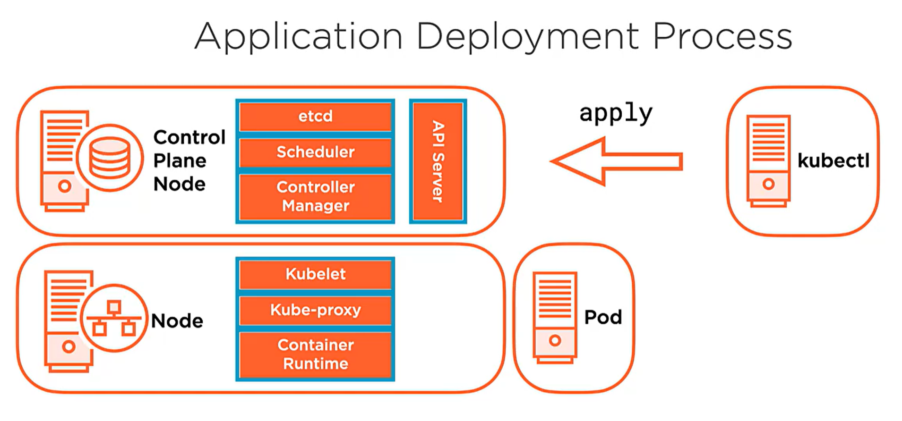

* what the API server is doing when `kubectl create deployment` is issued
1. admin issues `kubectl apply -f deployment.yaml`
2. deployment will creates a `replicaset`
3. `replicaset` will create `pods`, based on the `deployment.yaml`
4. `API server` will parse manifest yaml and store those objects in `etcd`
5. the `controller manager` is watching the `etcd` for any new interesting objects
6. if recognized as interesting (like a deployment), the `controller manager` will create a `controller` that will create a `replicaset`
7. the `replicaset` is going to create the required number of `pods` and write `pod` info to `etcd`
8. `scheduler` is watching `etcd` for `pod` info and validates that all pods that need/should be scheduled, the `scheduler` will schedule the `pods` to run on the `nodes`.
9. `scheduler` then updates `pod `info in `etcd` specifying the `node` where it is running
10. note that at this point in time `pods` haven't yet started on the `nodes`, images aren't yet pulled from the repo, etc.  `nodes` aren't aware yet that there are  published `pods` to be executed.... until...
11. on each `node`, `kubelet` is continuously watching `etcd` contents (via calls to the `api server`), and the `api server` reply will contain "yes, you have a pod that's to be scheduled"
12. the `node` resident `kubelet` signals to the `node` resident `container runtime` to pull down the image as per manifest `spec/container/image`, and start the `pod`.
13. if the `pod` is a member of a `service`, then once the `pod` is running, `container runtime` updates the `node` resident `kube-proxy`.

### demo: imperative deployments and workign with resources in the clsuter

1. create deployment
```
#this creates a deployment that's scheduled with the API Server with some accepted defaults
kubectl create deployment hello-world --image=gcr.io/google-samples/hello-app:1.0
#creates a deployment (replicaset) with one pod in it (replicas = 1)
# I ran into a problem again probably due to my ZTNA client.  Error was CrashLoopBackOff... and I verified by using `describe`.  I deleted the pod with `kubectl delete pod deployment && kubectl delete deploy hello-world` and will redeploy.
```

2. create a bare pod (a pod that's not managed by a controller)
* running a bare pod is similar to just launching a pod on docker desktop.
* bare pods are useful for tshooting as well
```
kubectl run hello-world-pod --image=gcr.io/google-samples/hello-app:1.0
```

3. get info on pods
```
$kubectl get pods -o widede
NAME                           READY   STATUS    RESTARTS   AGE   IP                NODE                NOMINATED NODE   READINESS GATES
hello-world-5457b44555-f9gmd   1/1     Running   0          97s   192.168.132.131   ubuntuworkernode2   <none>           <none>
hello-world-pod                1/1     Running   0          93s   192.168.28.68     ubuntuworkernode1   <none>           <none>
#note that both
# are deployed within SDN network
# you can see which nodes are running each pod
```

4. investigate containers that are running on a node
```
#ssh into ubuntuworkernode2
#since containerd is in use, use `crictl` to interface with the containerd instance via the socket
$ sudo crictl --runtime-endpoint unix:///run/containerd/containerd.sock ps
[sudo] password for matt:
CONTAINER           IMAGE               CREATED             STATE               NAME                ATTEMPT             POD ID              POD
7ff63836aebf9       13753a81eccfd       4 minutes ago       Running             hello-app           0                   f50a9fa760baa       hello-world-5457b44555-f9gmd
771eceb0d8771       08616d26b8e74       8 hours ago         Running             calico-node         0                   952fd6fa91f00       calico-node-mbdvm
cd426874fcb1e       e3f6fcd87756e       8 hours ago         Running             kube-proxy          0                   c6f6495ee3201       kube-proxy-2fkn2
```

5. tshooting techniques
```
#this will return stdout
kubectl logs hello-world-pod

#start a process inside a container inside a pod (note that /bin/sh is no longer on the image, so the following will fail)
kubectl exec -it hello-world-pod -- /bin/sh
```

#### inspect a deployment.
* this process is useful for tshooting
  * specifically review Events section of each

1. reviewing the earlier deployment (step 1)
```
$ kubectl get deployment hello-world
NAME          READY   UP-TO-DATE   AVAILABLE   AGE
hello-world   1/1     1            1           12h
$ kubectl get replicaset
NAME                     DESIRED   CURRENT   READY   AGE
hello-world-5457b44555   1         1         1       12h
$ kubectl get pods
NAME                           READY   STATUS    RESTARTS   AGE
hello-world-5457b44555-f9gmd   1/1     Running   0          12h
hello-world-pod                1/1     Running   0          12h
```

1. review the deployment, and notice that Deployments are made up of ReplicaSets
```
$ kubectl describe deployment hello-world
Name:                   hello-world
Namespace:              default
CreationTimestamp:      Fri, 31 Mar 2023 00:50:27 +0000
Labels:                 app=hello-world
Annotations:            deployment.kubernetes.io/revision: 1
Selector:               app=hello-world
Replicas:               1 desired | 1 updated | 1 total | 1 available | 0 unavailable
StrategyType:           RollingUpdate
MinReadySeconds:        0
RollingUpdateStrategy:  25% max unavailable, 25% max surge
Pod Template:
  Labels:  app=hello-world
  Containers:
   hello-app:
    Image:        gcr.io/google-samples/hello-app:1.0
    Port:         <none>
    Host Port:    <none>
    Environment:  <none>
    Mounts:       <none>
  Volumes:        <none>
Conditions:
  Type           Status  Reason
  ----           ------  ------
  Available      True    MinimumReplicasAvailable
  Progressing    True    NewReplicaSetAvailable
OldReplicaSets:  <none>
NewReplicaSet:   hello-world-5457b44555 (1/1 replicas created)
Events:          <none> #this will have a status of the deployment
```

1. take a look at the replica set.  Note the "Controlled by." ReplicaSets create the pods.
```
$ kubectl describe replicaset hello-world
Name:           hello-world-5457b44555
Namespace:      default
Selector:       app=hello-world,pod-template-hash=5457b44555
Labels:         app=hello-world
                pod-template-hash=5457b44555
Annotations:    deployment.kubernetes.io/desired-replicas: 1
                deployment.kubernetes.io/max-replicas: 2
                deployment.kubernetes.io/revision: 1
Controlled By:  Deployment/hello-world
Replicas:       1 current / 1 desired
Pods Status:    1 Running / 0 Waiting / 0 Succeeded / 0 Failed
Pod Template:
  Labels:  app=hello-world
           pod-template-hash=5457b44555
  Containers:
   hello-app:
    Image:        gcr.io/google-samples/hello-app:1.0
    Port:         <none>
    Host Port:    <none>
    Environment:  <none>
    Mounts:       <none>
  Volumes:        <none>
Events:           <none>
```

1. take a look at the pods.  Note the controlled by field.
```
$ kubectl describe pod hello-world-5457b44555-f9gmd
Name:         hello-world-5457b44555-f9gmd
Namespace:    default
Priority:     0
Node:         ubuntuworkernode2/172.16.94.12
Start Time:   Fri, 31 Mar 2023 00:50:27 +0000
Labels:       app=hello-world
              pod-template-hash=5457b44555
Annotations:  cni.projectcalico.org/containerID: f50a9fa760baade58f37c75e07f193a8ef8289b799b6eff74d2ea62d128e82cf
              cni.projectcalico.org/podIP: 192.168.132.131/32
              cni.projectcalico.org/podIPs: 192.168.132.131/32
Status:       Running
IP:           192.168.132.131
IPs:
  IP:           192.168.132.131
Controlled By:  ReplicaSet/hello-world-5457b44555
Containers:
  hello-app:
    Container ID:   containerd://7ff63836aebf9f706ea13168e9fab8a4dc0fa46a84768e7f21f1b18ee4e59e6d
    Image:          gcr.io/google-samples/hello-app:1.0
    Image ID:       gcr.io/google-samples/hello-app@sha256:845f77fab71033404f4cfceaa1ddb27b70c3551ceb22a5e7f4498cdda6c9daea
    Port:           <none>
    Host Port:      <none>
    State:          Running
      Started:      Fri, 31 Mar 2023 00:50:28 +0000
    Ready:          True
    Restart Count:  0
    Environment:    <none>
    Mounts:
      /var/run/secrets/kubernetes.io/serviceaccount from default-token-b44wj (ro)
Conditions:
  Type              Status
  Initialized       True
  Ready             True
  ContainersReady   True
  PodScheduled      True
Volumes:
  default-token-b44wj:
    Type:        Secret (a volume populated by a Secret)
    SecretName:  default-token-b44wj
    Optional:    false
QoS Class:       BestEffort
Node-Selectors:  <none>
Tolerations:     node.kubernetes.io/not-ready:NoExecute op=Exists for 300s
                 node.kubernetes.io/unreachable:NoExecute op=Exists for 300s
Events:          <none>
```

### demo: exposing and accessing services in your cluster

1. create a service listener
```
kubectl expose deployment hello-world --port=80 --target-port=8080
```

2. review service as it is
```
$ kubectl get service hello-world -o wide
NAME          TYPE        CLUSTER-IP      EXTERNAL-IP   PORT(S)   AGE   SELECTOR
hello-world   ClusterIP   10.97.104.123   <none>        80/TCP    37s   app=hello-world
```

3. review further details of the service
* note the endpoints.
  * these are the specific endpoints
```
$ kubectl describe service hello-world
Name:              hello-world
Namespace:         default
Labels:            app=hello-world
Annotations:       <none>
Selector:          app=hello-world
Type:              ClusterIP
IP Families:       <none>
IP:                10.97.104.123
IPs:               10.97.104.123
Port:              <unset>  80/TCP
TargetPort:        8080/TCP
Endpoints:         192.168.132.131:8080
Session Affinity:  None
Events:            <none>
```

4. gather info on the endpoint and then access the service
* if there were multiple replicas distributed across worker nodes, kubeproxy would handle routing of the requests to any one of the nodes
```
matt@ubuntucontrol:~$ kubectl get endpoints hello-world -o wide
NAME          ENDPOINTS              AGE
hello-world   192.168.132.131:8080   2m58s
matt@ubuntucontrol:~$ curl http://10.97.104.123:80
Hello, world!
Version: 1.0.0
Hostname: hello-world-5457b44555-f9gmd
matt@ubuntucontrol:~$ curl http://192.168.132.131:8080
Hello, world!
Version: 1.0.0
Hostname: hello-world-5457b44555-f9gmd
```

5. generate yaml or json for the deployment
* this isn't great for manifest production... remember you should use `--dry-run`.
```
$ kubectl get deployment hello-world -o yaml
apiVersion: apps/v1
kind: Deployment
metadata:
  annotations:
    deployment.kubernetes.io/revision: "1"
  creationTimestamp: "2023-03-31T00:50:27Z"
  generation: 1
  labels:
    app: hello-world
  managedFields:
  - apiVersion: apps/v1
    fieldsType: FieldsV1
    fieldsV1:
      f:metadata:
        f:labels:
          .: {}
          f:app: {}
      f:spec:
        f:progressDeadlineSeconds: {}
        f:replicas: {}
        f:revisionHistoryLimit: {}
        f:selector: {}
        f:strategy:
          f:rollingUpdate:
            .: {}
            f:maxSurge: {}
            f:maxUnavailable: {}
          f:type: {}
        f:template:
          f:metadata:
            f:labels:
              .: {}
              f:app: {}
          f:spec:
            f:containers:
              k:{"name":"hello-app"}:
                .: {}
                f:image: {}
                f:imagePullPolicy: {}
                f:name: {}
                f:resources: {}
                f:terminationMessagePath: {}
                f:terminationMessagePolicy: {}
            f:dnsPolicy: {}
            f:restartPolicy: {}
            f:schedulerName: {}
            f:securityContext: {}
            f:terminationGracePeriodSeconds: {}
    manager: kubectl-create
    operation: Update
    time: "2023-03-31T00:50:27Z"
  - apiVersion: apps/v1
    fieldsType: FieldsV1
    fieldsV1:
      f:metadata:
        f:annotations:
          .: {}
          f:deployment.kubernetes.io/revision: {}
      f:status:
        f:availableReplicas: {}
        f:conditions:
          .: {}
          k:{"type":"Available"}:
            .: {}
            f:lastTransitionTime: {}
            f:lastUpdateTime: {}
            f:message: {}
            f:reason: {}
            f:status: {}
            f:type: {}
          k:{"type":"Progressing"}:
            .: {}
            f:lastTransitionTime: {}
            f:lastUpdateTime: {}
            f:message: {}
            f:reason: {}
            f:status: {}
            f:type: {}
        f:observedGeneration: {}
        f:readyReplicas: {}
        f:replicas: {}
        f:updatedReplicas: {}
    manager: kube-controller-manager
    operation: Update
    time: "2023-03-31T00:50:28Z"
  name: hello-world
  namespace: default
  resourceVersion: "57965"
  uid: 6f138915-2f67-40af-8ae6-6e74028327d5
spec:
  progressDeadlineSeconds: 600
  replicas: 1
  revisionHistoryLimit: 10
  selector:
    matchLabels:
      app: hello-world
  strategy:
    rollingUpdate:
      maxSurge: 25%
      maxUnavailable: 25%
    type: RollingUpdate
  template:
    metadata:
      creationTimestamp: null
      labels:
        app: hello-world
    spec:
      containers:
      - image: gcr.io/google-samples/hello-app:1.0
        imagePullPolicy: IfNotPresent
        name: hello-app
        resources: {}
        terminationMessagePath: /dev/termination-log
        terminationMessagePolicy: File
      dnsPolicy: ClusterFirst
      restartPolicy: Always
      schedulerName: default-scheduler
      securityContext: {}
      terminationGracePeriodSeconds: 30
status:
  availableReplicas: 1
  conditions:
  - lastTransitionTime: "2023-03-31T00:50:28Z"
    lastUpdateTime: "2023-03-31T00:50:28Z"
    message: Deployment has minimum availability.
    reason: MinimumReplicasAvailable
    status: "True"
    type: Available
  - lastTransitionTime: "2023-03-31T00:50:27Z"
    lastUpdateTime: "2023-03-31T00:50:28Z"
    message: ReplicaSet "hello-world-5457b44555" has successfully progressed.
    reason: NewReplicaSetAvailable
    status: "True"
    type: Progressing
  observedGeneration: 1
  readyReplicas: 1
  replicas: 1
  updatedReplicas: 1


$ kubectl get deployment hello-world -o json
{
    "apiVersion": "apps/v1",
    "kind": "Deployment",
    "metadata": {
        "annotations": {
            "deployment.kubernetes.io/revision": "1"
        },
        "creationTimestamp": "2023-03-31T00:50:27Z",
        "generation": 1,
        "labels": {
            "app": "hello-world"
        },
        "managedFields": [
            {
                "apiVersion": "apps/v1",
                "fieldsType": "FieldsV1",
                "fieldsV1": {
                    "f:metadata": {
                        "f:labels": {
                            ".": {},
                            "f:app": {}
                        }
                    },
                    "f:spec": {
                        "f:progressDeadlineSeconds": {},
                        "f:replicas": {},
                        "f:revisionHistoryLimit": {},
                        "f:selector": {},
                        "f:strategy": {
                            "f:rollingUpdate": {
                                ".": {},
                                "f:maxSurge": {},
                                "f:maxUnavailable": {}
                            },
                            "f:type": {}
                        },
                        "f:template": {
                            "f:metadata": {
                                "f:labels": {
                                    ".": {},
                                    "f:app": {}
                                }
                            },
                            "f:spec": {
                                "f:containers": {
                                    "k:{\"name\":\"hello-app\"}": {
                                        ".": {},
                                        "f:image": {},
                                        "f:imagePullPolicy": {},
                                        "f:name": {},
                                        "f:resources": {},
                                        "f:terminationMessagePath": {},
                                        "f:terminationMessagePolicy": {}
                                    }
                                },
                                "f:dnsPolicy": {},
                                "f:restartPolicy": {},
                                "f:schedulerName": {},
                                "f:securityContext": {},
                                "f:terminationGracePeriodSeconds": {}
                            }
                        }
                    }
                },
                "manager": "kubectl-create",
                "operation": "Update",
                "time": "2023-03-31T00:50:27Z"
            },
            {
                "apiVersion": "apps/v1",
                "fieldsType": "FieldsV1",
                "fieldsV1": {
                    "f:metadata": {
                        "f:annotations": {
                            ".": {},
                            "f:deployment.kubernetes.io/revision": {}
                        }
                    },
                    "f:status": {
                        "f:availableReplicas": {},
                        "f:conditions": {
                            ".": {},
                            "k:{\"type\":\"Available\"}": {
                                ".": {},
                                "f:lastTransitionTime": {},
                                "f:lastUpdateTime": {},
                                "f:message": {},
                                "f:reason": {},
                                "f:status": {},
                                "f:type": {}
                            },
                            "k:{\"type\":\"Progressing\"}": {
                                ".": {},
                                "f:lastTransitionTime": {},
                                "f:lastUpdateTime": {},
                                "f:message": {},
                                "f:reason": {},
                                "f:status": {},
                                "f:type": {}
                            }
                        },
                        "f:observedGeneration": {},
                        "f:readyReplicas": {},
                        "f:replicas": {},
                        "f:updatedReplicas": {}
                    }
                },
                "manager": "kube-controller-manager",
                "operation": "Update",
                "time": "2023-03-31T00:50:28Z"
            }
        ],
        "name": "hello-world",
        "namespace": "default",
        "resourceVersion": "57965",
        "uid": "6f138915-2f67-40af-8ae6-6e74028327d5"
    },
    "spec": {
        "progressDeadlineSeconds": 600,
        "replicas": 1,
        "revisionHistoryLimit": 10,
        "selector": {
            "matchLabels": {
                "app": "hello-world"
            }
        },
        "strategy": {
            "rollingUpdate": {
                "maxSurge": "25%",
                "maxUnavailable": "25%"
            },
            "type": "RollingUpdate"
        },
        "template": {
            "metadata": {
                "creationTimestamp": null,
                "labels": {
                    "app": "hello-world"
                }
            },
            "spec": {
                "containers": [
                    {
                        "image": "gcr.io/google-samples/hello-app:1.0",
                        "imagePullPolicy": "IfNotPresent",
                        "name": "hello-app",
                        "resources": {},
                        "terminationMessagePath": "/dev/termination-log",
                        "terminationMessagePolicy": "File"
                    }
                ],
                "dnsPolicy": "ClusterFirst",
                "restartPolicy": "Always",
                "schedulerName": "default-scheduler",
                "securityContext": {},
                "terminationGracePeriodSeconds": 30
            }
        }
    },
    "status": {
        "availableReplicas": 1,
        "conditions": [
            {
                "lastTransitionTime": "2023-03-31T00:50:28Z",
                "lastUpdateTime": "2023-03-31T00:50:28Z",
                "message": "Deployment has minimum availability.",
                "reason": "MinimumReplicasAvailable",
                "status": "True",
                "type": "Available"
            },
            {
                "lastTransitionTime": "2023-03-31T00:50:27Z",
                "lastUpdateTime": "2023-03-31T00:50:28Z",
                "message": "ReplicaSet \"hello-world-5457b44555\" has successfully progressed.",
                "reason": "NewReplicaSetAvailable",
                "status": "True",
                "type": "Progressing"
            }
        ],
        "observedGeneration": 1,
        "readyReplicas": 1,
        "replicas": 1,
        "updatedReplicas": 1
    }
}
```
### demo: deleting resources

1. perform deletion.
* note the order of delete operations
```
$ kubectl get all
NAME                               READY   STATUS    RESTARTS   AGE
pod/hello-world-5457b44555-f9gmd   1/1     Running   0          12h
pod/hello-world-pod                1/1     Running   0          12h

NAME                  TYPE        CLUSTER-IP      EXTERNAL-IP   PORT(S)   AGE
service/hello-world   ClusterIP   10.97.104.123   <none>        80/TCP    7m31s
service/kubernetes    ClusterIP   10.96.0.1       <none>        443/TCP   23h

NAME                          READY   UP-TO-DATE   AVAILABLE   AGE
deployment.apps/hello-world   1/1     1            1           12h

NAME                                     DESIRED   CURRENT   READY   AGE
replicaset.apps/hello-world-5457b44555   1         1         1       12h

$ kubectl delete service hello-world
service "hello-world" deleted

$ kubectl delete deployment hello-world #this deletes the deployment, the replicaset, and the scheduled pods
deployment.apps "hello-world" deleted

$ kubectl delete pod hello-world-pod
pod "hello-world-pod" deleted

$ kubectl get all
NAME                 TYPE        CLUSTER-IP   EXTERNAL-IP   PORT(S)   AGE
service/kubernetes   ClusterIP   10.96.0.1    <none>        443/TCP   23h
```
### demo: declarative deployment and accessing and modifying existing resources in the cluster

1. produce a manifest for a deployment
```
$ kubectl create deployment hello-world --image=gcr.io/google-samples/hello-app:1.0 --dry-run=client -o yaml | tee deployment.yaml
apiVersion: apps/v1
kind: Deployment
metadata:
  creationTimestamp: null
  labels:
    app: hello-world
  name: hello-world
spec:
  replicas: 1
  selector:
    matchLabels:
      app: hello-world
  strategy: {}
  template:
    metadata:
      creationTimestamp: null
      labels:
        app: hello-world
    spec:
      containers:
      - image: gcr.io/google-samples/hello-app:1.0
        name: hello-app
        resources: {}
status: {}
```

2. deploy to the cluster
```
$ kubectl apply -f deployment.yaml
deployment.apps/hello-world created
```

3. create and deploy a service

```
$ kubectl expose deployment hello-world --port=80 --target-port=8080 --dry-run=client -o yaml | tee service.yaml
apiVersion: v1
kind: Service
metadata:
  creationTimestamp: null
  labels:
    app: hello-world
  name: hello-world
spec:
  ports:
  - port: 80
    protocol: TCP
    targetPort: 8080
  selector:
    app: hello-world
status:
  loadBalancer: {}
$ kubectl apply -f service.yaml
service/hello-world created
```

4. check status of deployment(s)
```
$ kubectl get all
NAME                               READY   STATUS    RESTARTS   AGE
pod/hello-world-5457b44555-cvt29   1/1     Running   0          2m12s

NAME                  TYPE        CLUSTER-IP       EXTERNAL-IP   PORT(S)   AGE
service/hello-world   ClusterIP   10.104.194.190   <none>        80/TCP    32s
service/kubernetes    ClusterIP   10.96.0.1        <none>        443/TCP   23h

NAME                          READY   UP-TO-DATE   AVAILABLE   AGE
deployment.apps/hello-world   1/1     1            1           2m12s

NAME                                     DESIRED   CURRENT   READY   AGE
replicaset.apps/hello-world-5457b44555   1         1         1       2m12s
```

5. make a change to an existing deployment.
* When you have a manifest file that's been deployed, you can simply modify this manifest, then re-`apply` and this will affect the currently running deployment.
```
vim deployment.yaml
# change the spec.replicas from 1 to 20
replicas: 20

$ kubectl apply -f deployment.yaml
deployment.apps/hello-world configured

$ kubectl get all -o wide #note the replica count
NAME                               READY   STATUS    RESTARTS   AGE     IP                NODE                NOMINATED NODE   READINESS GATES
pod/hello-world-5457b44555-2987p   1/1     Running   0          35s     192.168.28.75     ubuntuworkernode1   <none>           <none>
pod/hello-world-5457b44555-4wgz9   1/1     Running   0          35s     192.168.132.133   ubuntuworkernode2   <none>           <none>
pod/hello-world-5457b44555-6r5vs   1/1     Running   0          35s     192.168.236.196   ubuntuworkernode3   <none>           <none>
pod/hello-world-5457b44555-6wxbv   1/1     Running   0          35s     192.168.28.73     ubuntuworkernode1   <none>           <none>
pod/hello-world-5457b44555-8898x   1/1     Running   0          35s     192.168.236.201   ubuntuworkernode3   <none>           <none>
pod/hello-world-5457b44555-8pbvv   1/1     Running   0          35s     192.168.236.197   ubuntuworkernode3   <none>           <none>
pod/hello-world-5457b44555-cvt29   1/1     Running   0          7m29s   192.168.132.132   ubuntuworkernode2   <none>           <none>
pod/hello-world-5457b44555-dfbm5   1/1     Running   0          35s     192.168.132.134   ubuntuworkernode2   <none>           <none>
pod/hello-world-5457b44555-f727c   1/1     Running   0          35s     192.168.28.71     ubuntuworkernode1   <none>           <none>
pod/hello-world-5457b44555-fb68b   1/1     Running   0          35s     192.168.132.137   ubuntuworkernode2   <none>           <none>
pod/hello-world-5457b44555-g6xmg   1/1     Running   0          35s     192.168.28.70     ubuntuworkernode1   <none>           <none>
pod/hello-world-5457b44555-kkmgs   1/1     Running   0          35s     192.168.236.200   ubuntuworkernode3   <none>           <none>
pod/hello-world-5457b44555-kpdsb   1/1     Running   0          35s     192.168.132.136   ubuntuworkernode2   <none>           <none>
pod/hello-world-5457b44555-lqblw   1/1     Running   0          35s     192.168.132.135   ubuntuworkernode2   <none>           <none>
pod/hello-world-5457b44555-phr22   1/1     Running   0          35s     192.168.236.198   ubuntuworkernode3   <none>           <none>
pod/hello-world-5457b44555-q6p69   1/1     Running   0          35s     192.168.236.199   ubuntuworkernode3   <none>           <none>
pod/hello-world-5457b44555-q8wcc   1/1     Running   0          35s     192.168.236.195   ubuntuworkernode3   <none>           <none>
pod/hello-world-5457b44555-rnpf5   1/1     Running   0          35s     192.168.28.69     ubuntuworkernode1   <none>           <none>
pod/hello-world-5457b44555-sln6v   1/1     Running   0          35s     192.168.28.72     ubuntuworkernode1   <none>           <none>
pod/hello-world-5457b44555-sm944   1/1     Running   0          35s     192.168.28.74     ubuntuworkernode1   <none>           <none>

NAME                  TYPE        CLUSTER-IP       EXTERNAL-IP   PORT(S)   AGE     SELECTOR
service/hello-world   ClusterIP   10.104.194.190   <none>        80/TCP    5m49s   app=hello-world
service/kubernetes    ClusterIP   10.96.0.1        <none>        443/TCP   23h     <none>

NAME                          READY   UP-TO-DATE   AVAILABLE   AGE     CONTAINERS   IMAGES                                SELECTOR
deployment.apps/hello-world   20/20   20           20          7m29s   hello-app    gcr.io/google-samples/hello-app:1.0   app=hello-world

NAME                                     DESIRED   CURRENT   READY   AGE     CONTAINERS   IMAGES                                SELECTOR
replicaset.apps/hello-world-5457b44555   20        20        20      7m29s   hello-app    gcr.io/google-samples/hello-app:1.0   app=hello-world,pod-template-hash=5457b44555

#revert to 1 replica and `apply`
#the pods outside of the replica will Terminate then

$ kubectl get all -o wide
NAME                               READY   STATUS    RESTARTS   AGE     IP                NODE                NOMINATED NODE   READINESS GATES
pod/hello-world-5457b44555-cvt29   1/1     Running   0          8m59s   192.168.132.132   ubuntuworkernode2   <none>           <none>

NAME                  TYPE        CLUSTER-IP       EXTERNAL-IP   PORT(S)   AGE     SELECTOR
service/hello-world   ClusterIP   10.104.194.190   <none>        80/TCP    7m19s   app=hello-world
service/kubernetes    ClusterIP   10.96.0.1        <none>        443/TCP   23h     <none>

NAME                          READY   UP-TO-DATE   AVAILABLE   AGE     CONTAINERS   IMAGES                                SELECTOR
deployment.apps/hello-world   1/1     1            1           8m59s   hello-app    gcr.io/google-samples/hello-app:1.0   app=hello-world

NAME                                     DESIRED   CURRENT   READY   AGE     CONTAINERS   IMAGES                                SELECTOR
replicaset.apps/hello-world-5457b44555   1         1         1       8m59s   hello-app    gcr.io/google-samples/hello-app:1.0   app=hello-world,pod-template-hash=5457b44555


#expand back to 20 then apply again
$ kubectl get deployment hello-world
NAME          READY   UP-TO-DATE   AVAILABLE   AGE
hello-world   20/20   20           20          11m

#check service (note that this is the kubeproxy mesh, and all running pods will expose this listener to the kubeproxy LB)
$ kubectl get service hello-world
NAME          TYPE        CLUSTER-IP       EXTERNAL-IP   PORT(S)   AGE
hello-world   ClusterIP   10.104.194.190   <none>        80/TCP    10m

$ curl http://10.104.194.190
Hello, world!
Version: 1.0.0
Hostname: hello-world-5457b44555-fpgp8 #this a pod
$ curl http://10.104.194.190
Hello, world!
Version: 1.0.0
Hostname: hello-world-5457b44555-8qfp4 #this a pod
$ curl http://10.104.194.190
Hello, world!
Version: 1.0.0
Hostname: hello-world-5457b44555-4sdrs #this a pod
$ curl http://10.104.194.190
Hello, world!
Version: 1.0.0
Hostname: hello-world-5457b44555-6zncg #this a pod
```

6. edit a deployment's runtime config.  This is effectively affecting the API Server's (etcd) config for the deployment on-the-fly:
```
#change replicas to `30`
$ kubectl edit deployment hello-world
deployment.apps/hello-world edited

$ kubectl get pods  | wc -l
31

$ kubectl get deployment hello-world
NAME          READY   UP-TO-DATE   AVAILABLE   AGE
hello-world   30/30   30           30          54m
```

7. change a deployment's runtime config by command
```
$ kubectl scale deployment hello-world --replicas=40

$ kubectl get deployment hello-world
NAME          READY   UP-TO-DATE   AVAILABLE   AGE
hello-world   40/40   40           40          55m
```

7. delete the deployment
```
kubectl delete deployment hello-world
kubectl delete service hello-world
kubectl get pods --watch
```

# Managing the Kubernetes API Server and pods

## course overview
* using kubernetes API
  * interaction
  * internals
* managing objects with labels, annotations, and namespaces
  * organize workloads
* runnign and managing pods
  * how they're made
  * how to keep them working


## Using the Kubernetes API

### kubernetes API and API server

* single surface area over the resources in the cluster
* can use api objects to model system
  * are a collection of primitives to represent the system state
  * enables config of state
* API server
  * sole way to interact with cluster
  * sole way that k8s interacts with clsuter

#### API server
* client/server architecture
* implements REST API over HTTP using JSON
* client submits rquests over HTTP(S)
* server will respnd to the request
* the server is stateless (any conf changes made in cluster via API objects aren't stored in API server)
  * persisted in clsuter data store (etcd)

### Control Plan Node
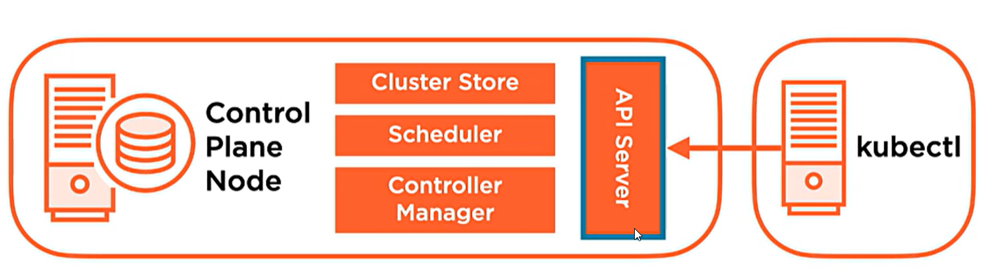

* critical services that facilitate functionality
* API server is the comm hub
  * etcd
  * scheduler
  * controller manager: implements lifecycle functions
* `kubectl` interacts with api server

### k8s api objects
* persistent entities in k8s
* represent the state of your system
* API objects are organized in three ways
  * `kind`: string value represents the REST API resource (ie: pod, service, deployment, etc)
  * `group`: group like objects together according to their function (ie: core, apps, storage)
  * `version`: defines the version schema of the API resource object in the API server (ie: v1, beta, alpha, etc)

#### Kubernetes API objects: kind
* `pods`: used to deploy container based apps to ks
* `deployments`: allow to declaratively deploy applications to the cluster and control image, scaling, etc
* `service`: provide LB and persistent access points
* `persistentvolumes`: provide persistent storage to container based apps
* there are more!

#### working with objects
* imperative config: executing a series of commands affecting the state
* declarative config:
  * define the desired state in code using manifests (YAML or JSON)
  * apply to the k8s clsuter with something like `kubectl apply`

### defining a basic pod manifest manually
* create a yaml pod manifest
```
apiVersion: v1
kind: Pod
metadata:
  name: mginx=pod
spec:
  containers:
  - name: nginx
    image: nginx
```
* apply with `kubectl apply -f nginz.yaml`

#### working with `kubectl --dry-run`

##### server-side dry-run
* when making an API request that creates/changes resources in the cluster, you can add the `--dry-run` to the request, but it will not be persisted.
  * this is used for validation of the config to the API server
```
kubectl apply -f deployment.yaml --dry-run=server
```

##### client-side dry-run
* validates and prints the object to stdout without sending to the API server
```
kubectl apply -f deployment.yaml --dry-run=client
kubectl create deployment hello-world --image=gcr.io/google-samples/hello-app:1.0 --dry-run=client -o yaml > deployment_dryrun.yaml
```

#### using the `kubectl diff`
* you can diff manifests (or stdin) versus cluster states
```
kubectl diff -f newdeployment.yaml
```

### demo: api server discovery: listing resources, using `kubectl explain` and creating objects

#### API discovery

1. validate cluster context and change if needed
```
$ kubectl config get-contexts
.CURRENT   NAME                          CLUSTER      AUTHINFO           NAMESPACE
*         kubernetes-admin@kubernetes   kubernetes   kubernetes-admin

$ kubectl config use-context kubernetes-admin@kubernetes
Switched to context "kubernetes-admin@kubernetes".

$ kubectl cluster-info
Kubernetes control plane is running at https://172.16.94.10:6443
KubeDNS is running at https://172.16.94.10:6443/api/v1/namespaces/kube-system/services/kube-dns:dns/proxy

To further debug and diagnose cluster problems, use 'kubectl cluster-info dump'
```

2. list API resources
* node the kind and name
```
$ kubectl api-resources
NAME                              SHORTNAMES   APIVERSION                             NAMESPACED   KIND
bindings                                       v1                                     true         Binding
componentstatuses                 cs           v1                                     false        ComponentStatus
configmaps                        cm           v1                                     true         ConfigMap
endpoints                         ep           v1                                     true         Endpoints
events                            ev           v1                                     true         Event
limitranges                       limits       v1                                     true         LimitRange
namespaces                        ns           v1                                     false        Namespace
nodes                             no           v1                                     false        Node
persistentvolumeclaims            pvc          v1                                     true         PersistentVolumeClaim
persistentvolumes                 pv           v1                                     false        PersistentVolume
pods                              po           v1                                     true         Pod
podtemplates                                   v1                                     true         PodTemplate
replicationcontrollers            rc           v1                                     true         ReplicationController
resourcequotas                    quota        v1                                     true         ResourceQuota
secrets                                        v1                                     true         Secret
serviceaccounts                   sa           v1                                     true         ServiceAccount
services                          svc          v1                                     true         Service
mutatingwebhookconfigurations                  admissionregistration.k8s.io/v1        false        MutatingWebhookConfiguration
validatingwebhookconfigurations                admissionregistration.k8s.io/v1        false        ValidatingWebhookConfiguration
customresourcedefinitions         crd,crds     apiextensions.k8s.io/v1                false        CustomResourceDefinition
apiservices                                    apiregistration.k8s.io/v1              false        APIService
controllerrevisions                            apps/v1                                true         ControllerRevision
daemonsets                        ds           apps/v1                                true         DaemonSet
deployments                       deploy       apps/v1                                true         Deployment
replicasets                       rs           apps/v1                                true         ReplicaSet
statefulsets                      sts          apps/v1                                true         StatefulSet
tokenreviews                                   authentication.k8s.io/v1               false        TokenReview
localsubjectaccessreviews                      authorization.k8s.io/v1                true         LocalSubjectAccessReview
selfsubjectaccessreviews                       authorization.k8s.io/v1                false        SelfSubjectAccessReview
selfsubjectrulesreviews                        authorization.k8s.io/v1                false        SelfSubjectRulesReview
subjectaccessreviews                           authorization.k8s.io/v1                false        SubjectAccessReview
horizontalpodautoscalers          hpa          autoscaling/v1                         true         HorizontalPodAutoscaler
cronjobs                          cj           batch/v1beta1                          true         CronJob
jobs                                           batch/v1                               true         Job
certificatesigningrequests        csr          certificates.k8s.io/v1                 false        CertificateSigningRequest
leases                                         coordination.k8s.io/v1                 true         Lease
bgpconfigurations                              crd.projectcalico.org/v1               false        BGPConfiguration
bgppeers                                       crd.projectcalico.org/v1               false        BGPPeer
blockaffinities                                crd.projectcalico.org/v1               false        BlockAffinity
caliconodestatuses                             crd.projectcalico.org/v1               false        CalicoNodeStatus
clusterinformations                            crd.projectcalico.org/v1               false        ClusterInformation
felixconfigurations                            crd.projectcalico.org/v1               false        FelixConfiguration
globalnetworkpolicies                          crd.projectcalico.org/v1               false        GlobalNetworkPolicy
globalnetworksets                              crd.projectcalico.org/v1               false        GlobalNetworkSet
hostendpoints                                  crd.projectcalico.org/v1               false        HostEndpoint
ipamblocks                                     crd.projectcalico.org/v1               false        IPAMBlock
ipamconfigs                                    crd.projectcalico.org/v1               false        IPAMConfig
ipamhandles                                    crd.projectcalico.org/v1               false        IPAMHandle
ippools                                        crd.projectcalico.org/v1               false        IPPool
ipreservations                                 crd.projectcalico.org/v1               false        IPReservation
kubecontrollersconfigurations                  crd.projectcalico.org/v1               false        KubeControllersConfiguration
networkpolicies                                crd.projectcalico.org/v1               true         NetworkPolicy
networksets                                    crd.projectcalico.org/v1               true         NetworkSet
endpointslices                                 discovery.k8s.io/v1beta1               true         EndpointSlice
events                            ev           events.k8s.io/v1                       true         Event
ingresses                         ing          extensions/v1beta1                     true         Ingress
flowschemas                                    flowcontrol.apiserver.k8s.io/v1beta1   false        FlowSchema
prioritylevelconfigurations                    flowcontrol.apiserver.k8s.io/v1beta1   false        PriorityLevelConfiguration
ingressclasses                                 networking.k8s.io/v1                   false        IngressClass
ingresses                         ing          networking.k8s.io/v1                   true         Ingress
networkpolicies                   netpol       networking.k8s.io/v1                   true         NetworkPolicy
runtimeclasses                                 node.k8s.io/v1                         false        RuntimeClass
poddisruptionbudgets              pdb          policy/v1beta1                         true         PodDisruptionBudget
podsecuritypolicies               psp          policy/v1beta1                         false        PodSecurityPolicy
clusterrolebindings                            rbac.authorization.k8s.io/v1           false        ClusterRoleBinding
clusterroles                                   rbac.authorization.k8s.io/v1           false        ClusterRole
rolebindings                                   rbac.authorization.k8s.io/v1           true         RoleBinding
roles                                          rbac.authorization.k8s.io/v1           true         Role
priorityclasses                   pc           scheduling.k8s.io/v1                   false        PriorityClass
csidrivers                                     storage.k8s.io/v1                      false        CSIDriver
csinodes                                       storage.k8s.io/v1                      false        CSINode
storageclasses                    sc           storage.k8s.io/v1                      false        StorageClass
volumeattachments                              storage.k8s.io/v1                      false        VolumeAttachment
```

3. explain the `pod` resources
```
$ kubectl explain pods
KIND:     Pod
VERSION:  v1

DESCRIPTION:
     Pod is a collection of containers that can run on a host. This resource is
     created by clients and scheduled onto hosts.

FIELDS:
   apiVersion   <string>
     APIVersion defines the versioned schema of this representation of an
     object. Servers should convert recognized schemas to the latest internal
     value, and may reject unrecognized values. More info:
     https://git.k8s.io/community/contributors/devel/sig-architecture/api-conventions.md#resources

   kind <string>
     Kind is a string value representing the REST resource this object
     represents. Servers may infer this from the endpoint the client submits
     requests to. Cannot be updated. In CamelCase. More info:
     https://git.k8s.io/community/contributors/devel/sig-architecture/api-conventions.md#types-kinds

   metadata     <Object>
     Standard object's metadata. More info:
     https://git.k8s.io/community/contributors/devel/sig-architecture/api-conventions.md#metadata

   spec <Object>
     Specification of the desired behavior of the pod. More info:
     https://git.k8s.io/community/contributors/devel/sig-architecture/api-conventions.md#spec-and-status

   status       <Object>
     Most recently observed status of the pod. This data may not be up to date.
     Populated by the system. Read-only. More info:
     https://git.k8s.io/community/contributors/devel/sig-architecture/api-conventions.md#spec-and-status

$ kubectl explain pods.spec
$ kubectl explain pods.spec.containers
```

4. write a pod manifest
```
apiVersion: v1
kind: Pod
metadata:
  name: hello-world
spec:
  containers:
  - name: hello-world
    image: gcr.io/google-samples/hello-app:1.0
```

5. apply this pod manifest, validate it, then delete it
```
$ kubectl apply -f pod.yaml
pod/hello-world created

$ kubectl get pods
NAME          READY   STATUS    RESTARTS   AGE
hello-world   1/1     Running   0          7s

$ kubectl delete pod hello-world
pod "hello-world" deleted
```

### demo: work with `kubectl --dry-run`
1. validate server-side
```
$ kubectl apply -f deployment.yaml --dry-run=server
deployment.apps/hello-world created (server dry run)
```

2. validate client-side
```
$ kubectl apply -f deployment.yaml --dry-run=client
deployment.apps/hello-world created (dry run)
```

3. create a bad manifest and validate client-side
```
cat deployment.yaml | sed s/apiVersion/apiZwervsion/ > deployment-error.yaml
$ kubectl apply -f deployment-error.yaml --dry-run=client
error: error validating "deployment-error.yaml": error validating data: apiVersion not set; if you choose to ignore these errors, turn validation off with --validate=false
```

4. generate yaml
```
#validdate
$ kubectl create deployment nginx --image=nginz --dry-run=client
deployment.apps/nginx created (dry run)

#produce yaml manifest
$ kubectl create deployment nginx --image=nginz --dry-run=client -o yaml
apiVersion: apps/v1
kind: Deployment
metadata:
  creationTimestamp: null
  labels:
    app: nginx
  name: nginx
spec:
  replicas: 1
  selector:
    matchLabels:
      app: nginx
  strategy: {}
  template:
    metadata:
      creationTimestamp: null
      labels:
        app: nginx
    spec:
      containers:
      - image: nginz
        name: nginz
        resources: {}
status: {}
```

5. remember you can delete resources created in a manifest by `-f manifest.yaml`

### demo: working with kubectl  diff

1. create a second manifest with a change
```
cat deployment.yaml | sed -e s/replicas:\ 20/replicas:\ 5/ > deployment-new.yaml
```

2. use `kubectl diff` to compare a manifest directly to the running cluster in the current context
```
kubectl diff -f deployment-new.yaml
```

### API Groups and API versioning

#### API group
* enable organization of resources in k8s API
* two high level API groups
  * core API (legacy group): original list of resources (ie: pods)
  * named API Groups: newer resources (ie: storage)
* Part of the API Object's URL in API requests
  * core API is part of the base URL

##### examples of resources/API objects
* core API groups
  * pods, nodes, namespace, persistentvolume, persistentvolumeclaims
* named API groups
  * apps (ie: Deployment)
  * storage.k8s.io (ie: StorageClass)
  * rbac.authorization.k8s.io (ie: Role)

#### API versioning

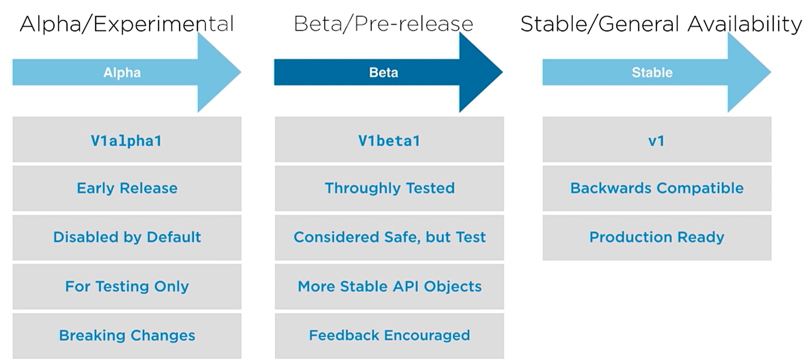

* API is versioned
* provide stability for existing implementations
* enable forward change
* deprecation of features occurs in stable/GA

### demo: api object discovery, API groups and versions

1. review api stuff by asking the API server about `api-resources`
* remember you're specifying an `apiVersion` in manifests...
```
$ kubectl api-resources | grep apps
controllerrevisions                            apps/v1                                true         ControllerRevision
daemonsets                        ds           apps/v1                                true         DaemonSet
deployments                       deploy       apps/v1                                true         Deployment
replicasets                       rs           apps/v1                                true         ReplicaSet
statefulsets                      sts          apps/v1                                true         StatefulSet

$ kubectl api-resources --api-group=apps
NAME                  SHORTNAMES   APIVERSION   NAMESPACED   KIND
controllerrevisions                apps/v1      true         ControllerRevision
daemonsets            ds           apps/v1      true         DaemonSet
deployments           deploy       apps/v1      true         Deployment
replicasets           rs           apps/v1      true         ReplicaSet
statefulsets          sts          apps/v1      true         StatefulSet

$ kubectl explain deployment --api-version apps/v1
```

2. review api versions availabe on the api server
```
$ kubectl api-versions | sort
admissionregistration.k8s.io/v1
admissionregistration.k8s.io/v1beta1
apiextensions.k8s.io/v1
apiextensions.k8s.io/v1beta1
apiregistration.k8s.io/v1
apiregistration.k8s.io/v1beta1
apps/v1
authentication.k8s.io/v1
authentication.k8s.io/v1beta1
authorization.k8s.io/v1
authorization.k8s.io/v1beta1
autoscaling/v1
autoscaling/v2beta1
autoscaling/v2beta2
batch/v1
batch/v1beta1
certificates.k8s.io/v1
certificates.k8s.io/v1beta1
coordination.k8s.io/v1
coordination.k8s.io/v1beta1
crd.projectcalico.org/v1
discovery.k8s.io/v1beta1
events.k8s.io/v1
events.k8s.io/v1beta1
extensions/v1beta1
flowcontrol.apiserver.k8s.io/v1beta1
networking.k8s.io/v1
networking.k8s.io/v1beta1
node.k8s.io/v1
node.k8s.io/v1beta1
policy/v1beta1
rbac.authorization.k8s.io/v1
rbac.authorization.k8s.io/v1beta1
scheduling.k8s.io/v1
scheduling.k8s.io/v1beta1
storage.k8s.io/v1
storage.k8s.io/v1beta1
v1
```

### anatomy of an API request
* when you issue a `kubectl` command, `kubectl` converts the command line and possibly the yaml manifest into json, then submits the request to the API server in the cluster context in which you're operating and have authed using the kubeconfig files.
* REST API actions are used: GET, POST, DELETE, etc
* requests contain specs
* client-server architecture
  * any client can communicate via REST to the server

#### what a valid API request looks like
* HTTP based REST API
  * HTTP verbs (GET, POST)
  * resource location (URI)
  * request = verb + resource location
  * server responds with response code

#### API verbs
* `GET`: get data for a specified resource
* `POST`: create a resource
* `DELETE`: delete a resource
* `PUT`: create or update entire existing resource
* `PATCH`: modify the specified fields of a resource

##### special API requests
* facilitating operations
* `LOG`: retrieve logs from a container in a `pod`.
* `EXEC`: executes a command in a container and get stdout back.
* `WATCH`: change notifications on a resource with streaming output
  * each resource has a `resourceVersion` (in a change table), then the `resourceVersion` if changed... notifications are sent to clients.

#### API resource location (paths)
* Core API (legacy) resource locations look like this:
  * `http://apiserver:port/api/$VERSION/$RESOURCE_TYPE`
  * namespaced: `http://apiserver:port/api/$VERSION/namespaces/$NAMESPACE/$RESOURCE_TYPE/$RESOURCE_NAME`
* API Groups resource locations look like this:
  * `http://apiserver:port/apis/$GROUPNAME/$VERSION/$RESOURCE_TYPE`
  * namespaced: `http://apiserver:port/apis/$GROUPNAME/$VERSION/namespaces/$NAMESPACE/$RESOURCE_TYPE/$RESOURCE_NAME`

#### API responses (HTTP response codes)
* successes (2xx)
  * 200: OK
  * 201: created
  * 202: accepted (async operation)
* client errors (4xx)
  * 401: unauthed
  * 403: access denied
  * 404: not found
* server errors (5xx)
  * 500: internal server error

#### lifecycle of an api request

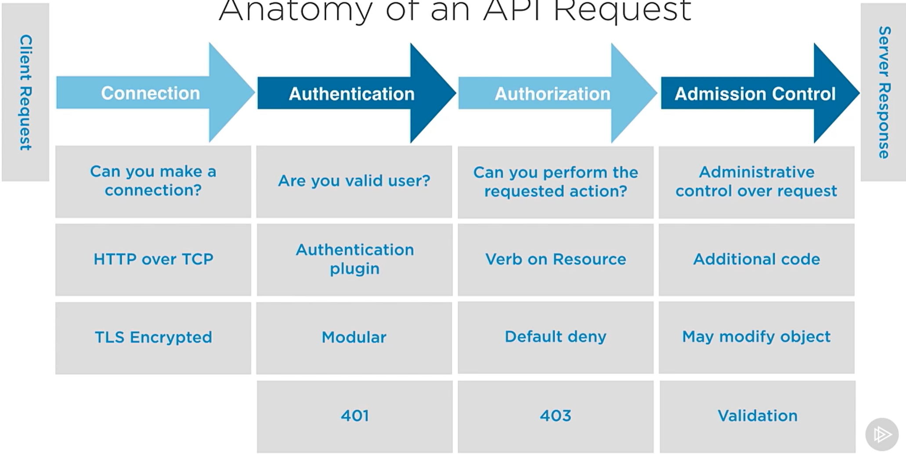

* connection:
  * can you make a connection?
  * HTTP over TCP
  * TLS encrypted
* authentication
  * are you a valid user?
  * authentication plugin
    * modular, certs, token, etc
  * HTTP response 401 == fail
* authorization
  * can you perform the requested action?
  * VERB on NOUN (resource)
  * default deny, roles allow VERBs
  * HTTP response 403 == fail
* Admission control
  * administrative control over request
  * additional code to queue and order requests that are being sent to the cluster
  * it may modify (adding defaults, resource quotas, reject, etc)
  * validate the request

### demo: anatomy of an API request
1. produce pod.yaml and apply to cluster

```
cat <<EOF | tee ~/pod.yaml
apiVersion: v1
kind: Pod
metadata:
  name: hello-world
spec:
  containers:
  - name: hello-world
    image: gcr.io/google-samples/hello-app:1.0
EOF

kubectl apply -f pod.yaml
```

2. adjust verbosity

```
$ kubectl get pod -v 6
I0331 18:05:07.455512   60942 loader.go:379] Config loaded from file:  /home/matt/.kube/config
I0331 18:05:07.467294   60942 round_trippers.go:445] GET https://172.16.94.10:6443/api/v1/namespaces/default/pods?limit=500 200 OK in 6 milliseconds
NAME          READY   STATUS    RESTARTS   AGE
hello-world   1/1     Running   0          16s

$ kubectl get pod -v 7
I0331 18:05:08.750068   60947 loader.go:379] Config loaded from file:  /home/matt/.kube/config
I0331 18:05:08.757690   60947 round_trippers.go:422] GET https://172.16.94.10:6443/api/v1/namespaces/default/pods?limit=500
I0331 18:05:08.758062   60947 round_trippers.go:429] Request Headers:
I0331 18:05:08.758224   60947 round_trippers.go:433]     Accept: application/json;as=Table;v=v1;g=meta.k8s.io,application/json;as=Table;v=v1beta1;g=meta.k8s.io,application/json
I0331 18:05:08.758521   60947 round_trippers.go:433]     User-Agent: kubectl/v1.20.1 (linux/amd64) kubernetes/c4d7527
I0331 18:05:08.764671   60947 round_trippers.go:448] Response Status: 200 OK in 5 milliseconds
NAME          READY   STATUS    RESTARTS   AGE
hello-world   1/1     Running   0          17s
```
* note the call to the API via the VERBs (`GET`)

3. issue curl against the API server

```
#establish tunnel using kubeproxy
sudo netstat -anop | grep 8001
kubectl proxy &
sudo netstat -anop | grep 8001

curl -s http://localhost:8001/api/v1/namespaces/default/pods/hello-world | head -n 20
fg 1
ctrl-c
```

### demo: special API requests: watch, exec and log
1. execute a watch

```
$ kubectl get pods --watch -v 6 &
[1] 83573
$ I0331 18:39:31.298968   83573 loader.go:379] Config loaded from file:  /home/matt/.kube/config
<snip>
NAME          READY   STATUS    RESTARTS   AGE
hello-world   1/1     Running   0          34m
I0331 18:39:31.420722   83573 round_trippers.go:445] GET https://172.16.94.10:6443/api/v1/namespaces/default/pods?resourceVersion=153128&watch=true 200 OK in 0 milliseconds
# note the `&watch=true`

# see that kubectl holds open a connection to the API Server
$ sudo netstat -plant | grep kubectl
tcp        0      0 172.16.94.10:53836      172.16.94.10:6443       ESTABLISHED 83573/kubectl

```

2. delete a pod and observe the `kubectl --watch` output
```
$ kubectl delete pods hello-world
hello-world   1/1     Terminating   0          37m
pod "hello-world" deleted
hello-world   1/1     Terminating   0          37m
hello-world   0/1     Terminating   0          37m
hello-world   0/1     Terminating   0          37m
hello-world   0/1     Terminating   0          37m
```

3. recreate pod and observe the `kubectl --watch` output... then kill `kubectl --watch`
```
$ kubectl apply -f pod.yaml
hello-world   0/1     Pending       0          0s
pod/hello-world created
hello-world   0/1     Pending       0          0s
hello-world   0/1     ContainerCreating   0          0s
hello-world   0/1     ContainerCreating   0          1s
hello-world   1/1     Running             0          2s

fg 1
ctrl-c
```

4. grab some logs

```
$ kubectl logs hello-world
.2023/03/31 18:43:12 Server listening on port 8080

$ kubectl logs hello-world -v 6
I0331 18:45:29.843142   87359 loader.go:379] Config loaded from file:  /home/matt/.kube/config
I0331 18:45:29.861117   87359 round_trippers.go:445] GET https://172.16.94.10:6443/api/v1/namespaces/default/pods/hello-world 200 OK in 10 milliseconds
I0331 18:45:29.868644   87359 round_trippers.go:445] GET https://172.16.94.10:6443/api/v1/namespaces/default/pods/hello-world/log 200 OK in 3 milliseconds
2023/03/31 18:43:12 Server listening on port 8080
```

5. create a tunnel and curl some logs
```
kubectl proxy &
curl -s https://localhost:8001/api/v1/namespaces/default/pods/hello-world/log

fg 1
ctrl-c
```

### demo: authen failures and missing resources

1. create a backup of kubeconfig
```
cp ~/.kube/config ~/.kube/config.orig
#modify `~/.kube/config` and change `kubernetes-admin` name under `users` to `kubenetes-admin1`
```

2. execute a command
* notice the `403` error in the returned data
```
$ kubectl get pods -v 6
I0331 18:51:02.488519   90889 loader.go:379] Config loaded from file:  /home/matt/.kube/config
Please enter Username: foo
Please enter Password: I0331 18:51:23.495192   90889 round_trippers.go:445] GET https://172.16.94.10:6443/api?timeout=32s 403 Forbidden in 4 milliseconds
I0331 18:51:23.509595   90889 round_trippers.go:445] GET https://172.16.94.10:6443/apis?timeout=32s 403 Forbidden in 0 milliseconds
I0331 18:51:23.511329   90889 cached_discovery.go:125] skipped caching discovery info, no groups found
I0331 18:51:23.512557   90889 round_trippers.go:445] GET https://172.16.94.10:6443/api?timeout=32s 403 Forbidden in 0 milliseconds
I0331 18:51:23.519896   90889 round_trippers.go:445] GET https://172.16.94.10:6443/apis?timeout=32s 403 Forbidden in 1 milliseconds
I0331 18:51:23.521901   90889 cached_discovery.go:125] skipped caching discovery info, no groups found
I0331 18:51:23.522877   90889 round_trippers.go:445] GET https://172.16.94.10:6443/api?timeout=32s 403 Forbidden in 0 milliseconds
I0331 18:51:23.526458   90889 round_trippers.go:445] GET https://172.16.94.10:6443/apis?timeout=32s 403 Forbidden in 0 milliseconds
I0331 18:51:23.528411   90889 cached_discovery.go:125] skipped caching discovery info, no groups found
F0331 18:51:23.528462   90889 helpers.go:115] error: the server doesn't have a resource type "pods"
<snip>
```

3. revert changes
```
mv ~/.kube/config.orig ~/.kube/config 
```

4. get a resource that doesn't exist
* notice the `404`
```
$ kubectl get pods nginx-pod -v 6
I0331 18:53:15.855410   92357 loader.go:379] Config loaded from file:  /home/matt/.kube/config
I0331 18:53:15.871222   92357 round_trippers.go:445] GET https://172.16.94.10:6443/api/v1/namespaces/default/pods/nginx-pod 404 Not Found in 5 milliseconds
<snip>
```

5. perform an apply
* notice the `GET` with response code `200`, the `GET` with response code `404` and the `POST` with a response code of `201`
```
$ kubectl apply -f deployment.yaml -v 6
I0331 18:54:16.351435   92996 loader.go:379] Config loaded from file:  /home/matt/.kube/config
I0331 18:54:16.370436   92996 round_trippers.go:445] GET https://172.16.94.10:6443/openapi/v2?timeout=32s 200 OK in 18 milliseconds
I0331 18:54:16.476147   92996 round_trippers.go:445] GET https://172.16.94.10:6443/apis/apps/v1/namespaces/default/deployments/hello-world 404 Not Found in 1 milliseconds
I0331 18:54:16.482705   92996 round_trippers.go:445] POST https://172.16.94.10:6443/apis/apps/v1/namespaces/default/deployments?fieldManager=kubectl-client-side-apply 201 Created in 5 milliseconds
deployment.apps/hello-world created
I0331 18:54:16.483431   92996 apply.go:396] Running apply post-processor function
```

6. delete a deployment (replicaset and pods)
* notice the `DELETE` call with the response code of `200`
```
$ kubectl delete deployment hello-world -v 6
I0331 18:55:50.856381   93947 loader.go:379] Config loaded from file:  /home/matt/.kube/config
I0331 18:55:50.878062   93947 round_trippers.go:445] DELETE https://172.16.94.10:6443/apis/apps/v1/namespaces/default/deployments/hello-world 200 OK in 11 milliseconds
deployment.apps "hello-world" deleted
I0331 18:55:50.887883   93947 round_trippers.go:445] GET https://172.16.94.10:6443/apis/apps/v1/namespaces/default/deployments?fieldSelector=metadata.name%3Dhello-world 200 OK in 6 milliseconds
```

7. clean up
```
kubectl delete pod hello-world
```

## managing objects with labels, annotations and namespaces

### organizing objects in kubernetes
* methods for organization
  * namespaces: when you want to put a boundary around a resource related to security, naming or resource allocation.
  * labels: when you want to act on an object or group of objects, or influence k8s operations
  * annotations: when you want to add more info or metadata about an object or resource


### introduction and working with namespaces

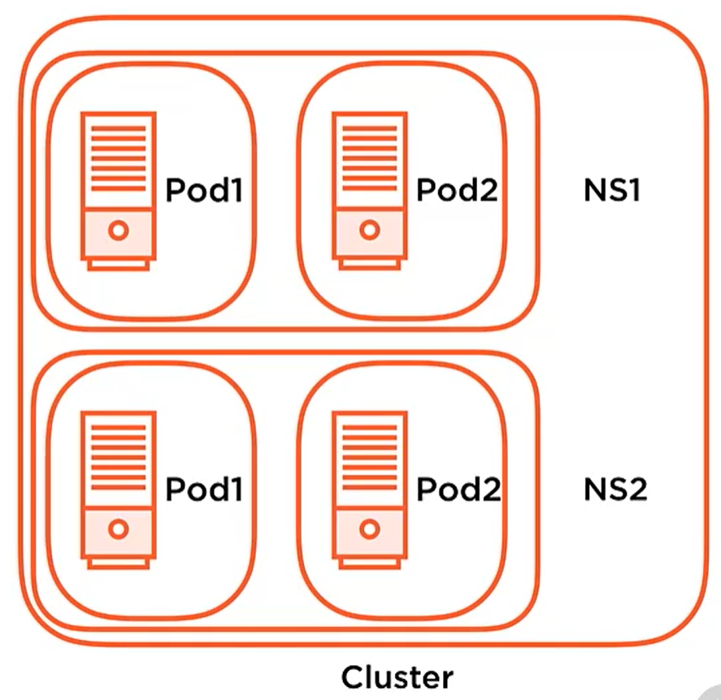

* abilit yto subdivide a clsuter and its resources
  * "virtual cluster" to deploy objects into
* namespaces give you organization (resource) boundaries
  * maybe app envs, or stacks, or multi tenancy/teams
  * you do this becuase you have limited hardware resources

#### some details on namespaces
* security boundary for RBAC
* naming boundary
  * have a resource in two separate namespaces have the same name
    * note that a resource can only be in one namespace
* namespaces has nothing to with the concept of namespaces in linux

#### working with namespaces
* scoping for:
  * CRUD operations
  * operate on objects in a namespace
  * some objects are "namespaced" and some aren't
    * namespaced: resources (ie: controllers, services, pods)... the things that run in a cluster
    * not namespaced: PersistentVolumes, Nodes... things that are physical
* default namespaces
  * `default`: exists for when you deploy a resource and don't assign a namespace
  * `kube-public`: created automatically and readable to all users.  stores shared objects between namespaces. (config maps, etc)
  * `kube-system`: system pods
* user defined namespaces can be created:
  * imperatively with `kubectl`
  * declaritively within a manifast

### creating names spaces and creating objects in namespaces
1. declarative namespace creation
cat << EOF | tee namespace.yaml
apiVersion: v1
kind: Namespace
metadata:
  name: playgroundinyaml
---
apiVersion: apps/v1
kind: Deployment
metadata:
  namesapce: playgroundinyaml
EOD

2. imperative namespace creation
```
kubectl create namespace playground1
kubectl run nginz --image=nginx --namespace playground1
```

### demo: working with namespaces and objects in namespces
1. list all namespaces and get some api-resource info
```
$ kubectl get namespaces
NAME              STATUS   AGE
default           Active   29h
kube-node-lease   Active   29h
kube-public       Active   29h
kube-system       Active   29

$ kubectl api-resources --namespaced=true
NAME                        SHORTNAMES   APIVERSION                     NAMESPACED   KIND
bindings                                 v1                             true         Binding
configmaps                  cm           v1                             true         ConfigMap
endpoints                   ep           v1                             true         Endpoints
events                      ev           v1                             true         Event
limitranges                 limits       v1                             true         LimitRange
persistentvolumeclaims      pvc          v1                             true         PersistentVolumeClaim
pods                        po           v1                             true         Pod
podtemplates                             v1                             true         PodTemplate
replicationcontrollers      rc           v1                             true         ReplicationController
resourcequotas              quota        v1                             true         ResourceQuota
secrets                                  v1                             true         Secret
serviceaccounts             sa           v1                             true         ServiceAccount
services                    svc          v1                             true         Service
controllerrevisions                      apps/v1                        true         ControllerRevision
daemonsets                  ds           apps/v1                        true         DaemonSet
deployments                 deploy       apps/v1                        true         Deployment
replicasets                 rs           apps/v1                        true         ReplicaSet
statefulsets                sts          apps/v1                        true         StatefulSet
localsubjectaccessreviews                authorization.k8s.io/v1        true         LocalSubjectAccessReview
horizontalpodautoscalers    hpa          autoscaling/v1                 true         HorizontalPodAutoscaler
cronjobs                    cj           batch/v1beta1                  true         CronJob
jobs                                     batch/v1                       true         Job
leases                                   coordination.k8s.io/v1         true         Lease
networkpolicies                          crd.projectcalico.org/v1       true         NetworkPolicy
networksets                              crd.projectcalico.org/v1       true         NetworkSet
endpointslices                           discovery.k8s.io/v1beta1       true         EndpointSlice
events                      ev           events.k8s.io/v1               true         Event
ingresses                   ing          extensions/v1beta1             true         Ingress
ingresses                   ing          networking.k8s.io/v1           true         Ingress
networkpolicies             netpol       networking.k8s.io/v1           true         NetworkPolicy
poddisruptionbudgets        pdb          policy/v1beta1                 true         PodDisruptionBudget
rolebindings                             rbac.authorization.k8s.io/v1   true         RoleBinding
roles                                    rbac.authorization.k8s.io/v1   true         Role

$ kubectl api-resources --namespaced=false
NAME                              SHORTNAMES   APIVERSION                             NAMESPACED   KIND
componentstatuses                 cs           v1                                     false        ComponentStatus
namespaces                        ns           v1                                     false        Namespace
nodes                             no           v1                                     false        Node
persistentvolumes                 pv           v1                                     false        PersistentVolume
mutatingwebhookconfigurations                  admissionregistration.k8s.io/v1        false        MutatingWebhookConfiguration
validatingwebhookconfigurations                admissionregistration.k8s.io/v1        false        ValidatingWebhookConfiguration
customresourcedefinitions         crd,crds     apiextensions.k8s.io/v1                false        CustomResourceDefinition
apiservices                                    apiregistration.k8s.io/v1              false        APIService
tokenreviews                                   authentication.k8s.io/v1               false        TokenReview
selfsubjectaccessreviews                       authorization.k8s.io/v1                false        SelfSubjectAccessReview
selfsubjectrulesreviews                        authorization.k8s.io/v1                false        SelfSubjectRulesReview
subjectaccessreviews                           authorization.k8s.io/v1                false        SubjectAccessReview
certificatesigningrequests        csr          certificates.k8s.io/v1                 false        CertificateSigningRequest
bgpconfigurations                              crd.projectcalico.org/v1               false        BGPConfiguration
bgppeers                                       crd.projectcalico.org/v1               false        BGPPeer
blockaffinities                                crd.projectcalico.org/v1               false        BlockAffinity
caliconodestatuses                             crd.projectcalico.org/v1               false        CalicoNodeStatus
clusterinformations                            crd.projectcalico.org/v1               false        ClusterInformation
felixconfigurations                            crd.projectcalico.org/v1               false        FelixConfiguration
globalnetworkpolicies                          crd.projectcalico.org/v1               false        GlobalNetworkPolicy
globalnetworksets                              crd.projectcalico.org/v1               false        GlobalNetworkSet
hostendpoints                                  crd.projectcalico.org/v1               false        HostEndpoint
ipamblocks                                     crd.projectcalico.org/v1               false        IPAMBlock
ipamconfigs                                    crd.projectcalico.org/v1               false        IPAMConfig
ipamhandles                                    crd.projectcalico.org/v1               false        IPAMHandle
ippools                                        crd.projectcalico.org/v1               false        IPPool
ipreservations                                 crd.projectcalico.org/v1               false        IPReservation
kubecontrollersconfigurations                  crd.projectcalico.org/v1               false        KubeControllersConfiguration
flowschemas                                    flowcontrol.apiserver.k8s.io/v1beta1   false        FlowSchema
prioritylevelconfigurations                    flowcontrol.apiserver.k8s.io/v1beta1   false        PriorityLevelConfiguration
ingressclasses                                 networking.k8s.io/v1                   false        IngressClass
runtimeclasses                                 node.k8s.io/v1                         false        RuntimeClass
podsecuritypolicies               psp          policy/v1beta1                         false        PodSecurityPolicy
clusterrolebindings                            rbac.authorization.k8s.io/v1           false        ClusterRoleBinding
clusterroles                                   rbac.authorization.k8s.io/v1           false        ClusterRole
priorityclasses                   pc           scheduling.k8s.io/v1                   false        PriorityClass
csidrivers                                     storage.k8s.io/v1                      false        CSIDriver
csinodes                                       storage.k8s.io/v1                      false        CSINode
storageclasses                    sc           storage.k8s.io/v1                      false        StorageClass
volumeattachments                              storage.k8s.io/v1                      false        VolumeAttachment

$ kubectl describe namespaces
Name:         default
Labels:       <none>
Annotations:  <none>
Status:       Active

No resource quota.

No LimitRange resource.


Name:         kube-node-lease
Labels:       <none>
Annotations:  <none>
Status:       Active

No resource quota.

No LimitRange resource.


Name:         kube-public
Labels:       <none>
Annotations:  <none>
Status:       Active

No resource quota.

No LimitRange resource.


Name:         kube-system
Labels:       <none>
Annotations:  <none>
Status:       Active

No resource quota.

No LimitRange resource.
```

2. list pods in all namespaces and `kube-system` namespaces

```
$ kubectl get pods -A -o wide
NAMESPACE     NAME                                       READY   STATUS    RESTARTS   AGE   IP               NODE                NOMINATED NODE   READINESS GATES
kube-system   calico-kube-controllers-5bb7768754-92rf9   1/1     Running   1          29h   192.168.246.70   ubuntucontrol       <none>           <none>
kube-system   calico-node-5x8wq                          0/1     Running   1          27h   172.16.94.11     ubuntuworkernode1   <none>           <none>
kube-system   calico-node-mbdvm                          0/1     Running   1          27h   172.16.94.12     ubuntuworkernode2   <none>           <none>
kube-system   calico-node-qw5pf                          0/1     Running   1          29h   172.16.94.10     ubuntucontrol       <none>           <none>
kube-system   calico-node-zn6w6                          0/1     Running   1          27h   172.16.94.13     ubuntuworkernode3   <none>           <none>
kube-system   coredns-74ff55c5b-qbg9s                    1/1     Running   1          30h   192.168.246.68   ubuntucontrol       <none>           <none>
kube-system   coredns-74ff55c5b-xbtsh                    1/1     Running   1          30h   192.168.246.69   ubuntucontrol       <none>           <none>
kube-system   etcd-ubuntucontrol                         1/1     Running   1          30h   172.16.94.10     ubuntucontrol       <none>           <none>
kube-system   kube-apiserver-ubuntucontrol               1/1     Running   1          30h   172.16.94.10     ubuntucontrol       <none>           <none>
kube-system   kube-controller-manager-ubuntucontrol      1/1     Running   2          30h   172.16.94.10     ubuntucontrol       <none>           <none>
kube-system   kube-proxy-2fkn2                           1/1     Running   1          27h   172.16.94.12     ubuntuworkernode2   <none>           <none>
kube-system   kube-proxy-gnhpm                           1/1     Running   1          27h   172.16.94.13     ubuntuworkernode3   <none>           <none>
kube-system   kube-proxy-sqbm5                           1/1     Running   1          30h   172.16.94.10     ubuntucontrol       <none>           <none>
kube-system   kube-proxy-tkjg8                           1/1     Running   1          27h   172.16.94.11     ubuntuworkernode1   <none>           <none>
kube-system   kube-scheduler-ubuntucontrol               1/1     Running   2          30h   172.16.94.10     ubuntucontrol       <none>           <none>
$ kubectl get pods -n kube-system -o wide
NAME                                       READY   STATUS    RESTARTS   AGE   IP               NODE                NOMINATED NODE   READINESS GATES
calico-kube-controllers-5bb7768754-92rf9   1/1     Running   1          29h   192.168.246.70   ubuntucontrol       <none>           <none>
calico-node-5x8wq                          0/1     Running   1          27h   172.16.94.11     ubuntuworkernode1   <none>           <none>
calico-node-mbdvm                          0/1     Running   1          27h   172.16.94.12     ubuntuworkernode2   <none>           <none>
calico-node-qw5pf                          0/1     Running   1          29h   172.16.94.10     ubuntucontrol       <none>           <none>
calico-node-zn6w6                          0/1     Running   1          27h   172.16.94.13     ubuntuworkernode3   <none>           <none>
coredns-74ff55c5b-qbg9s                    1/1     Running   1          30h   192.168.246.68   ubuntucontrol       <none>           <none>
coredns-74ff55c5b-xbtsh                    1/1     Running   1          30h   192.168.246.69   ubuntucontrol       <none>           <none>
etcd-ubuntucontrol                         1/1     Running   1          30h   172.16.94.10     ubuntucontrol       <none>           <none>
kube-apiserver-ubuntucontrol               1/1     Running   1          30h   172.16.94.10     ubuntucontrol       <none>           <none>
kube-controller-manager-ubuntucontrol      1/1     Running   2          30h   172.16.94.10     ubuntucontrol       <none>           <none>
kube-proxy-2fkn2                           1/1     Running   1          27h   172.16.94.12     ubuntuworkernode2   <none>           <none>
kube-proxy-gnhpm                           1/1     Running   1          27h   172.16.94.13     ubuntuworkernode3   <none>           <none>
kube-proxy-sqbm5                           1/1     Running   1          30h   172.16.94.10     ubuntucontrol       <none>           <none>
kube-proxy-tkjg8                           1/1     Running   1          27h   172.16.94.11     ubuntuworkernode1   <none>           <none>
kube-scheduler-ubuntucontrol               1/1     Running   2          30h   172.16.94.10     ubuntucontrol       <none>           <none>
```

3. create a namespace imperatively
```
$ kubectl create namespace playground1
namespace/playground1 created

$ kubectl create namespace Playground1 #sorry no upper case letters
The Namespace "Playground1" is invalid: metadata.name: Invalid value: "Playground1": a lowercase RFC 1123 label must consist of lower case alphanumeric characters or '-', and must start and end with an alphanumeric character (e.g. 'my-name',  or '123-abc', regex used for validation is '[a-z0-9]([-a-z0-9]*[a-z0-9])?')
```

3. create a namespace declaratively

```
cat <<EOF | tee namespace.yaml
apiVersion: v1
kind: Namespace
metadata:
  name: playgroundinyaml
EOF

$ kubectl apply -f namespace.yaml
namespace/playgroundinyaml created
```

4. list namesapces

```
$ kubectl get namespaces
NAME               STATUS   AGE
default            Active   30h
kube-node-lease    Active   30h
kube-public        Active   30h
kube-system        Active   30h
playground1        Active   102s
playgroundinyaml   Active   4s
```

5. create a deployment within a namespace declaratively, get info on the `pods`, then delete the pods, realize that k8s redeployed accordding to the `etcd`, then delete the namespace (which deletes any resources within the namespace)
* note the use of metadata.namespace
```
cat <<EOF | tee deployment.yaml
apiVersion: apps/v1
kind: Deployment
metadata:
  name: hello-world
  labels:
    app: hello-world
  namespace: playground1
spec:
  replicas: 4
  selector:
    matchLabels:
      app: hello-world
  template:
    metadata:
      labels:
        app: hello-world
    spec:
      containers:
      - name: hello-world
        image: gcr.io/google-samples/hello-app:1.0
        ports:
        - containerPort: 8080
EOF

$ kubectl apply -f deployment.yaml
deployment.apps/hello-world created

$ kubectl get pods -n playground1
NAME                           READY   STATUS    RESTARTS   AGE
hello-world-5f7cd95c4b-5p522   1/1     Running   0          2m14s
hello-world-5f7cd95c4b-dgjl8   1/1     Running   0          2m14s
hello-world-5f7cd95c4b-lkhcr   1/1     Running   0          2m14s
hello-world-5f7cd95c4b-rlgmh   1/1     Running   0          2m14s

$ kubectl delete pods --all --namespace playground1
pod "hello-world-5f7cd95c4b-5p522" deleted
pod "hello-world-5f7cd95c4b-dgjl8" deleted
pod "hello-world-5f7cd95c4b-lkhcr" deleted
pod "hello-world-5f7cd95c4b-rlgmh" deleted

$ kubectl get pods --namespace playground1
NAME                           READY   STATUS    RESTARTS   AGE
hello-world-5f7cd95c4b-7wrnd   1/1     Running   0          53s
hello-world-5f7cd95c4b-c7mq7   1/1     Running   0          53s
hello-world-5f7cd95c4b-q5npz   1/1     Running   0          53s
hello-world-5f7cd95c4b-sz58k   1/1     Running   0          53s

$ kubectl delete namespace playground1
namespace "playground1" deleted

$ kubectl delete namespace playgroundinyaml
namespace "playgroundinyaml" deleted
```

### introducing and workig gwith labels and how k8s uses labels
* `Label Selectors` are used to select/query Objects
  * returns collections of Objects that satisfy search conditions
  * enables you to perform operations on a collection fo resources... like `Pods`
* labels are...
  * used to organize resources (pods, nodes, etc)
  * used to influence the internal operations of k8s cluster
  * a non-hierarchical, key/value pair
* resources can have more than one label per resource
* enables more complex representation of state and ability to query
  * keys = 63 chars or less
  * values = 253 chars or less

### using labels
* creating resources with `Labels`
  * imperatively with `kubectl`
  * declaratively with a manifest
* editign existing resources' labels
  * assign new label
  * overwrite existing
* you would use labels:
  * to isolate applications for example

#### querying usign labels and selectors
```
kubectl get pods --show-labels
kubectl get pods --selector tier=prod
kubectl get pods -l 'tier in (prod,qa)`
kubectl get pods -l 'tier notin (prod,qa)`
kubectl get nodes --show-labels
```

#### how kubernetes itself uses labels
* `Controllers` and `Services` match `Pods` using selectors
  * it's how k8s cluster knows who belongs to watch
* used to influences pod scheduling on nodes
  * scheduling to specific nodes using selectors
  * special hardware (SSD or GPU) using selectors

#### Example: k8s functionality based on labels... Services
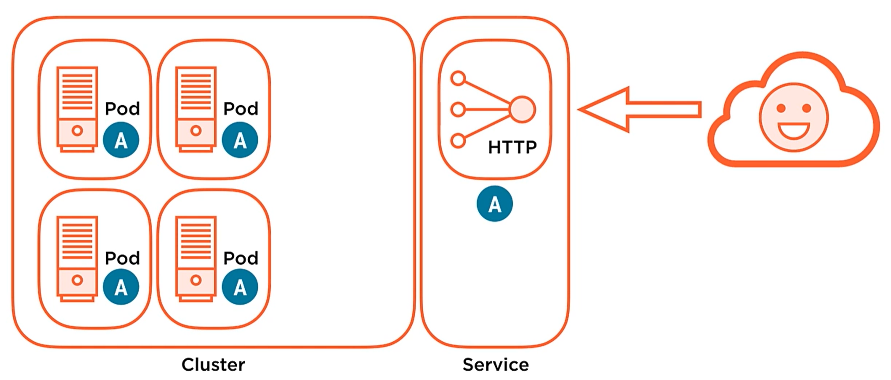
* if we purposefully remove a `label` from a single `pod`, then the Service Controller deregisters

#### Example: k8s functionality based on labels... controller operations
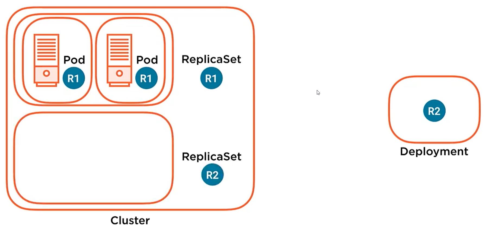
* deployments change `replicasets` and `pods`
  * if you remove a `label` on a `pod`, then the `pod` is removed from the `replicaset`

#### Example: k8s functionality based on labels... scheduling pods to specific nodes
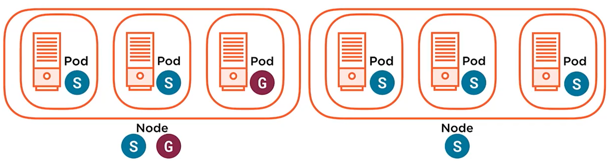
* when you define a `node`, you can specify a `label` for the `node` (ie: "hardware=SSD" or "hardware=GPU")
* when you define a `pod`, you can specify a `selector` with the `label` you wish (ie: SSD or GPU)

#### declarative labeling example: deployment and service
* deployment example:
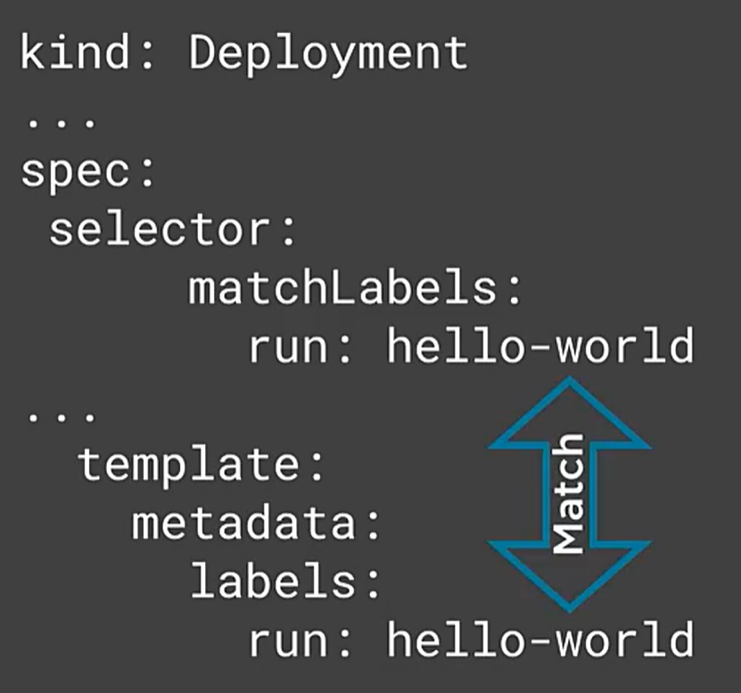

* service example:
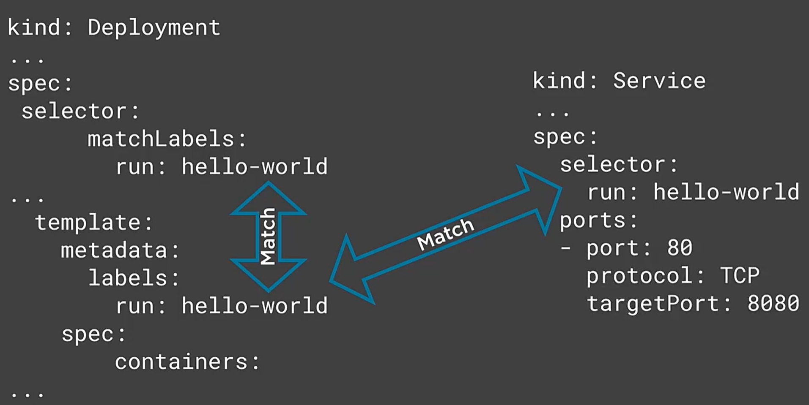

### demo: working with labels: creating querying and editing

1. create manifest

```
cat <<EOF | tee CreatePodsWithLabels.yaml
apiVersion: v1
kind: Pod
metadata:
  name: nginx-pod-1
  labels: 
    app: MyWebApp
    deployment: v1
    tier: prod
spec:
  containers:
  - name: nginx
    image: nginx
    ports:
    - containerPort: 80
---
apiVersion: v1
kind: Pod
metadata:
  name: nginx-pod-2
  labels: 
    app: MyWebApp
    deployment: v1.1
    tier: prod
spec:
  containers:
  - name: nginx
    image: nginx
    ports:
    - containerPort: 80
---
apiVersion: v1
kind: Pod
metadata:
  name: nginx-pod-3
  labels: 
    app: MyWebApp
    deployment: v1.1
    tier: qa
spec:
  containers:
  - name: nginx
    image: nginx
    ports:
    - containerPort: 80
---
apiVersion: v1
kind: Pod
metadata:
  name: nginx-pod-4
  labels: 
    app: MyAdminApp
    deployment: v1
    tier: prod
spec:
  containers:
  - name: nginx
    image: nginx
    ports:
    - containerPort: 80
---
EOF
```
* note the use of `labels` for each `kind`.

2. Apply this manifest and verify
```
$ kubectl apply -f CreatePodsWithLabels.yaml
pod/nginx-pod-1 created
pod/nginx-pod-2 created
pod/nginx-pod-3 created
pod/nginx-pod-4 created

$ kubectl get pods -o wide --show-labels
NAME          READY   STATUS    RESTARTS   AGE   IP                NODE                NOMINATED NODE   READINESS GATES   LABELS
nginx-pod-1   1/1     Running   0          55s   192.168.28.100    ubuntuworkernode1   <none>           <none>            app=MyWebApp,deployment=v1,tier=prod
nginx-pod-2   1/1     Running   0          55s   192.168.236.225   ubuntuworkernode3   <none>           <none>            app=MyWebApp,deployment=v1.1,tier=prod
nginx-pod-3   1/1     Running   0          55s   192.168.132.161   ubuntuworkernode2   <none>           <none>            app=MyWebApp,deployment=v1.1,tier=qa
nginx-pod-4   1/1     Running   0          55s   192.168.132.162   ubuntuworkernode2   <none>           <none>            app=MyAdminApp,deployment=v1,tier=prod

$ kubectl describe pod nginx-pod-1 | head
Name:         nginx-pod-1
Namespace:    default
Priority:     0
Node:         ubuntuworkernode1/172.16.94.11
Start Time:   Mon, 03 Apr 2023 16:14:35 +0000
Labels:       app=MyWebApp
              deployment=v1
              tier=prod
Annotations:  cni.projectcalico.org/containerID: e701ee6e1cf6680325a29683a437c7f716d33c494e5a30eac61311e88452ad71
              cni.projectcalico.org/podIP: 192.168.28.100/32
```

3. querying labels using selectors

```
$ kubectl get pods --selector tier=prod
NAME          READY   STATUS    RESTARTS   AGE
nginx-pod-1   1/1     Running   0          105s
nginx-pod-2   1/1     Running   0          105s
nginx-pod-4   1/1     Running   0          105s

$ kubectl get pods -l tier=prod
NAME          READY   STATUS    RESTARTS   AGE
nginx-pod-1   1/1     Running   0          2m6s
nginx-pod-2   1/1     Running   0          2m6s
nginx-pod-4   1/1     Running   0          2m6s

$ kubectl get pods -l 'tier=prod,app=MyWebApp' --show-labels
NAME          READY   STATUS    RESTARTS   AGE     LABELS
nginx-pod-1   1/1     Running   0          2m39s   app=MyWebApp,deployment=v1,tier=prod
nginx-pod-2   1/1     Running   0          2m39s   app=MyWebApp,deployment=v1.1,tier=prod

$ kubectl get pods -l 'tier in (prod,qa),app!=MyWebApp' --show-labels
NAME          READY   STATUS    RESTARTS   AGE     LABELS
nginx-pod-4   1/1     Running   0          3m11s   app=MyAdminApp,deployment=v1,tier=prod

$ kubectl get pods -L tier
NAME          READY   STATUS    RESTARTS   AGE     TIER
nginx-pod-1   1/1     Running   0          3m32s   prod
nginx-pod-2   1/1     Running   0          3m32s   prod
nginx-pod-3   1/1     Running   0          3m32s   qa
nginx-pod-4   1/1     Running   0          3m32s   prod

$ kubectl get pods -L app,tier
NAME          READY   STATUS    RESTARTS   AGE     APP          TIER
nginx-pod-1   1/1     Running   0          3m48s   MyWebApp     prod
nginx-pod-2   1/1     Running   0          3m48s   MyWebApp     prod
nginx-pod-3   1/1     Running   0          3m48s   MyWebApp     qa
nginx-pod-4   1/1     Running   0          3m48s   MyAdminApp   prod
```

4. editing an existing label in `etcd`
```
$ kubectl label pod nginx-pod-1 tier=non-prod --overwrite
pod/nginx-pod-1 labeled
$ kubectl get pod nginx-pod-1 --show-labels
NAME          READY   STATUS    RESTARTS   AGE     LABELS
nginx-pod-1   1/1     Running   0          5m29s   app=MyWebApp,deployment=v1,tier=non-prod
```

5. add a new label in `etcd`
```
$ kubectl label pod nginx-pod-1 another=Label
pod/nginx-pod-1 labeled
$ kubectl get pod nginx-pod-1 --show-labels
NAME          READY   STATUS    RESTARTS   AGE    LABELS
nginx-pod-1   1/1     Running   0          6m9s   another=Label,app=MyWebApp,deployment=v1,tier=non-prod

```

6. remove an existing label in `etcd`
```
#just a minus sign ()`-`)
$ kubectl label pod nginx-pod-1 another-
pod/nginx-pod-1 labeled
$ kubectl get pod nginx-pod-1 --show-labels
NAME          READY   STATUS    RESTARTS   AGE     LABELS
nginx-pod-1   1/1     Running   0          6m57s   app=MyWebApp,deployment=v1,tier=non-prod
```

7. perform an operation on a collection of pods based on a label query

```
$ kubectl label pod --all tier=non-prod --overwrite
pod/nginx-pod-1 not labeled #because this already has the label `tier=nonprod` set
pod/nginx-pod-2 labeled
pod/nginx-pod-3 labeled
pod/nginx-pod-4 labeled
$ kubectl get pod --show-labels
NAME          READY   STATUS    RESTARTS   AGE     LABELS
nginx-pod-1   1/1     Running   0          8m44s   app=MyWebApp,deployment=v1,tier=non-prod
nginx-pod-2   1/1     Running   0          8m44s   app=MyWebApp,deployment=v1.1,tier=non-prod
nginx-pod-3   1/1     Running   0          8m44s   app=MyWebApp,deployment=v1.1,tier=non-prod
nginx-pod-4   1/1     Running   0          8m44s   app=MyAdminApp,deployment=v1,tier=non-prod
```

8. delete all pods matching the tier=non-prod label
```
$ kubectl delete pod -l tier=non-prod
pod "nginx-pod-1" deleted
pod "nginx-pod-2" deleted
pod "nginx-pod-3" deleted
pod "nginx-pod-4" deleted

$ kubectl get pods
No resources found in default namespace.
```

### demo: deployments, replicasets, labels and selectors

1. create manifest

```
cat <<EOF | tee deployment-label.yaml
apiVersion: apps/v1
kind: Deployment
metadata:
  name: hello-world
  labels:
    app: hello-world
spec:
  replicas: 4
  selector:
    matchLabels:
      app: hello-world
  template:
    metadata:
      labels:
        app: hello-world
    spec:
      containers:
      - name: hello-world
        image: psk8s.azurecr.io/hello-app:1.0
        ports:
        - containerPort: 8080
EOF
```

2. Apply this manifest and verify

```
$ kubectl apply -f deployment-label.yaml
deployment.apps/hello-world created

$ kubectl get pods -o wide --show-labels
NAME                           READY   STATUS    RESTARTS   AGE   IP                NODE                NOMINATED NODE   READINESS GATES   LABELS
hello-world-5f7cd95c4b-grgpp   1/1     Running   0          4s    192.168.132.163   ubuntuworkernode2   <none>           <none>            app=hello-world,pod-template-hash=5f7cd95c4b
hello-world-5f7cd95c4b-hl84v   1/1     Running   0          4s    192.168.28.102    ubuntuworkernode1   <none>           <none>            app=hello-world,pod-template-hash=5f7cd95c4b
hello-world-5f7cd95c4b-tjj2p   1/1     Running   0          4s    192.168.236.226   ubuntuworkernode3   <none>           <none>            app=hello-world,pod-template-hash=5f7cd95c4b
hello-world-5f7cd95c4b-zfcng   1/1     Running   0          4s    192.168.28.101    ubuntuworkernode1   <none>           <none>            app=hello-world,pod-template-hash=5f7cd95c4b
```

3. review deployment info:

* note the 'selectors' and 'pod template.labels' and the `newreplicaset` values
```
$ kubectl describe deployment hello-world
Name:                   hello-world
Namespace:              default
CreationTimestamp:      Mon, 03 Apr 2023 16:30:36 +0000
Labels:                 app=hello-world
Annotations:            deployment.kubernetes.io/revision: 1
Selector:               app=hello-world
Replicas:               4 desired | 4 updated | 4 total | 4 available | 0 unavailable
StrategyType:           RollingUpdate
MinReadySeconds:        0
RollingUpdateStrategy:  25% max unavailable, 25% max surge
Pod Template:
  Labels:  app=hello-world
  Containers:
   hello-world:
    Image:        psk8s.azurecr.io/hello-app:1.0
    Port:         8080/TCP
    Host Port:    0/TCP
    Environment:  <none>
    Mounts:       <none>
  Volumes:        <none>
Conditions:
  Type           Status  Reason
  ----           ------  ------
  Available      True    MinimumReplicasAvailable
  Progressing    True    NewReplicaSetAvailable
OldReplicaSets:  <none>
NewReplicaSet:   hello-world-5f7cd95c4b (4/4 replicas created)
Events:
  Type    Reason             Age    From                   Message
  ----    ------             ----   ----                   -------
  Normal  ScalingReplicaSet  2m55s  deployment-controller  Scaled up replica set hello-world-5f7cd95c4b to 4
```

4. review the `replicaset`
* note:
  * the name of the `replicaset` (hello-world-5f7cd95c4b)
    * that last hash is the `pod-template-hash`, which is a `selector`
  * the selector will let the k8s cluster be aware of which resources:
    * which pods match the selectors
    * review: 'Pod Template.Labels'
```
#noting the above newreplicaset=hello-world-5f7cd95c4b
$ kubectl describe replicaset hello-world
Name:           hello-world-5f7cd95c4b
Namespace:      default
Selector:       app=hello-world,pod-template-hash=5f7cd95c4b
Labels:         app=hello-world
                pod-template-hash=5f7cd95c4b
Annotations:    deployment.kubernetes.io/desired-replicas: 4
                deployment.kubernetes.io/max-replicas: 5
                deployment.kubernetes.io/revision: 1
Controlled By:  Deployment/hello-world
Replicas:       4 current / 4 desired
Pods Status:    4 Running / 0 Waiting / 0 Succeeded / 0 Failed
Pod Template:
  Labels:  app=hello-world
           pod-template-hash=5f7cd95c4b
  Containers:
   hello-world:
    Image:        psk8s.azurecr.io/hello-app:1.0
    Port:         8080/TCP
    Host Port:    0/TCP
    Environment:  <none>
    Mounts:       <none>
  Volumes:        <none>
Events:
  Type    Reason            Age   From                   Message
  ----    ------            ----  ----                   -------
  Normal  SuccessfulCreate  10m   replicaset-controller  Created pod: hello-world-5f7cd95c4b-grgpp
  Normal  SuccessfulCreate  10m   replicaset-controller  Created pod: hello-world-5f7cd95c4b-zfcng
  Normal  SuccessfulCreate  10m   replicaset-controller  Created pod: hello-world-5f7cd95c4b-tjj2p
  Normal  SuccessfulCreate  10m   replicaset-controller  Created pod: hello-world-5f7cd95c4b-hl84v
```

5. review pods
* note the `pod-template-hash`
```
$ kubectl get pods --show-labels
NAME                           READY   STATUS    RESTARTS   AGE   LABELS
hello-world-5f7cd95c4b-grgpp   1/1     Running   0          14m   app=hello-world,pod-template-hash=5f7cd95c4b
hello-world-5f7cd95c4b-hl84v   1/1     Running   0          14m   app=hello-world,pod-template-hash=5f7cd95c4b
hello-world-5f7cd95c4b-tjj2p   1/1     Running   0          14m   app=hello-world,pod-template-hash=5f7cd95c4b
hello-world-5f7cd95c4b-zfcng   1/1     Running   0          14m   app=hello-world,pod-template-hash=5f7cd95c4b
```

6. edit the `pod-template-hash` label of one pod
* we know what's going to happen:
  * the `replicaset` describes the replicas (which is `4`)... the pod-template-hash is used to track the pods that should exist in the replicaset.
    * once the `scheduling manager` sees in `etcd` that the this `replicaset` is not in desired that... the scheduling manager will use the controller to launch a new pod to reach desired state.
```
#list all pod names
$ kubectl get pods -o json | jq '.items[].metadata.name' -r
hello-world-5f7cd95c4b-grgpp
hello-world-5f7cd95c4b-hl84v
hello-world-5f7cd95c4b-tjj2p
hello-world-5f7cd95c4b-zfcng

# edit the pod-template-hash of `hello-world-5f7cd95c4b-grgpp`
$ kubectl label pod hello-world-5f7cd95c4b-grgpp pod-template-hash=DEBUG --overwrite
pod/hello-world-5f7cd95c4b-grgpp labeled

$ kubectl get pods --show-labels
NAME                           READY   STATUS    RESTARTS   AGE   LABELS
hello-world-5f7cd95c4b-grgpp   1/1     Running   0          27m   app=hello-world,pod-template-hash=DEBUG
hello-world-5f7cd95c4b-h7chl   1/1     Running   0          19s   app=hello-world,pod-template-hash=5f7cd95c4b
hello-world-5f7cd95c4b-hl84v   1/1     Running   0          27m   app=hello-world,pod-template-hash=5f7cd95c4b
hello-world-5f7cd95c4b-tjj2p   1/1     Running   0          27m   app=hello-world,pod-template-hash=5f7cd95c4b
hello-world-5f7cd95c4b-zfcng   1/1     Running   0          27m   app=hello-world,pod-template-hash=5f7cd95c4b
# note that the affected pod is still up and running
```

### demo: services, labels, selectors and scheduling pods to nodes

1. instantiate a service:

```
$ kubectl apply -f service.yaml
service/hello-world created
```
2. validate the service
* note the `endpoints` are exposed on the `pods`
* note the 'selector' of 'app=hello-world' as this will be used to qualify pods with a matching label.
```
$ kubectl get service
NAME          TYPE        CLUSTER-IP      EXTERNAL-IP   PORT(S)   AGE
hello-world   ClusterIP   10.101.83.247   <none>        80/TCP    27s
kubernetes    ClusterIP   10.96.0.1       <none>        443/TCP   4d3h

$ kubectl describe service hello-world
Name:              hello-world
Namespace:         default
Labels:            app=hello-world
Annotations:       <none>
Selector:          app=hello-world
Type:              ClusterIP
IP Families:       <none>
IP:                10.101.83.247
IPs:               10.101.83.247
Port:              <unset>  80/TCP
TargetPort:        8080/TCP
Endpoints:         192.168.132.163:8080,192.168.132.164:8080,192.168.236.226:8080 + 2 more...
Session Affinity:  None
Events:            <none>
```

3. validate the endpoints
* note that there are five pods that are exposing endpoints via 'subsets.addresses'
  * remember there are five pods now
```
$ kubectl describe endpoints hello-world
Name:         hello-world
Namespace:    default
Labels:       app=hello-world
Annotations:  endpoints.kubernetes.io/last-change-trigger-time: 2023-04-03T17:00:37Z
Subsets:
  Addresses:          192.168.132.163,192.168.132.164,192.168.236.226,192.168.28.101,192.168.28.102
  NotReadyAddresses:  <none>
  Ports:
    Name     Port  Protocol
    ----     ----  --------
    <unset>  8080  TCP

Events:  <none>

#which pods are offering this service? --> see selector used in the output of `kubectl describe service hello-world` that match the label:
$ kubectl get pods --show-labels
NAME                           READY   STATUS    RESTARTS   AGE   LABELS
hello-world-5f7cd95c4b-grgpp   1/1     Running   0          37m   app=hello-world,pod-template-hash=DEBUG
hello-world-5f7cd95c4b-h7chl   1/1     Running   0          10m   app=hello-world,pod-template-hash=5f7cd95c4b
hello-world-5f7cd95c4b-hl84v   1/1     Running   0          37m   app=hello-world,pod-template-hash=5f7cd95c4b
hello-world-5f7cd95c4b-tjj2p   1/1     Running   0          37m   app=hello-world,pod-template-hash=5f7cd95c4b
hello-world-5f7cd95c4b-zfcng   1/1     Running   0          37m   app=hello-world,pod-template-hash=5f7cd95c4b
```

4. evict the pod "hello-world-5f7cd95c4b-grgpp" from the endpoint and validate that the pod is evicted
```
$ kubectl label pod hello-world-5f7cd95c4b-grgpp app=DEBUG --overwrite
pod/hello-world-5f7cd95c4b-grgpp labeled

$ kubectl get pods --show-labels
NAME                           READY   STATUS    RESTARTS   AGE   LABELS
hello-world-5f7cd95c4b-grgpp   1/1     Running   0          38m   app=DEBUG,pod-template-hash=DEBUG
hello-world-5f7cd95c4b-h7chl   1/1     Running   0          11m   app=hello-world,pod-template-hash=5f7cd95c4b
hello-world-5f7cd95c4b-hl84v   1/1     Running   0          38m   app=hello-world,pod-template-hash=5f7cd95c4b
hello-world-5f7cd95c4b-tjj2p   1/1     Running   0          38m   app=hello-world,pod-template-hash=5f7cd95c4b
hello-world-5f7cd95c4b-zfcng   1/1     Running   0          38m   app=hello-world,pod-template-hash=5f7cd95c4b

$ kubectl describe endpoints hello-world
Name:         hello-world
Namespace:    default
Labels:       app=hello-world
Annotations:  <none>
Subsets:
  Addresses:          192.168.132.164,192.168.236.226,192.168.28.101,192.168.28.102 #note only four IPs
  NotReadyAddresses:  <none>
  Ports:
    Name     Port  Protocol
    ----     ----  --------
    <unset>  8080  TCP

Events:  <none>
```

5. clean up
```
kubectl delete deployment hello-world
kubectl delete service hello-world
kubectl delete pod hello-world-5f7cd95c4b-grgpp
$ kubectl get all
NAME                 TYPE        CLUSTER-IP   EXTERNAL-IP   PORT(S)   AGE
service/kubernetes   ClusterIP   10.96.0.1    <none>        443/TCP   4d3h
```

### demo: schedule a pod to a specific node

1. review `labels` on `nodes`
```
$ kubectl get nodes --show-labels
NAME                STATUS   ROLES                  AGE    VERSION   LABELS
ubuntucontrol       Ready    control-plane,master   4d3h   v1.20.1   beta.kubernetes.io/arch=amd64,beta.kubernetes.io/os=linux,kubernetes.io/arch=amd64,kubernetes.io/hostname=ubuntucontrol,kubernetes.io/os=linux,node-role.kubernetes.io/control-plane=,node-role.kubernetes.io/master=
ubuntuworkernode1   Ready    <none>                 4d     v1.20.1   beta.kubernetes.io/arch=amd64,beta.kubernetes.io/os=linux,kubernetes.io/arch=amd64,kubernetes.io/hostname=ubuntuworkernode1,kubernetes.io/os=linux
ubuntuworkernode2   Ready    <none>                 4d     v1.20.1   beta.kubernetes.io/arch=amd64,beta.kubernetes.io/os=linux,kubernetes.io/arch=amd64,kubernetes.io/hostname=ubuntuworkernode2,kubernetes.io/os=linux
ubuntuworkernode3   Ready    <none>                 4d     v1.20.1   beta.kubernetes.io/arch=amd64,beta.kubernetes.io/os=linux,kubernetes.io/arch=amd64,kubernetes.io/hostname=ubuntuworkernode3,kubernetes.io/os=linux
```

2. create `labels` and attach to `nodes` and query the labels
```
$ kubectl label node ubuntuworkernode2 disk=local_ssd
node/ubuntuworkernode2 labeled
$ kubectl label node ubuntuworkernode3 hardware=local_gpu
node/ubuntuworkernode3 labeled

$ kubectl get node -L disk,hardware
NAME                STATUS   ROLES                  AGE    VERSION   DISK        HARDWARE
ubuntucontrol       Ready    control-plane,master   4d3h   v1.20.1
ubuntuworkernode1   Ready    <none>                 4d     v1.20.1
ubuntuworkernode2   Ready    <none>                 4d     v1.20.1   local_ssd
ubuntuworkernode3   Ready    <none>                 4d     v1.20.1               local_gpu
```

3. create three pods, two will be using `node` `selectors` and one won't be
* note 'spec.nodeSelector'
```
cat <<EOF | tee PodsToNodes.yaml
apiVersion: v1
kind: Pod
metadata:
  name: nginx-pod-ssd
spec:
  containers:
  - name: nginx
    image: nginx
    ports:
    - containerPort: 80
  nodeSelector:
    disk: local_ssd
---
apiVersion: v1
kind: Pod
metadata:
  name: nginx-pod-gpu
spec:
  containers:
  - name: nginx
    image: nginx
    ports:
    - containerPort: 80
  nodeSelector:
    hardware: local_gpu
---
apiVersion: v1
kind: Pod
metadata:
  name: nginx-pod
spec:
  containers:
  - name: nginx
    image: nginx
    ports:
    - containerPort: 80
EOF

$ kubectl apply -f PodsToNodes.yaml
pod/nginx-pod-ssd created
pod/nginx-pod-gpu created
pod/nginx-pod created
```

4. validate the pods are on the nodes as per their nodeSelectors:
```
$ kubectl get node -L disk,hardware
NAME                STATUS   ROLES                  AGE    VERSION   DISK        HARDWARE
ubuntucontrol       Ready    control-plane,master   4d3h   v1.20.1
ubuntuworkernode1   Ready    <none>                 4d     v1.20.1
ubuntuworkernode2   Ready    <none>                 4d     v1.20.1   local_ssd
ubuntuworkernode3   Ready    <none>                 4d     v1.20.1               local_gpu

$ kubectl get pods -o wide
NAME            READY   STATUS    RESTARTS   AGE     IP                NODE                NOMINATED NODE   READINESS GATES
nginx-pod       1/1     Running   0          5m14s   192.168.28.103    ubuntuworkernode1   <none>           <none>
nginx-pod-gpu   1/1     Running   0          5m14s   192.168.236.227   ubuntuworkernode3   <none>           <none>
nginx-pod-ssd   1/1     Running   0          5m14s   192.168.132.165   ubuntuworkernode2   <none>           <none>
```

5. clean up
```
#remove labels from nodes
kubectl label node ubuntuworkernode2 disk-
kubectl label node ubuntuworkernode3 hardware-
kubectl delete pod nginx-pod
kubectl delete pod nginx-pod-gpu
kubectl delete pod nginx-pod-ssd
```

### introducing and working with annotations
* an annotation is a non-hierarchival key-value pair
  * not used by `Selectors` (only `labels` can be used for this)
* keys can be up to 63 chars
* values can be up to 256KB
* used to add additional info about your cluster resources
* used by people or tooling
  * used to make decisions about what to do...
  * ie: build, releases, image info
* reduces the need to merge data from external data sources

#### adding and editing annotations

1. manifest example:
```
apiVersion: v1
kind: pod
metadata:
  name: nginx-pod
  annotation: owner: Anthony
spec:
  containers:
  - name: nginx
    image: nginx
```

2. kubectl example
```
kubectl annotate pod nginx-pod owner=Anthony
kubectl annotate pod nginx-pod owner=NotAnthony --overwrite
```

### overall organizational methods: namespaces, labels, selectors, annotations
* namespaces:
  * when you want to put a boundary around resources, security or naming
* labels:
  * when you want to act on objects in groups or influence k8s operations (via Selectors)
* annotations
  * when you want to add additional info about a resource

## running and managing pods

### understanding pods

* what is a pod
  * a wrapper around container based application
* what is kubernetes
  * manages and schedules pods
* generally there is a single container per pod, but can be many
* pod has resources
  * storage, networking, env vars, etc.

#### what is a pod in kubernetes
* a pod is a unit of scheduling
  * the scheduler needs to allocate pods in the clsuter (onto nodes) based on resources
  * the pod is an OS process consuming resources somewhere on the cluster
* a pod is the unit of deployment
  * it is the application configuration
  * it is the needed resources (networking, storage, etc)

#### why do you need pods?
* provide a higher level abstraction in the cluster for managability reasons.

### how pods manage containers
* single container pods: most common... single container... single pod.
* multicontainer pods:
  * tightly couple apps
  * producer-consumer relationship
* init containers:
  * run before an app container runs


### introduccting and working with single container pods and controllers
* most common scenario
* single process running in a container
* leads to easier app scaling (minimizing process)

#### controllers and pods
* controllers:
  * keep your apps in a desired state
  * start and stop pods (to conform to desired state, `replicaset`)
  * app scaling (as per desired state)
  * app recover (as per desired state)
* generally, you don't want to run bare/naked pods
  * they won't be recreated in the event of a failure

### introducing and working with static pods
* pods that are managed by `kubelet` on specific nodes
* static pod manifests are created and can be pushed to nodes
  * `staticPodPath` in `kubelet` resident manifests
    * push the manifest to the directory `/etc/kubernetes/manifests`
* static pod manifests are how control plane pods are configured!
  * kubeadm bootstrapping process creates these manifests
* can configure the `kubelet` via the file `/var/lib/kubelet/config.yaml`
* `staticPodPath` is watched by the `kubelet`
  * manifest changes are also monitored
* pods created this way are managed by the `kubelet` itself, not the `API Server`
  * however, the `kubelet` creates a "mirror" pod "pointer" and files it into `etcd`

### working with pods kubectl exec, logs and port-forward

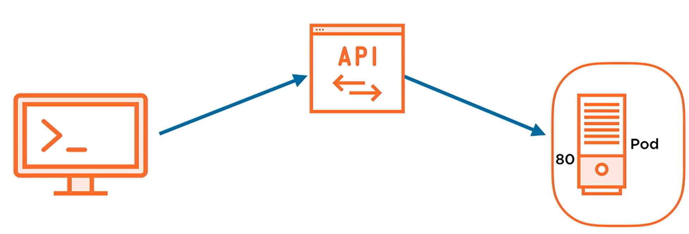
* start a process using `exec` or stream logs with `log`:
```
kubectl exec -it POD1 --container CONTAINERS1 -- /bin/bash
kubectl logs POD1 --container CONTAINER1
```
* what happens:
  * opens connection to API server
  * API server commands pod to start the process
  * output will be streamed through API server to local host
* port forwarding into container:
```
kubectl port-forward pod POD1 LOCALPORT:CONTAINERPORT
```

### demo: running bare pods and pods in controllers
1. create manifests
* `pod.yaml` contains a bare pod
* `deployment.yaml` contains a deployment (replicaset)

```
cat <<EOF | tee pod.yaml
apiVersion: v1
kind: Pod
metadata:
  name: hello-world-pod
spec:
  containers:
  - name: hello-world
    image: psk8s.azurecr.io/hello-app:1.0
    ports:
    - containerPort: 80
EOF
cat <<EOF | tee deployment.yaml
apiVersion: apps/v1
kind: Deployment
metadata:
  name: hello-world
spec:
  replicas: 1
  selector:
    matchLabels:
      app: hello-world
  template:
    metadata:
      labels:
        app: hello-world
    spec:
      containers:
      - name: hello-world
        image: psk8s.azurecr.io/hello-app:1.0
        ports:
        - containerPort: 8080
EOF
```

2. start kubectl with get events, then apply the manifests
```
$ kubectl get events --watch &

$ kubectl apply -f pod.yaml
pod/hello-world-pod created
$ LAST SEEN   TYPE     REASON      OBJECT                MESSAGE
0s          Normal   Scheduled   pod/hello-world-pod   Successfully assigned default/hello-world-pod to ubuntuworkernode2
0s          Normal   Pulled      pod/hello-world-pod   Container image "psk8s.azurecr.io/hello-app:1.0" already present on machine
0s          Normal   Created     pod/hello-world-pod   Created container hello-world
0s          Normal   Started     pod/hello-world-pod   Started container hello-world

$ kubectl apply -f deplokubectl apply -f deployment.yaml
deployment.apps/hello-world created
$ 0s          Normal   ScalingReplicaSet   deployment/hello-world   Scaled up replica set hello-world-5f7cd95c4b to 1
0s          Normal   SuccessfulCreate    replicaset/hello-world-5f7cd95c4b   Created pod: hello-world-5f7cd95c4b-zc8kl
0s          Normal   Scheduled           pod/hello-world-5f7cd95c4b-zc8kl    Successfully assigned default/hello-world-5f7cd95c4b-zc8kl to ubuntuworkernode1
0s          Normal   Pulled              pod/hello-world-5f7cd95c4b-zc8kl    Container image "psk8s.azurecr.io/hello-app:1.0" already present on machine
0s          Normal   Created             pod/hello-world-5f7cd95c4b-zc8kl    Created container hello-world
0s          Normal   Started             pod/hello-world-5f7cd95c4b-zc8kl    Started container hello-world
```

3. scale the replicaset from 1 to 2 replicas:

```
$ kubectl scale deployment hello-world --replicas=2
deployment.apps/hello-world scaled
$ 0s          Normal   ScalingReplicaSet   deployment/hello-world              Scaled up replica set hello-world-5f7cd95c4b to 2
0s          Normal   SuccessfulCreate    replicaset/hello-world-5f7cd95c4b   Created pod: hello-world-5f7cd95c4b-svpng
0s          Normal   Scheduled           pod/hello-world-5f7cd95c4b-svpng    Successfully assigned default/hello-world-5f7cd95c4b-svpng to ubuntuworkernode3
0s          Normal   Pulled              pod/hello-world-5f7cd95c4b-svpng    Container image "psk8s.azurecr.io/hello-app:1.0" already present on machine
0s          Normal   Created             pod/hello-world-5f7cd95c4b-svpng    Created container hello-world
0s          Normal   Started             pod/hello-world-5f7cd95c4b-svpng    Started container hello-world
```

4. scale the replicaset from 2 to 1 replicas:
```
$ kubectl scale deployment hello-world --replicas=1
deployment.apps/hello-world scaled
$ 0s          Normal   ScalingReplicaSet   deployment/hello-world              Scaled down replica set hello-world-5f7cd95c4b to 1
0s          Normal   Killing             pod/hello-world-5f7cd95c4b-svpng    Stopping container hello-world
0s          Normal   SuccessfulDelete    replicaset/hello-world-5f7cd95c4b   Deleted pod: hello-world-5f7cd95c4b-svpng
```

5. execute a process /bin/sh in a pod from the deployment
```
$ kubectl get pods
NAME                           READY   STATUS    RESTARTS   AGE
hello-world-5f7cd95c4b-zc8kl   1/1     Running   0          4m29s
hello-world-pod                1/1     Running   0          5m2s

$ kubectl -v 6 exec -it hello-world-5f7cd95c4b-zc8kl -- /bin/sh
I0403 19:17:05.036261  165850 loader.go:379] Config loaded from file:  /home/matt/.kube/config
I0403 19:17:05.051705  165850 round_trippers.go:445] GET https://172.16.94.10:6443/api/v1/namespaces/default/pods/hello-world-5f7cd95c4b-zc8kl 200 OK in 5 milliseconds
I0403 19:17:05.077222  165850 round_trippers.go:445] POST https://172.16.94.10:6443/api/v1/namespaces/default/pods/hello-world-5f7cd95c4b-zc8kl/exec?command=%2Fbin%2Fsh&container=hello-world&stdin=true&stdout=true&tty=true 101 Switching Protocols in 18 milliseconds
                                                        /app # ps
PID   USER     TIME  COMMAND
    1 root      0:00 ./hello-app
   10 root      0:00 /bin/sh
   16 root      0:00 ps
/app # hostname
hello-world-5f7cd95c4b-zc8kl
/app # exit
```

### demo: running pods and using kubectl port-forward to access a pod's application

1. obtain the node where the pod deployed within a replicaset is running:
```
# get the node where the pod is running
$ kubectl get pods -o wide
NAME                           READY   STATUS    RESTARTS   AGE     IP                NODE                NOMINATED NODE   READINESS GATES
hello-world-5f7cd95c4b-zc8kl   1/1     Running   0          7m35s   192.168.28.104    ubuntuworkernode1   <none>           <none>
hello-world-pod                1/1     Running   0          8m8s    192.168.132.166   ubuntuworkernode2   <none>           <none>
```

2. ssh to this node, then see the "containered" process running on the node!
```
ssh matt@ubuntuworkernode1
matt@ubuntuworkernode1:~$ ps -aux | grep hello-app
root       78899  0.0  0.0 713304  3832 ?        Ssl  19:11   0:00 ./hello-app
matt       81857  0.0  0.0   4020  2140 pts/0    S+   19:21   0:00 grep --color=auto hello-app
exit
```

3. (back on control plane node) set up a port-forwarding

```
$ kubectl port-forward hello-world-5f7cd95c4b-zc8kl 8080:8080 &
[2] 169790
Forwarding from 127.0.0.1:8080 -> 8080
Forwarding from [::1]:8080 -> 8080

$ curl http://localhost:8080
Handling connection for 8080
Hello, world!
Version: 1.0.0
hello-world-5f7cd95c4b-zc8kl
```

4. kill the port forward, and clearn up
```
fg
ctrl-c
kubectl delete deployment hello-world
kubectl delete pods hello-world-pod
$ jobs
[1]+  Running                 kubectl get events --watch &
$ fg 1
kubectl get events --watch
ctrl-c
```

### demo: working with static pods

1. on the control plane node: create a manifest and push to `ubuntuworkernode1` and create a static pod manifest:
```
$ kubectl run hello-world --image=gcr.io/google-samples/hello-app2.0 --dry-run=client -o yaml --port=8080
apiVersion: v1
kind: Pod
metadata:
  creationTimestamp: null
  labels:
    run: hello-world
  name: hello-world
spec:
  containers:
  - image: gcr.io/google-samples/hello-app2.0
    name: hello-world
    ports:
    - containerPort: 8080
    resources: {}
  dnsPolicy: ClusterFirst
  restartPolicy: Always
status: {}
```

2. on a worker node: create the static pod manifest
* remember static pods are created by CREATING A MANIFEST in the `staticPodPath` ON A NODE ITSELF!!!
  * `kubelet` on the node will instantiate the pod immediately as the path is FS watched for changes then config ingested.
```
# locate where the static pod manifest should live
$ sudo cat /var/lib/kubelet/config.yaml | grep staticPodPath
staticPodPath: /etc/kubernetes/manifests

# create the static pod manifest
cat <<EOF | sudo tee /etc/kubernetes/manifests/mypod.yaml
apiVersion: v1
kind: Pod
metadata:
  creationTimestamp: null
  labels:
    run: hello-world
  name: hello-world
spec:
  containers:
  - image: gcr.io/google-samples/hello-app:2.0
    name: hello-world
    ports:
    - containerPort: 8080
    resources: {}
  dnsPolicy: ClusterFirst
  restartPolicy: Always
status: {}
EOF
```

3. on the control plane node (where the `kubectl` client is configed), confirm that the worker node has pushed the necessary entries into `etcd` and interrogation about the static pod is available via calls to the API Server
* note the static pod is named `hello-world-ubuntuworkernode1`
```
$ kubectl get pods -o wide
NAME                            READY   STATUS    RESTARTS   AGE   IP                NODE                NOMINATED NODE   READINESS GATES
hello-world-5f7cd95c4b-zc8kl    1/1     Running   0          52m   192.168.28.104    ubuntuworkernode1   <none>           <none>
hello-world-pod                 1/1     Running   0          53m   192.168.132.166   ubuntuworkernode2   <none>           <none>
hello-world-ubuntuworkernode1   1/1     Running   0          17s   192.168.28.106    ubuntuworkernode1   <none>           <none>
```

4. delete the static pod entry in `etcd` via the same call you'd use to trigger a pod deletion in the cluster
* if you delete the pod, it deletes the entry in `etcd` but will NOT delete the static pod (on the node for which kubelet instantiated).
* once the entry is deleted via the kubectl client's call to the API server, and the API Server's call to `etcd`, the kubelet on the node will immediately be like "yea nah" and trigger an entry back into `etcd`.

```
$ kubectl delete pod hello-world-ubuntuworkernode1
pod "hello-world-ubuntuworkernode1" deleted

#note the age of the entry for the static pod:
$ kubectl get pods -o wide
NAME                            READY   STATUS    RESTARTS   AGE   IP                NODE                NOMINATED NODE   READINESS GATES
hello-world-5f7cd95c4b-zc8kl    1/1     Running   0          54m   192.168.28.104    ubuntuworkernode1   <none>           <none>
hello-world-pod                 1/1     Running   0          55m   192.168.132.166   ubuntuworkernode2   <none>           <none>
hello-world-ubuntuworkernode1   1/1     Running   0          10s   192.168.28.106    ubuntuworkernode1   <none>           <none>
```

5. delete the static pod entry on ubuntuworkernode1
```
matt@ubuntuworkernode1:~$ sudo rm -rf /etc/kubernetes/manifests/mypod.yaml
matt@ubuntucontrol:~$ kubectl get pods -o wide
No resources found in default namespace.
```

### introducing and working with multi-container pods
* why multi container pod
  * tightly coupled apps == processes are scheduled together on the same nodes.
  * requirement on some shared resources between containers
    * usually one process is generating data while the other process consumes the data
* you do not use multicontainer pods for scheduling... you use labels and namespaces

#### yaml code example
```
apiVersion: v1
kind: Pod
metadata:
  name: multicontainer-pod
spec:
  containers:
  - name: nfinx
    image: nfinx
      ports:
      - containerPort: 80
  - name: alpine
    image: alpine
```

#### common anti-pattern for multi-container pods
* you don't want to put the web and database server in the same pods
  * problems:
    * recovery options
    * limits scalability

#### shared resources in a pod
* networking:
  * containers in the pod share the name OS namespace, including network namespace
  * all pods share the same loopback interface, used for comms over `localhost`
  * be mindful of app port conflicts (must be unique)
* storage:
  * each container image has it's own file system
  * volumes (persistentVolume claim) are defined at the Pod level
    * they are shared resources among the containers in a pod
    * mounted into the containers' file system
    * common way for containers to exchange data

### demo: running multi-container pods and sharing data between containers in a pod
1. create the declarative config:
* note the two `containers.name` entries
* note the use of `volumes`, and the `volumes.name` reference within each `containers.volumemounts.name`
  * `emptyDir` is a volume type that will be written locally on node
  * this will be a shared volume
  * this is a NOT PERSISTENT store

```
cat << EOF | tee multicontainer-pod.yaml
apiVersion: v1
kind: Pod
metadata:
  name: multicontainer-pod
spec:
  containers:
  - name: producer
    image: ubuntu
    command: ["/bin/bash"]
    args: ["-c", "while true; do echo $(hostname) $(date) >> /var/log/index.html; sleep 10; done"]
    volumeMounts:
    - name: webcontent
      mountPath: /var/log
  - name: consumer
    image: nginx
    ports:
      - containerPort: 80
    volumeMounts:
    - name: webcontent
      mountPath: /usr/share/nginx/html
  volumes:
  - name: webcontent 
    emptyDir: {}
EOF
```

2. deploy
```
kubectl apply -f multicontainer-pod.yaml
$ kubectl get pods
NAME                 READY   STATUS    RESTARTS   AGE
multicontainer-pod   2/2     Running   0          30s
```

3. open shell on producer container
*if you don't specify a container, then `kubectl exec` will default to the first container in the config

```
$ kubectl exec -it multicontainer-pod -- /bin/sh
Defaulting container name to producer.
Use 'kubectl describe pod/multicontainer-pod -n default' to see all of the containers in this pod.
# ls -al /var/log
total 12
drwxrwxrwx  2 root root 4096 Apr 10 16:36 .
drwxr-xr-x 11 root root 4096 Mar  8 02:08 ..
-rw-r--r--  1 root root  516 Apr 10 16:38 index.html
# tail /var/log/index.html
ubuntucontrol Mon Apr 10 16:27:42 UTC 2023
ubuntucontrol Mon Apr 10 16:27:42 UTC 2023
ubuntucontrol Mon Apr 10 16:27:42 UTC 2023
ubuntucontrol Mon Apr 10 16:27:42 UTC 2023
ubuntucontrol Mon Apr 10 16:27:42 UTC 2023
ubuntucontrol Mon Apr 10 16:27:42 UTC 2023
ubuntucontrol Mon Apr 10 16:27:42 UTC 2023
ubuntucontrol Mon Apr 10 16:27:42 UTC 2023
ubuntucontrol Mon Apr 10 16:27:42 UTC 2023
ubuntucontrol Mon Apr 10 16:27:42 UTC 2023
exit
```

4. open shell on consumer container
```
$ kubectl exec -it multicontainer-pod --container consumer -- /bin/sh
# ls -al /usr/share/nginx/html
total 12
drwxrwxrwx 2 root root 4096 Apr 10 16:36 .
drwxr-xr-x 3 root root 4096 Mar 28 22:20 ..
-rw-r--r-- 1 root root 1032 Apr 10 16:40 index.html
# tail /usr/share/nginx/html/index.html
ubuntucontrol Mon Apr 10 16:27:42 UTC 2023
ubuntucontrol Mon Apr 10 16:27:42 UTC 2023
ubuntucontrol Mon Apr 10 16:27:42 UTC 2023
ubuntucontrol Mon Apr 10 16:27:42 UTC 2023
ubuntucontrol Mon Apr 10 16:27:42 UTC 2023
ubuntucontrol Mon Apr 10 16:27:42 UTC 2023
ubuntucontrol Mon Apr 10 16:27:42 UTC 2023
ubuntucontrol Mon Apr 10 16:27:42 UTC 2023
ubuntucontrol Mon Apr 10 16:27:42 UTC 2023
ubuntucontrol Mon Apr 10 16:27:42 UTC 2023
exit
```

5. create a tunnel and access the container
```
kubectl port-forward multicontainer-pod 8080:80 & 
curl http://localhost:8080
fg
ctrl-c
```

6. clean up pod
```
$ kubectl delete pod multicontainer-pod
pod "multicontainer-pod" deleted
0s          Normal   Killing     pod/multicontainer-pod   Stopping container producer
0s          Normal   Killing     pod/multicontainer-pod   Stopping container consumer
```


### introducing and working with init containers

#### init containers
* containers that run before main app container is started
* commonly used to run tools setup environment/apps
* must run to completion
* can have multiple in a pod, which are execed sequentially, all must run for main app to run
* when init container fails... container `restartPolicy` applies
 * by default kubelet restarts containers

#### when to use init containers
* run tools or utilities to set up env
* separation of duties
  * can run init container at high priv, and app can run at low priv
* block container setup

#### manifest example
* note the use of multiple `initContainers` (which will be executed in the order in which they are located in the manifest)
```
apiVersion: v1
king: pod
spec:
  initContainers:
  - name: init-service
    image: ubuntu
    command: ['sh', '-c', "echo waiting for service; sleep 2]
  - name init-database
    image: ubuntu
    command: ['sh', '-c', "echo waiting for service; sleep 2]
containers:
  - name: app-container
    image: nginx
```

### demo: working with init containers
1. instantiate a manifest
```
cat << EOF | tee init-containers.yaml
apiVersion: v1
kind: Pod
metadata:
  name: init-containers
spec:
  initContainers:
  - name: init-service
    image: ubuntu
    command: ['sh', '-c', "echo waiting for service; sleep 2"]
  - name: init-database
    image: ubuntu
    command: ['sh', '-c', "echo waiting for database; sleep 2"]
  containers:
  - name: app-container
    image: nginx
EOF
```

2. subscribe to pod activity stream
```
kubectl get pods --watch &
```

3. declare the pod and kill the `kubectl --watch`
```
kubectl apply -f init-containers.yaml
#will then init some pods and progress through: pending-> init:0/2, then init:1/2, then PodInitializing, then running
fg
ctrl-c
```

4. review details
* note the fields for `Init Containers`, note `state` and `reason`
```
$ kubectl describe pods init-containers
Name:         init-containers
Namespace:    default
Priority:     0
Node:         ubuntuworkernode1/172.16.94.11
Start Time:   Mon, 10 Apr 2023 17:45:15 +0000
Labels:       <none>
Annotations:  cni.projectcalico.org/containerID: 36de8cf8f5d7bc296a4547cec40c900d05e15c2d16593abb249ce597eb5a7ec1
              cni.projectcalico.org/podIP: 192.168.28.107/32
              cni.projectcalico.org/podIPs: 192.168.28.107/32
Status:       Running
IP:           192.168.28.107
IPs:
  IP:  192.168.28.107
Init Containers:
  init-service:
    Container ID:  containerd://7f7c8536328cd052c3dd51a10c6736730f4e9a9ef93fc3a915e23534f16af844
    Image:         ubuntu
    Image ID:      docker.io/library/ubuntu@sha256:67211c14fa74f070d27cc59d69a7fa9aeff8e28ea118ef3babc295a0428a6d21
    Port:          <none>
    Host Port:     <none>
    Command:
      sh
      -c
      echo waiting for service; sleep 2
    State:          Terminated
      Reason:       Completed
      Exit Code:    0
      Started:      Mon, 10 Apr 2023 17:45:24 +0000
      Finished:     Mon, 10 Apr 2023 17:45:26 +0000
    Ready:          True
    Restart Count:  0
    Environment:    <none>
    Mounts:
      /var/run/secrets/kubernetes.io/serviceaccount from default-token-b44wj (ro)
  init-database:
    Container ID:  containerd://f6a343bf6caefda93e4c3646b75e151876c7d36b607fbb28fa6c928994b36cb7
    Image:         ubuntu
    Image ID:      docker.io/library/ubuntu@sha256:67211c14fa74f070d27cc59d69a7fa9aeff8e28ea118ef3babc295a0428a6d21
    Port:          <none>
    Host Port:     <none>
    Command:
      sh
      -c
      echo waiting for database; sleep 2
    State:          Terminated
      Reason:       Completed
      Exit Code:    0
      Started:      Mon, 10 Apr 2023 17:45:28 +0000
      Finished:     Mon, 10 Apr 2023 17:45:30 +0000
    Ready:          True
    Restart Count:  0
    Environment:    <none>
    Mounts:
      /var/run/secrets/kubernetes.io/serviceaccount from default-token-b44wj (ro)
Containers:
  app-container:
    Container ID:   containerd://f03fe9e3c60ab6adb8e3b1f6ee9bf780781a232494d89bd7eed7a8124dfe2cfc
    Image:          nginx
    Image ID:       docker.io/library/nginx@sha256:2ab30d6ac53580a6db8b657abf0f68d75360ff5cc1670a85acb5bd85ba1b19c0
    Port:           <none>
    Host Port:      <none>
    State:          Running
      Started:      Mon, 10 Apr 2023 17:45:31 +0000
    Ready:          True
    Restart Count:  0
    Environment:    <none>
    Mounts:
      /var/run/secrets/kubernetes.io/serviceaccount from default-token-b44wj (ro)
Conditions:
  Type              Status
  Initialized       True
  Ready             True
  ContainersReady   True
  PodScheduled      True
Volumes:
  default-token-b44wj:
    Type:        Secret (a volume populated by a Secret)
    SecretName:  default-token-b44wj
    Optional:    false
QoS Class:       BestEffort
Node-Selectors:  <none>
Tolerations:     node.kubernetes.io/not-ready:NoExecute op=Exists for 300s
                 node.kubernetes.io/unreachable:NoExecute op=Exists for 300s
Events:
  Type    Reason     Age   From               Message
  ----    ------     ----  ----               -------
  Normal  Scheduled  10m   default-scheduler  Successfully assigned default/init-containers to ubuntuworkernode1
  Normal  Pulling    10m   kubelet            Pulling image "ubuntu"
  Normal  Pulled     10m   kubelet            Successfully pulled image "ubuntu" in 8.358356759s
  Normal  Created    10m   kubelet            Created container init-service
  Normal  Started    10m   kubelet            Started container init-service
  Normal  Pulling    10m   kubelet            Pulling image "ubuntu"
  Normal  Pulled     10m   kubelet            Successfully pulled image "ubuntu" in 348.142825ms
  Normal  Created    10m   kubelet            Created container init-database
  Normal  Started    10m   kubelet            Started container init-database
  Normal  Pulling    10m   kubelet            Pulling image "nginx"
  Normal  Pulled     10m   kubelet            Successfully pulled image "nginx" in 322.707829ms
  Normal  Created    10m   kubelet            Created container app-container
  Normal  Started    10m   kubelet            Started container app-container
```

5. delete the resources declared int eh manifest
```
$ kubectl delete -f init-containers.yaml
pod "init-containers" deleted
```

### pod lifecycle, stopping/terminating pods and persistency of pods

#### phases of a pod lifecycle
* creation
 * done administratively or by a Controller
* running
 * scheduled to a node
* termination
 * process is terminated/crashed
 * pod is deleted (administratively or by a controller)
 * pod is evicted due to lack of hardware resources
 * node failures or maintenance
 * no pod is redeployed... they are recreated

#### stopping/terminating a pod
1. user or controller sends notice to `API server` to delete pods
2. `API server` is updated with a grace period time (30 seconds by default)... time k8s cluster is allowing the pod to shut down on it's own.
3. pods are listed as "Terminating" (in `etcd`)
4. `kubelet` on node will see the pod is marked as "terminating" and then send a `SIGTERM` to the processes within the container.
5. `Service Endpoints` and `Controllers` are updated to the status of the pods, and then the pod is deleted.
6. If the grace period expires, then `kubelet` will send a `SIGKILL` to the processes.
7. `API server`/`etcd` are updated.

* grace period timer can be configured
  * imperatively
  ```
  kubectl delete pod [name] --grace-period=[seconds]
  #force deletions (note that you must get a shell on the node and clean up detached processes)
  kubectl delete pod [name] --grace-period=0 --force
  ```
  * declaratively
  ```
  apiVersion: v1
  kind: Pod
  metadata:
    name: hello-world-pod
  spec:
    terminationGracePeriodSeconds: 10
    containers:
    - name: hello-world
      image: gcr.io/google-samples/hello-app:1.0
  ```
#### persistency of pods
* a pod isn't redeployed, it's created
  * if a pod stops, a new one is created based on its controller
  * go back to the original container image(s) in the Pod definition
* how is state/configuration decoupled?
* configuration is managed externally
  * pod manifests, `secrets` and `ConfigMaps`
  * passing env vars into containers
* data persistency is managed externally
  * `PersistentVolume`
  * `PersistentVolumeClaim`

### introducing and working with container restart policy
* a container in a pod can restart independant of the pod itself
* applies to containers inside a pod and defined inside the pod's spec
* pod is the env that the container runs in
* pods not rescheduled to another node, but restarted by the kubelet on that node
* restarts with an exponential backoff timer (10s, 20s, 40s, eventually to 5m), this timer is reset after 10 mins of successful runtime

#### different configs for restart policy
* `Always`: default, will restart all containers inside a pod
* `OnFailure`: when terminations occur without an exitcode of 0
* `Never`: never restart

#### pod with container restart policy declarative manifest
```
apiVersion: v1
kind: Pod
metadata:
  name: nginx-pod
spec:
  containers:
  - name:nginx
    image: nginx
  restartPolicy: OnFailure
```

### demo: pod lifecycle and container restart policy
1. instantiate a pod manifest

```
cat << EOF | tee pod.yaml
apiVersion: v1
kind: Pod
metadata:
  name: hello-world-pod
spec:
  containers:
  - name: hello-world
    image: psk8s.azurecr.io/hello-app:1.0
    ports:
    - containerPort: 80
EOF
```

2. start a `kubectl get events --watch` and then create a pod
```
$ kubectl get events --watch &
[1] 3044943
$ kubectl apply -f pod.yaml
pod/hello-world-pod created
$ LAST SEEN   TYPE     REASON      OBJECT                MESSAGE
0s          Normal   Scheduled   pod/hello-world-pod   Successfully assigned default/hello-world-pod to ubuntuworkernode1
0s          Normal   Pulled      pod/hello-world-pod   Container image "psk8s.azurecr.io/hello-app:1.0" already present on machine
0s          Normal   Created     pod/hello-world-pod   Created container hello-world
0s          Normal   Started     pod/hello-world-pod   Started container hello-world
```

3. run a `ps` within the pod, then `killall` the app, then 
* note container restartPolicy being set to Always by default restarts the container if it dies.
```
$ kubectl exec -it hello-world-pod -- ps
PID   USER     TIME  COMMAND
    1 root      0:00 ./hello-app
   11 root      0:00 ps

$ kubectl exec -it hello-world-pod -- /usr/bin/killall hello-app
command terminated with exit code 137
$ 0s          Normal   Pulled      pod/hello-world-pod   Container image "psk8s.azurecr.io/hello-app:1.0" already present on machine
0s          Normal   Created     pod/hello-world-pod   Created container hello-world
0s          Normal   Started     pod/hello-world-pod   Started container hello-world

$ kubectl get pods
NAME                 READY   STATUS    RESTARTS   AGE
hello-world-pod      1/1     Running   1          2m40s
```


### defining pod health: `livenessProbes`, `readinessProbes` and `startupProbes`
### configuring and defining container probes
### demo: implementing container probes: livenessProbues and readinessProbes
### demo: implementing container probes: startupProbes