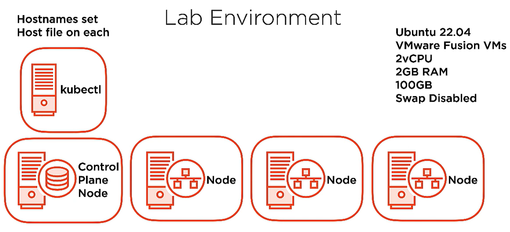

* https://app.pluralsight.com/course-player?clipId=18a74fb8-708b-4c8f-964b-41758e7245cb

# Kubernetes installatina nd configuration fundamentals

## Course Overview

## Exploring the Kubernetes Architecture

### What Is Kubernetes? Kubernetes Benefits and Operating Principles

* what is kubernetes?
  * container orchestrator
  * workload placement: deploy container based app to hardware
  * provides an infrastructure abstraction
    * LBs, hardware allocation, etc
  * maintains desired state
* benefits of kubernetes
  * speed of deployment
    * absorb change quickly
  * ability to recover quickly
    * achieves desired state repeatedly
  * hide infrastructure complexity in the cluster
    * storage, network place, etc

#### kubernetes principles
* desired state/declarative config
  * write code to describe deployment, kubernetes brings it online
* controllers/control loop
  * monitors and maintains desired state
  * if failure, then the controller will bring the service up.
* kubernetes API/API server
  * collection of objects that we can use to build and define systems
  * API server is central comm hub for cluster
  * controller uses the API server to acheive desired state

### Introducing the Kubernetes API - Objects and API Server

* API objects
  * collection of primitives to represent your system's state
    * ex: pod, nodes
  * enables config of state
    * declaratively: describe the state that should be acheived
    * imperatively: (manually) executed a bunch of commands to achieve a state
* API server
  * REST API over HTTP using JSON
  * only way that we interact with our cluster
  * only way kubernetes interacts with your cluster
  * desired state is serialized and persisted into the cluster data store

### Understanding API Objects - Pods
* single or collection of containers that we deploy as a single unit.  The 
* unit of scheduling work.
* defined in the manifest.
* ephemeral: no pod is ever redeployed.
* atomicity: the pod is there or it's not.
  * multicontainer pods: if one container dies, then the entire pod becomes unavailable.

* k8s Controllers are responsible (via the API server) to maintain communication with a Pod to maintain the desired state by:
  * observing state of pod: up/down
  * health of pod: application is good/bad via Probes
    * Probes: within manifest, you define Probe checks.

### Understanding API Objects - Controllers
* keeps the system in a desired state.
* Controllers are exposed via Workload resource API objects via the API Server.
  * create and manage Pods for you
* Controllers monitor and respond to the state of health.

#### Controller type: ReplicaSet controller
* define a number of replicas that should be running at all times.
* you generally don't create `ReplicaSets` directly, but create `Deployments`.

### controller type: Deployment controller
* admin defines a deployment.
* Deployment manages the rollout of the ReplicaSet.
  * commonly used when deploying container versions
  * can roll back

#### Understanding API Objects - Services
* provide a persistent access point to applications that we deploy in Pods
  * as things change, and controllers deploy new Pods, the Services provide a single point of access.
  * persists IP and DNS name for the service
  * networking abstraction for Pod access
* Services are dynamically updated based on Pod lifecycle
  * updates routing information, firewall config, etc.
* Services can be scaled by adding/removing pods
* provides load balancing

#### Understanding API Objects - Storage
* store data persistently
* Persistent Volume: pod independant storage that's defined at the Cluster level
  * when a Pod wants access to a storage, defines a persistent volume claim
  * decouples pod from storage

### Kubernetes Cluster Components Overview and Control Plane
* control plane node: implements major control functions of a cluster (used to be called "Master Node")
  * coordinates:
    * cluster operations
    * monitoring
    * pod scheduling
    * access point for cluster amdin
* Node/worker node
  * responsible for starting pods and containers
  * implement networking
  * contributes to compute capacity
  * Cluster is made up of many nodes (depending on configuration)
  * can be virtual or physical machines

#### control plane node


* `API Server`: primary access point for cluster admin, comm hub, it's stateless.
  * `kubectl` interacts with the API Server to configure.
  * central to the control of cluster, config changes are communicated via this component.
  * Simple interface.
  * REST API: GET, PUSH, POST
  * persists state of cluster to `etcd`
* Cluster store `etcd`: persists the state of the cluster objects
  * persists states
  * API Object maintainance
  * Stores state as key-value pairs
* `Scheduler`: tells k8s which nodes to start pods on based on the pod's desired state
  * watches API server for unscheduled pods
  * schedules pods on nodes
  * evaluates resources needed for pods
  * respects any contraints described for pods
* `Controller Manager`: implementing lifecycle functions of the Controllers, that control and monitor the state of the objects such as pods.  This is what commands Controllers to maintain the desired state.
  * controller loop execution
  * implement lifecycle functions and desired states
  * watch and update the API server of the state of the cluster
  * Made up of specific Controllers with specific roles, such as `ReplicaSet`

### Nodes
* a node is where the app pods run
* starts a pod and ensures the containers in pods are up and running
* implement networking
* can have many nodes in cluster based on scalability requirements
* nodes are either physical machines or VMs

#### node components
* each of these components run on all the nodes (including control plane node)

* `kubelet`: responsible for starting/stopping pods on nodes.
  * communicates directly with `API Server` to monitor for changes in the environment... sending info and rcving commands relevant to the `kubelet`'s role (to start pods).
  * monitors API server for changes
  * responsible for pod lifecycle (starting and stopping pods [and containers])
  * reports to API server on Node and Pod state
  * Pod health probe execution
* `kube-proxy`: responsible for pod networking and implementing out services abstraction ont he node itself.
  * communicates directly with `API Server` to monitor for changes in the environment... sending info and rcving commands relevant to the `kube-proxy`'s role (to change network topology).
  * `iptables`
  * implements services abstraction
  * routing traffic to Pods
  * load balancing
* `container runtime`: the actual runtime env, responsible for pulling container image from container registry and providing execution environment for container image and pod abstraction
  * downloads images and runs containers.
  * wrapped within Container Runtime Interface (CRI)
    * can swap out container runtime.
  * `containerd`: default runtime used by kubernetes, it is CRI compliant.
    * in `v1.20`, Docker was depreciated as the default container runtime.  It will be removed in `v1.22`, but you can still use containers built for Docker.


### Cluster Add-on Pods
* pods that provide special services to the cluster itself.
  * DNS:
    * provide DNS services within cluster via coreDNS server
    * IPs for the services and the search suffix is placed into the network config for any pods within the cluster via the cluster API server
    * commonly used for service discovery
  * Ingress controllers (optional)
    * advanced HTTP and layer 7 load balancers that handle content routing requests
  * Dashboard (optional)
    * for web based admin of k8s cluster
  * network overlays


### Pod Operations
* a cluster is established
  * this means it has a control plane node and two worker nodes
  * using `kubectl` we submit commands to configure a cluster, to the control plane node, that define
    * we want 3 replicas of the pod (submitted to API server, and stored to `etcd`)
    * controller manager will spin up the three requested replicas in replica set, which is submitted to the scheduler.
    * the scheduler then tells API server that the pods need to be spun up on nodes it selects, and the config decisions are written to `etcd`
      * which nodes did the pod replicas get scheduled on?
      * depedant on resources requested in the pods, and the resources available in the nodes in the cluster.
      * the `kubelet`s on the nodes will check in with the API server to see if there is any work queued for execution.
        * once the queued work is received, the pod will be spun up.
  * The controller manager receives information from the nodes regarding the state of pods running on each node.
    * if a node drops, the node is no longer reporting state.
      * controller manager will signal to the scheduler to locate a node to schedule the replica of the pod on.
        * by default the control plane node is NOT to be used for pod replica targets, only on worker node.

### Service Operations
* network or access point to applicaitons running within cluster
* review at cluster level
* pods are created within cluster for web app
* expose access with a Service, running HTTP on tcp 80
  * users can access on port 80
  * fixed and persistent service endpoint, which will be a DNS name or ip address
    * requests will be load balanced across replica set of pods
* services abstract access to pods' services
  * "self-healing" of underlying pods within a replica set occurs by the replica set controller

### Kubernetes Networking Fundamentals
* every pod deployed gets assigned a unique IP addr.
* pods on a node can communicate with all pods on all nodes in a cluster without NAT.
* agents on a node (kubelet, etc) can communicate with all pods on that node.

#### k8s network design


* multi container pod within cluster (within a node)
  * the containers within this pod communicate via namespaces within localhost
* additional pods deployed to the cluster (within a node)
  * these pods will inter-communicate via a software defined network bridge, using the real IPs of the pods themslves.
* pod on one node need to reach out to a pod on a second node
  * occurs between the real IPs of the pods themselves, so layer 2 and/or 3 connectivity must exist between the nodes
  * overlay network
    * if you don't control the underlying network infrastructure (inter-node), then you can deploy an overlay network to provide the overlay of layer 2/3 connectivity inter-node.
* external services
  * `kube-proxy` exposes the service within a cluster to external clients
    * the `service` then interacts with the pods.


## Installing and Configuring Kubernetes

### Installation Considerations
* where are you going to install?
  * cloud
    * two major use cases
      * IaaS: VMs as nodes
        * OS and k8s cluster must be managed.
      * PaaS: managed service
        * lose flexibility in versioning.
  * on prem
    * base metal or VMs
  * which one to choose?
    * skill set?c
    * cloud footprint already?
* cluster networking
  * overlay network versus metal r+s
* scalability
  * nodes, etc
* HA and DR
  * single control plane node?

### Installation Methods
* desktop installation
  * dev environments
    * docker-desktop
    * lens
* `kubeadm`
  * bootstraps cluster quickly
* cloud IaaS/PaaS

### Installation Requirements
* system requirements
  * need linux (ubuntu/RHEL)
  * 2 CPUs, 2GB RAM
  * swap is disabled on *nix
* container runtime
  * CRI compatbiel
    * containerd <-- we'll use this
    * docker
    * CRI-O
* networking
  * connectivity between all nodes
  * nodes need unique hostnames
  * nodes need unique MAC addresses

### Understanding Cluster Networking Ports
* setting up security perimters
  * control plane node provides services to the cluster
  * working nodes need access to the API server
* API server: tcp 6443, used by all cluster items (and admin via `kubectl`)
* `etcd`: tcp 2379-2380, used by API server and any etcd replicas
* Scheduler: tcp 10251, used by itself only (localhost)
* Controller Manager: tcp 10252, used by itself only (localhost)
* `kubelet`: tcp 10250, control plane services
  * worker nodes also run kubelets, tcp 10250, control plane needs access to worker node's kubelets
  * NodePort service: tcp 30000-32767, used by components that need access to the services published on the NodePorts
    * NodePort service: exposes `services` via ports on each node in cluster, and port ranges are allocated from the tcp port range.


### Getting Kubernetes
* github.com/kubernetes/kubernetes
* *nix repos

### Building Your Own Cluster
* steps
  * install and configure packages
  * create the cluster
  * configure pod networking
  * join nodes to cluster
* required packages on all nodes (worker or control plane)
  * container runtime: `containerd`
  * `kubelet`
  * `kubeadm`: create cluster, joins nodes
  * `kubectl`: configure pod network, etc.
* 

### Installing Kubernetes on VMs
* refer to wsl2.md in this repo for some work I did in that area, however I need to move on now... so I'm going to use vmware player and build four VMs.
* "ubuntucontrol" = 192.168.207.10,"ubuntuworkernode1" = 192.168.207.11,"ubuntuworkernode2" = 192.168.207.12,"ubuntuworkernode3" = 192.168.207.13
  * Onboard as NAT networking type
  * update local Windows host at `C:\windows\system32\drivers\etc\hosts` for all nodes' IPs
* after ubuntu 22.02 install, configure as follows:
  * set each to a static IP within the vmware player established vswitch subnet by creating a netplan config at `/etc/netplan/99_config.yaml`, `sudo netplan try --state /etc/netplan/`, then `sudo netplan apply`
    ```
    #it's a yaml, so indents matter
    network:
      version: 2
      renderer: networkd
      ethernets:
        ens33:
          addresses:
            - 192.168.207.10/24
          routes:
            - to: default
              via: 192.168.207.2
          nameservers:
              search: [localdomain]
              addresses: [192.168.207.2]
    ```
  * 


### Lab Environment Overview



* one control plane node, and three worker nodes
  * `kubectl` on control plane node
  * ubuntu version 22.04
  * remember to disable swap
  * add `/etc/hosts` entries for each node


### Demo: Installing and Configuring containerd

* goals:
  * install the following
    * containerd
    * kubelet
    * kubeadm
    * kubectl
  * review how `systemd` manages these
   
* interface with each VM, decrease swappiness, then install containerd
```
#https://askubuntu.com/a/103871
cat /proc/sys/vm/swappiness #should read 60, meaning if RAM is 60% utilized that the UMM will swap memory to disk
sudo vim /etc/sysctl.conf
# add to end of file vm.swappiness = 10
sudo sysctl --system #reload sysctl.conf
cat /proc/sys/vm/swappiness


#containerd prereqs
cat <<EOI | sudo tee /etc/modules-load.d/containerd.conf
overlay
br_netfilter
EOI
# affect at runtime
sudo modprobe overlay
sudo modprobe br_netfilter

#k8s prereqs
cat <<EOI | sudo tee /etc/sysctl.d/00-kubernetes-cri.conf
net.bridge.bridge-nf-call-iptables = 1
net.ipv4.ip_forward = 1
net.bridge.bridge-nf-call-ip6tables = 1
EOI
# affect at runtime
sudo sysctl --system


sudo apt update -y

#install and configure containerd
sudo apt install -y containerd
sudo mkdir -p /etc/containerd
sudo containerd config default | sudo tee /etc/containerd/config.toml
#set the cgroup driver to systemd in /etc/containerd/config.toml
$below `[plugins."io.containerd.grpc.v1.cri".containerd.runtimes.runc.options]` find and change the following value:
SystemdCgroup = true
sudo systemctl restart containerd
```

### Demo: Installing and Configuring Kubernetes Packages

* install kubernetes packages

```
# install kubernetes
# https://kubernetes.io/docs/setup/production-environment/tools/kubeadm/install-kubeadm/
curl -s https://packages.cloud.google.com/apt/doc/apt-key.gpg | sudo apt-key add -
sudo bash -c 'cat <<EOI > /etc/apt/sources.list.d/kubernetes.list
deb https://apt.kubernetes.io kubernetes-xenial main
EOI'

sudo apt update
#list versions
apt-cache policy kubelet | head -n 20

#pin to a specific version during install
VERSION=1.20.1-00
sudo apt install -y kubelet=$VERSION kubeadm=$VERSION kubectl=$VERSION

#disable upgrading of these packages by apt so that you can control what versions you're using:
sudo apt-mark hold kubelet kubeadm kubectl containerd
```

* review kubelet systemd unit status, note that it will fail to start because there's no cluster config (see next section)
```
sudo systemctl status kubelet.service
● kubelet.service - kubelet: The Kubernetes Node Agent
     Loaded: loaded (/lib/systemd/system/kubelet.service; enabled; vendor preset: enabled)
    Drop-In: /etc/systemd/system/kubelet.service.d
             └─10-kubeadm.conf
     Active: activating (auto-restart) (Result: exit-code) since Thu 2023-03-30 10:10:22 UTC; 1s ago
       Docs: https://kubernetes.io/docs/home/
    Process: 4049 ExecStart=/usr/bin/kubelet $KUBELET_KUBECONFIG_ARGS $KUBELET_CONFIG_ARGS $KUBELET_KUBEADM_ARGS $KUBELET_EXTRA_ARGS (code=exited, status=255/EXCEPTION)
   Main PID: 4049 (code=exited, status=255/EXCEPTION)
        CPU: 100ms

Mar 30 10:10:22 ubuntucontrol systemd[1]: kubelet.service: Main process exited, code=exited, status=255/EXCEPTION
Mar 30 10:10:22 ubuntucontrol systemd[1]: kubelet.service: Failed with result 'exit-code'.
```

* review containerd systemd unit status
```
sudo systemctl status containerd.service
```

* set both `kubelet` and `containerd` to start upon system boot
```
sudo systemctl enable kubelet.service containerd.service
```

### Bootstrapping a Cluster with kubeadm (on the control plane node)
* create a cluster by invoking `kubeadm init`.  This performs the following:
1. validation occurs
  * RAM
  * compatible container runtime check and that it's running
2. creates a CA (certs are used for encryption and authentication)
3. generates `kubeconfig` files
4. generates static pob manifests
5. wait for the control plane pods to start
6. taints the control plane node
  * this will cause the control plane node to never schedule user pods on the control plane node
7. generates a bootstrap taken
8. starts add-on components: DNS and kube-proxy

### Understanding the Certificate Authority's Role in Your Cluster
* kubeadm init creates a self signed CA
* you can tell kubeadm to integrate into an external PKI
* CA is used: /etc/kubernetes/pki
  * to secure cluster comms throughout cluster
    * used for API Server comms
  * to authenticate users and cluster components (nodes, etc)
* The CA certs are distributed to each node

### kubeadm Created kubeconfig Files and Static Pod Manifests

#### kubeconfig files
* a `kubeconfig` file defines how to connect to the cluster
  * includes:
    * client certs
    * CA certs
    * cluster API server network location
* `kubeadm` creates various `kubeconfig` files that are used by the control plane node and worker nodes within `/etc/kubernetes`
  * `admin.conf` (kubernetes-admin): is the admin account/superuser
  * `kubelet.conf`: used to help kubelet to locate the API server and provide auth cert
  * `controller-manager.conf`: used to help controller manager to locate the API server and provide auth cert
  * `scheduler.conf`: : used to help scheduler to locate the API server and provide auth cert

#### static pod manifests
* manifest describes a config of a pod
* generated by `kubeadm init`
  * produces files in `/etc/kubernetes/manifests`
* core control plan components:
  * etcd
  * api server
  * controller manager
  * scheduler
* `kubelet` watches the directory `/etc/kubernetes/manifests` for changes to the config

### Pod Networking Fundamentals


* overlay network options
  * Flannel: layer 3 virtual network
  * Calico: layer 3 and policy based traffic management
  * Weave Net: multi host network

### Creating a Cluster Control Plane Node and Adding a Node

#### create a cluster control plane node, admin user, and overlay network
* download yaml manifest that describes the pod overlay network
```
wget https://docs.projectcalico.org/manifests/calico.yaml
```
* create a cluster config file
```
kubeadm config print init-defaults | tee ClusterConfigurations.yaml
```
* init the cluster
```
sudo kubeadm init --config=Clusterconfiguration.yaml --cri-socket /run/containerd/containerd.sock
```
  * once this command has exited, all control plane pods will be up and running
  * this command will also output:
    * commands to have workernodes join the cluster
    * how to execute kubeadm to create an admin user

##### creating a cluster admin user
```
mkdir -p $HOME/.kube
sudo cp -i /etc/kubernetes/admin.conf $HOME/.kube/config
sudo chown $(id -u):$(id -d) $HOME/.kube/config
```
* inside of this kubeconfig file will contain network info on API server as well as certs used for authentication

##### deploy the pod network
```
kubectl apply -f calico.yaml
# this will push the overlay network related pods into the cluster
```

#### adding a node to a cluster
1. install packages
2. `kubeadm join`
  * takes additional parameters: bootstrap token, CA cert hash, and the location of the API server
3. downloads cluster info
4. node submits a CSR to the API server (used for kubelet to auth to API server)
5. CA signs the CSR automatically
  * `kubeadm join` downloads the cert and stores in `/var/lib/kubelet/pki`
6. creates `/etc/kubernetes/kubelet.conf`
  * contains client auth cert
  * contains API server info 
* invocation is: (note that `kubeadm init` you ran earlier produces this command)
```
kubeadm join APISERVER:6443 --token [token] --discovery-token-ca-cert-hash sha256:[hash]
```

### Demo: Creating a Cluster Control Plane Node
* create the cluster
```
# https://docs.tigera.io/calico/latest/getting-started/kubernetes/self-managed-onprem/onpremises#install-calico-with-kubernetes-api-datastore-50-nodes-or-less
wget https://raw.githubusercontent.com/projectcalico/calico/v3.25.0/manifests/calico.yaml

#find CALICO_IPV4POOL_CIDR and modify this range to something outside of the ranges used by any infrastructure (in our case there is an overlap)
vim calico.yaml

#create a kubeconfig file
kubeadm config print init-defaults | tee ClusterConfiguration.yaml
vim ClusterConfiguration.yaml

```
* create a pod network
* review systemd units
* static pod manifests
* join some worker nodes


### Demo: Adding a Node to Your Cluster
### Managed Cloud Deployment Scenarios: AKS, EKS, and GKE
### Demo: Creating a Cluster in the Cloud with Azure Kubernetes Service