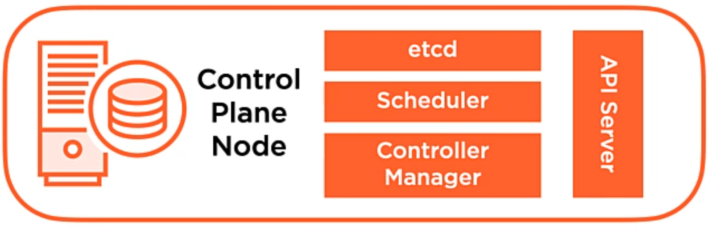

* https://app.pluralsight.com/course-player?clipId=e73685d0-189c-4207-88fd-f9550289a695

# Kubernetes installatina nd configuration fundamentals

## Course Overview

## Exploring the Kubernetes Architecture

### What Is Kubernetes? Kubernetes Benefits and Operating Principles

* what is kubernetes?
  * container orchestrator
  * workload placement: deploy container based app to hardware
  * provides an infrastructure abstraction
    * LBs, hardware allocation, etc
  * maintains desired state
* benefits of kubernetes
  * speed of deployment
    * absorb change quickly
  * ability to recover quickly
    * achieves desired state repeatedly
  * hide infrastructure complexity in the cluster
    * storage, network place, etc

#### kubernetes principles
* desired state/declarative config
  * write code to describe deployment, kubernetes brings it online
* controllers/control loop
  * monitors and maintains desired state
  * if failure, then the controller will bring the service up.
* kubernetes API/API server
  * collection of objects that we can use to build and define systems
  * API server is central comm hub for cluster
  * controller uses the API server to acheive desired state

### Introducing the Kubernetes API - Objects and API Server

* API objects
  * collection of primitives to represent your system's state
    * ex: pod, nodes
  * enables config of state
    * declaratively: describe the state that should be acheived
    * imperatively: (manually) executed a bunch of commands to achieve a state
* API server
  * REST API over HTTP using JSON
  * only way that we interact with our cluster
  * only way kubernetes interacts with your cluster
  * desired state is serialized and persisted into the cluster data store

### Understanding API Objects - Pods
* single or collection of containers that we deploy as a single unit.  The 
* unit of scheduling work.
* defined in the manifest.
* ephemeral: no pod is ever redeployed.
* atomicity: the pod is there or it's not.
  * multicontainer pods: if one container dies, then the entire pod becomes unavailable.

* k8s Controllers are responsible (via the API server) to maintain communication with a Pod to maintain the desired state by:
  * observing state of pod: up/down
  * health of pod: application is good/bad via Probes
    * Probes: within manifest, you define Probe checks.

### Understanding API Objects - Controllers
* keeps the system in a desired state.
* Controllers are exposed via Workload resource API objects via the API Server.
  * create and manage Pods for you
* Controllers monitor and respond to the state of health.

#### Controller type: ReplicaSet controller
* define a number of replicas that should be running at all times.
* you generally don't create `ReplicaSets` directly, but create `Deployments`.

### controller type: Deployment controller
* admin defines a deployment.
* Deployment manages the rollout of the ReplicaSet.
  * commonly used when deploying container versions
  * can roll back

#### Understanding API Objects - Services
* provide a persistent access point to applications that we deploy in Pods
  * as things change, and controllers deploy new Pods, the Services provide a single point of access.
  * persists IP and DNS name for the service
  * networking abstraction for Pod access
* Services are dynamically updated based on Pod lifecycle
  * updates routing information, firewall config, etc.
* Services can be scaled by adding/removing pods
* provides load balancing

#### Understanding API Objects - Storage
* store data persistently
* Persistent Volume: pod independant storage that's defined at the Cluster level
  * when a Pod wants access to a storage, defines a persistent volume claim
  * decouples pod from storage

### Kubernetes Cluster Components Overview and Control Plane
* control plane node: implements major control functions of a cluster (used to be called "Master Node")
  * coordinates:
    * cluster operations
    * monitoring
    * pod scheduling
    * access point for cluster amdin
* Node/worker node
  * responsible for starting pods and containers
  * implement networking
  * contributes to compute capacity
  * Cluster is made up of many nodes (depending on configuration)
  * can be virtual or physical machines

#### control plane node


* `API Server`: primary access point for cluster admin, comm hub, it's stateless.
  * `kubectl` interacts with the API Server to configure.
  * central to the control of cluster, config changes are communicated via this component.
  * Simple interface.
  * REST API: GET, PUSH, POST
  * persists state of cluster to `etcd`
* Cluster store `etcd`: persists the state of the cluster objects
  * persists states
  * API Object maintainance
  * Stores state as key-value pairs
* `Scheduler`: tells k8s which nodes to start pods on based on the pod's desired state
  * watches API server for unscheduled pods
  * schedules pods on nodes
  * evaluates resources needed for pods
  * respects any contraints described for pods
* `Controller Manager`: implementing lifecycle functions of the Controllers, that control and monitor the state of the objects such as pods.  This is what commands Controllers to maintain the desired state.
  * controller loop execution
  * implement lifecycle functions and desired states
  * watch and update the API server of the state of the cluster
  * Made up of specific Controllers with specific roles, such as `ReplicaSet`

### Nodes
* a node is where the app pods run
* starts a pod and ensures the containers in pods are up and running
* implement networking
* can have many nodes in cluster based on scalability requirements
* nodes are either physical machines or VMs

#### node components
* each of these components run on all the nodes (including control plane node)

* `kubelet`: responsible for starting/stopping pods on nodes.
  * communicates directly with `API Server` to monitor for changes in the environment... sending info and rcving commands relevant to the `kubelet`'s role (to start pods).
  * monitors API server for changes
  * responsible for pod lifecycle (starting and stopping pods [and containers])
  * reports to API server on Node and Pod state
  * Pod health probe execution
* `kube-proxy`: responsible for pod networking and implementing out services abstraction ont he node itself.
  * communicates directly with `API Server` to monitor for changes in the environment... sending info and rcving commands relevant to the `kube-proxy`'s role (to change network topology).
  * `iptables`
  * implements services abstraction
  * routing traffic to Pods
  * load balancing
* `container runtime`: the actual runtime env, responsible for pulling container image from container registry and providing execution environment for container image and pod abstraction
  * downloads images and runs containers.
  * wrapped within Container Runtime Interface (CRI)
    * can swap out container runtime.
  * `containerd`: default runtime used by kubernetes, it is CRI compliant.
    * in `v1.20`, Docker was depreciated as the default container runtime.  It will be removed in `v1.22`, but you can still use containers built for Docker.


### Cluster Add-on Pods
* pods that provide special services to the cluster itself.
  * DNS:
    * provide DNS services within cluster via coreDNS server
    * IPs for the services and the search suffix is placed into the network config for any pods within the cluster via the cluster API server
    * commonly used for service discovery
  * Ingress controllers (optional)
    * advanced HTTP and layer 7 load balancers that handle content routing requests
  * Dashboard (optional)
    * for web based admin of k8s cluster
  * network overlays


### Pod Operations
* a cluster is established
  * this means it has a control plane node and two worker nodes
  * using `kubectl` we submit commands to configure a cluster, to the control plane node, that define
    * we want 3 replicas of the pod (submitted to API server, and stored to `etcd`)
    * controller manager will spin up the three requested replicas in replica set, which is submitted to the scheduler.
    * the scheduler then tells API server that the pods need to be spun up on nodes it selects, and the config decisions are written to `etcd`
      * which nodes did the pod replicas get scheduled on?
      * depedant on resources requested in the pods, and the resources available in the nodes in the cluster.
      * the `kubelet`s on the nodes will check in with the API server to see if there is any work queued for execution.
        * once the queued work is received, the pod will be spun up.
  * The controller manager receives information from the nodes regarding the state of pods running on each node.
    * if a node drops, the node is no longer reporting state.
      * controller manager will signal to the scheduler to locate a node to schedule the replica of the pod on.
        * by default the control plane node is NOT to be used for pod replica targets, only on worker node.

### Service Operations
* network or access point to applicaitons running within cluster
* review at cluster level
* pods are created within cluster for web app
* expose access with a Service, running HTTP on tcp 80
  * users can access on port 80
  * fixed and persistent service endpoint, which will be a DNS name or ip address
    * requests will be load balanced across replica set of pods
* services abstract access to pods' services
  * "self-healing" of underlying pods within a replica set occurs by the replica set controller

### Kubernetes Networking Fundamentals
* every pod deployed gets assigned a unique IP addr.
* pods on a node can communicate with all pods on all nodes with NAT
* agents on a node (kubelet, etc) can communicate with all pods on that node

#### k8s network design


* multi container pod within cluster (within a node)
  * the containers within this pod communicate via namespaces within localhost
* additional pods deployed to the cluster (within a node)
  * these pods will inter-communicate via a software defined network bridge, using the real IPs of the pods themslves.
* pod on one node need to reach out to a pod on a second node
  * occurs between the real IPs of the pods themselves, so layer 2 and/or 3 connectivity must exist between the nodes
  * overlay network
    * if you don't control the underlying network infrastructure (inter-node), then you can deploy an overlay network to provide the overlay of layer 2/3 connectivity inter-node.
* external services
  * `kube-proxy` exposes the service within a cluster to external clients
    * the `service` then interacts with the pods.


## Installing and Configuring Kubernetes

### Installation Considerations
* where are you going to install?
  * cloud
    * two major use cases
      * IaaS: VMs as nodes
        * OS and k8s cluster must be managed.
      * PaaS: managed service
        * lose flexibility in versioning.
  * on prem
    * base metal or VMs
  * which one to choose?
    * skill set?
    * cloud footprint already?
* cluster networking
  * overlay network versus metal r+s
* scalability
  * nodes, etc
* HA and DR
  * single control plane node?

### Installation Methods
* desktop installation
  * dev environments
    * docker-desktop
    * lens
* kubeadm
  * bootstraps cluster quickly
* cloud IaaS/PaaS

### Installation Requirements
* system requirements
  * need linux (ubuntu/RHEL)
  * 2 CPUs, 2GB RAM
  * swap is disabled on *nix
* container runtime
  * CRI compatbiel
    * containerd <-- we'll use this
    * docker
    * CRI-O
* networking
  * connectivity between all nodes
  * nodes need unique hostnames
  * nodes need unique MAC addresses

### Understanding Cluster Networking Ports
* setting up security perimters
  * control plane node provides services to the cluster
  * working nodes need access to the API server
* API server: tcp 6443, used by all cluster items (and admin via `kubectl`)
* etcd: tcp 2379-2380, used by API server and any etcd replicas
* Scheduler: tcp 10251, used by itself only (localhost)
* Controller Manager: tcp 10252, used by itself only (localhost)
* kubelet: tcp 10250, control plane services
  * worker nodes also run kubelets, tcp 10250, control plane needs access to worker node's kubelets
  * NodePort service: tcp 30000-32767, used by components that need access to the services published on the NodePorts
    * NodePort service: exposes `services` via ports on each node in cluster, and port ranges are allocated from the tcp port range.


### Getting Kubernetes
* github.com/kubernetes/kubernetes
* *nix repos

### Building Your Own Cluster
* steps
  * install and configure packages
  * create the cluster
  * configure pod networking
  * join nodes to cluster
* required packages on all nodes (worker or control plane)
  * container runtime: containerd
  * `kubelet`
  * `kubeadm`
  * `kubectl`

### Installing Kubernetes on VMs
* I'll be using WSL2 because I like making things difficult.
```
# distros are available: https://learn.microsoft.com/en-us/windows/wsl/install-manual
Invoke-WebRequest -Uri https://aka.ms/wslubuntu -OutFile ubuntu.appx -UseBasicParsing
#or
azcopy copy https://wslstorestorage.blob.core.windows.net/wslblob/Ubuntu2204-221101.AppxBundle ubuntu.appx
Add-AppxPackage .\ubuntu.appx

#run ubuntu
ubuntu #exit without setting a user
#migrate ubuntu installation to WSL2
wsl --set-version ubuntu 2
#open docker desktop and enable ubuntu via settings>resources> WSL integration (if you don't see Ubuntu listed, you may need to restart docker desktop)

#then "safely" create four more ubuntu VMs (https://www.mourtada.se/installing-multiple-instances-of-ubuntu-in-wsl2/)
wsl --terminate ubuntu
wsl -l -v
wsl --export Ubuntu $env:userprofile\wsl2\ubuntu_baseline.tar.gz


#I'm going to attempt to go through this at this point in time for the single VM: https://github.com/ocroz/wsl2-boot
  #this entire thing is actually unnecessarily complex
  # I'm going to have to re-write this entire thing so it's less of a cluster fuck

#in powershell as the user
mkdir -p $env:userprofile\repos && cd $env:userprofile\repos
git clone https://github.com/ocroz/wsl2-boot
cd wsl2-boot
[Environment]::SetEnvironmentVariable("WSL2_BOOT", "%USERPROFILE%\repo\wsl2-boot", "User")
[Environment]::SetEnvironmentVariable("WSL2_BOOT", "%USERPROFILE%\OneDrive - Digital Currency Group\repos\wsl2-boot", "User")

#in ubuntu instance

<# I'm not buying that this is needed
sudo update-alternatives --config editor
#select vim.basic
visudo
 %sudo   ALL=(ALL:ALL) ALL
 %sudo   ALL=(ALL:ALL) NOPASSWD: ALL
#>
sudo apt update && sudo apt upgrade -y
sudo ssh-keygen -A # not needed

#configure resolv to be created by wsl2-boot things
cd "/mnt/c/Users/MBrown/OneDrive - Digital Currency Group/repos/wsl2-boot"
sed -i 's/generateResolvConf = false/generateResolvConf = true/' "linux/wsl.conf"
sudo rm /etc/resolv.conf

#configure the baseline wsl.conf file and other wsl2-boot things
sudo cp linux/wsl.conf /etc/
sudo cp linux/wsl-boot.sh /boot/
sudo chmod 744 /boot/wsl-boot.sh


#back in pwsh on the Windows host
cd $env:userprofile\repos\wsl2-boot\
cp windows\.bash_profile $env:userprofile\ #don't think we need this
cp windows\.wslconfig $env:userprofile\ #okayyyy
mkdir -p $env:userprofile\winbin\
cp windows\wsl-boot.bat $env:userprofile\winbin\ # Or wherever in your Windows PATH

#modify $env:userprofile\winbin\wsl-boot.bat
# - Update the path to `wsl-boot.ps1` as per your settings
# - Update the subnet as you need e.g. to replace "192.168.50" by "192.168.130"
# - Add all your WSL distributions
# - Replace `PowerShell` by `pwsh` if to use PowerShell 7.1+


#create four VMs that will be nodes
$nodes = "control","workernode1","workernode2","workernode3"
foreach ($node in $nodes) {
  write-host building $node node
  #wsl --import ubuntu_$node $env:userprofile\wsl2\ubuntu_$node $env:userprofile\wsl2\ubuntu_baseline.tar.gz
  write-host converting $node node to WSL2 from WSL1
}

wsl -l -v

#access each node by using the `--distribution` switch
wsl -d ubuntu_control

# go through each instance, run `apt update && apt upgrade`

# maybe I need to do this: https://github.com/ocroz/wsl2-boot or https://stevegy.medium.com/wsl-2-static-ip-341603d84401


#note that you can configure RAM, CPU, etc: https://learn.microsoft.com/en-us/windows/wsl/wsl-config
```
* interface with each WSL2 VM and install the kube stuff
```
sudo apt install -y containerd
curl -s https://packages.cloud.google.com/apt/doc/apt-key.gpg | sudo apt-key add -
echo deb https://api.kubernetes.io kubernetes-xenial main > /etc/apt/sources.list.d/kubernetes.list
apt install -y kubelet kubeadm kubectl
#disable upgrading of these packages by apt so that you can control what versions you're using:
apt-mark hold kubelet kubeadm kubectl containerd
```


### Lab Environment Overview
* one control plane node, and three worker nodes

### Demo: Installing and Configuring containerd
### Demo: Installing and Configuring Kubernetes Packages
### Bootstrapping a Cluster with kubeadm
### Understanding the Certificate Authority's Role in Your Cluster
### kubeadm Created kubeconfig Files and Static Pod Manifests
### Pod Networking Fundamentals
### Creating a Cluster Control Plane Node and Adding a Node
### Demo: Creating a Cluster Control Plane Node
### Demo: Adding a Node to Your Cluster
### Managed Cloud Deployment Scenarios: AKS, EKS, and GKE
### Demo: Creating a Cluster in the Cloud with Azure Kubernetes Service
4. Working with Your Kubernetes Cluster

9